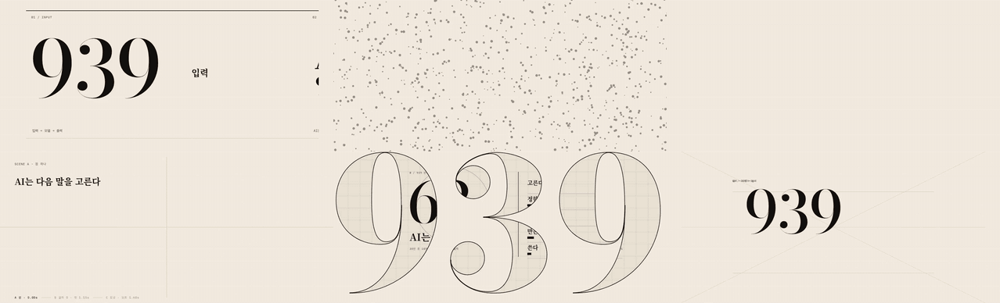
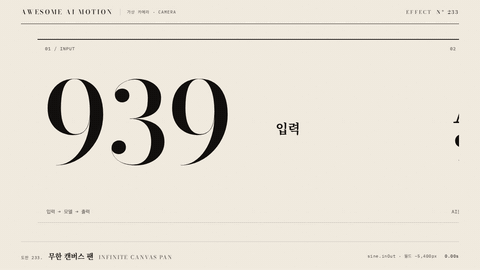
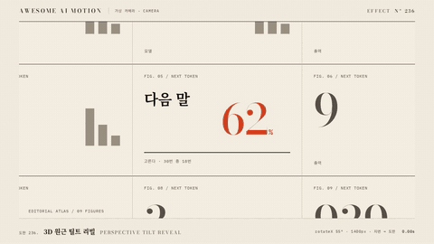
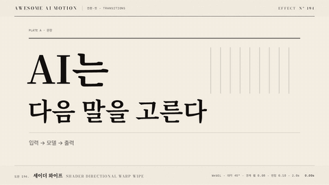
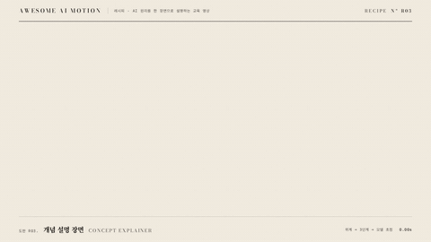

<p align="center">
<a href="https://gongnyang.github.io/awesome-ai-motion/"></a>
</p>

<h1 align="center">Awesome AI Motion</h1>

<p align="center"><b>AI 에이전트가 읽는 모션 기법 도감.</b></p>

<p align="center">기법 637개 · 기준 클립 128개 · 레시피 11개 · 용도별 루트 7개</p>

<p align="center">
<a href="README.md">English</a> · <a href="https://gongnyang.github.io/awesome-ai-motion/">사이트</a> · <a href="SKILL.md">Agent skill</a> · <a href="docs/catalog.md">전체 목록</a>
</p>

장면이 전해야 할 의미에 맞춰 모션을 고른다. 효과 카드마다 정의, 기본 파라미터, 예시, 출처와 Claude Code·Codex용 프롬프트가 있다.

## 빠른 시작

### 1. 레포 받기

```bash
git clone https://github.com/gongnyang/awesome-ai-motion.git
cd awesome-ai-motion
```

사이트 탐색, 카드 읽기, 스킬 연결에는 의존성 설치가 필요 없다.
로컬 렌더에는 Node.js 20 이상, PATH에 있는 ffmpeg, Chromium을 설치한 Playwright가 필요하다.
렌더 의존성이 없을 때만 아래 설치를 진행한다:

```bash
npm install                          # 전역 playwright가 있으면 선택 사항
npx playwright install chromium      # Chromium 설치가 되어 있으면 생략
ffmpeg -version                      # ffmpeg가 PATH에 있는지 확인
```

### 2. 스킬 연결

현재 체크아웃을 Claude Code 스킬 디렉터리에 연결한다:

```bash
mkdir -p ~/.claude/skills
ln -s "$PWD" ~/.claude/skills/awesome-ai-motion
```

링크 대신 복사해도 된다. 두 방법 중 하나를 선택하고, 대상 경로는 비어 있어야 한다.

```bash
mkdir -p ~/.claude/skills
cp -R "$PWD" ~/.claude/skills/awesome-ai-motion
```

Codex는 같은 방식으로 `~/.codex/skills/`에 연결하거나 복사한다. 복사본은 레포 변경 시 다시 갱신한다.
연결한 다음 에이전트에게 장면에 맞는 효과를 요청한다:

```text
제품 공개 장면에 맞는 모션을 골라줘. 효과 카드를 읽고 기본 파라미터로 적용해줘.
```

### 3. 첫 클립 렌더

문구를 바꾸고 임베드용 무대를 적용해 별도 출력 디렉터리에 렌더한다:

```bash
node scripts/render.mjs effects/mask-reveal \
  --embed --text "움직임으로 전해" --out .staging/my-first-motion
```

결과는 `.staging/my-first-motion/`의 `clip.mp4`, `preview.gif`, `poster.jpg`로 확인한다. 원본 효과는 다음 작업에도 재사용한다.
기준 클립을 보존하려면 `effects/`와 `recipes/` 밖에 출력 경로를 잡는다.

## 먼저 볼 임팩트 클립 16개

큰 카메라 이동, 강한 리빌, 형태 변화를 중심으로 골랐다. 미리보기를 누르면 효과 카드로 이동한다.

<table>
<tr>
<td align="center" width="25%"><a href="effects/infinite-pan/"><br><sub><b>무한 캔버스 팬</b></sub></a><br><sub><a href="effects/infinite-pan/clip.mp4">MP4</a></sub></td>
<td align="center" width="25%"><a href="effects/camera-flythrough/"><br><sub><b>카메라 플라이스루</b></sub></a><br><sub><a href="effects/camera-flythrough/clip.mp4">MP4</a></sub></td>
<td align="center" width="25%"><a href="effects/infinite-zoom/"><br><sub><b>무한 줌 스루</b></sub></a><br><sub><a href="effects/infinite-zoom/clip.mp4">MP4</a></sub></td>
<td align="center" width="25%"><a href="effects/deep-parallax/"><br><sub><b>깊은 다층 패럴랙스</b></sub></a><br><sub><a href="effects/deep-parallax/clip.mp4">MP4</a></sub></td>
</tr>
<tr>
<td align="center" width="25%"><a href="effects/kinetic-type-sweep/"><br><sub><b>대형 키네틱 타이포 스윕</b></sub></a><br><sub><a href="effects/kinetic-type-sweep/clip.mp4">MP4</a></sub></td>
<td align="center" width="25%"><a href="effects/giant-mask-reveal/"><br><sub><b>대형 마스크 리빌</b></sub></a><br><sub><a href="effects/giant-mask-reveal/clip.mp4">MP4</a></sub></td>
<td align="center" width="25%"><a href="effects/particle-assemble/"><br><sub><b>입자 흩어졌다 모이기</b></sub></a><br><sub><a href="effects/particle-assemble/clip.mp4">MP4</a></sub></td>
<td align="center" width="25%"><a href="effects/morph-match-cut/"><br><sub><b>매치컷 모프</b></sub></a><br><sub><a href="effects/morph-match-cut/clip.mp4">MP4</a></sub></td>
</tr>
<tr>
<td align="center" width="25%"><a href="effects/card-flip-stack/"><br><sub><b>3D 카드 플립 스택</b></sub></a><br><sub><a href="effects/card-flip-stack/clip.mp4">MP4</a></sub></td>
<td align="center" width="25%"><a href="effects/perspective-tilt/"><br><sub><b>3D 원근 틸트 리빌</b></sub></a><br><sub><a href="effects/perspective-tilt/clip.mp4">MP4</a></sub></td>
<td align="center" width="25%"><a href="effects/shader-wipe/"><br><sub><b>셰이더 와이프</b></sub></a><br><sub><a href="effects/shader-wipe/clip.mp4">MP4</a></sub></td>
<td align="center" width="25%"><a href="effects/noise-dissolve/"><br><sub><b>노이즈 디졸브 전환</b></sub></a><br><sub><a href="effects/noise-dissolve/clip.mp4">MP4</a></sub></td>
</tr>
<tr>
<td align="center" width="25%"><a href="effects/light-sweep/"><br><sub><b>라이트 스윕</b></sub></a><br><sub><a href="effects/light-sweep/clip.mp4">MP4</a></sub></td>
<td align="center" width="25%"><a href="effects/scroll-scrub-cinema/"><br><sub><b>스크롤 스크럽 시네마</b></sub></a><br><sub><a href="effects/scroll-scrub-cinema/clip.mp4">MP4</a></sub></td>
<td align="center" width="25%"><a href="effects/ken-burns/"><br><sub><b>켄 번스</b></sub></a><br><sub><a href="effects/ken-burns/clip.mp4">MP4</a></sub></td>
<td align="center" width="25%"><a href="effects/overlapping-action/"><br><sub><b>오버랩</b></sub></a><br><sub><a href="effects/overlapping-action/clip.mp4">MP4</a></sub></td>
</tr>
</table>

## 움직임으로 보는 레시피 8개

교육 첫 5초 훅을 포함해 효과가 하나의 장면으로 이어지는 모습을 본다. 이름이나 미리보기를 누르면 레시피로 이동한다.

<table>
<tr>
<td align="center" width="25%"><a href="recipes/edu-hook/"><br><sub><b>교육 첫 5초 훅</b></sub></a><br><sub><a href="recipes/edu-hook/clip.mp4">MP4</a></sub></td>
<td align="center" width="25%"><a href="recipes/shorts-hook/"><br><sub><b>숏폼 훅</b></sub></a><br><sub><a href="recipes/shorts-hook/clip.mp4">MP4</a></sub></td>
<td align="center" width="25%"><a href="recipes/title-opener/"><br><sub><b>타이포 오프닝</b></sub></a><br><sub><a href="recipes/title-opener/clip.mp4">MP4</a></sub></td>
<td align="center" width="25%"><a href="recipes/product-demo/"><br><sub><b>제품 UI 시연</b></sub></a><br><sub><a href="recipes/product-demo/clip.mp4">MP4</a></sub></td>
</tr>
<tr>
<td align="center" width="25%"><a href="recipes/data-story/"><br><sub><b>데이터 스토리</b></sub></a><br><sub><a href="recipes/data-story/clip.mp4">MP4</a></sub></td>
<td align="center" width="25%"><a href="recipes/concept-explainer/"><br><sub><b>개념 설명 장면</b></sub></a><br><sub><a href="recipes/concept-explainer/clip.mp4">MP4</a></sub></td>
<td align="center" width="25%"><a href="recipes/before-after/"><br><sub><b>전후 비교</b></sub></a><br><sub><a href="recipes/before-after/clip.mp4">MP4</a></sub></td>
<td align="center" width="25%"><a href="recipes/scrolldeck-scene/"><br><sub><b>스크롤덱 장면 3박자</b></sub></a><br><sub><a href="recipes/scrolldeck-scene/clip.mp4">MP4</a></sub></td>
</tr>
</table>

[사이트](https://gongnyang.github.io/awesome-ai-motion/)에서 느린 재생과 최대 네 클립 비교를 할 수 있다. [전체 목록](docs/catalog.md)에서 모든 기법과 클립 유무를 확인한다.

## 다음 장면 고르기

| 입구 | 쓰임 |
|---|---|
| [사이트](https://gongnyang.github.io/awesome-ai-motion/) | 클립 탐색·재생·필터·비교 |
| [문서 목차](docs/README.md) | 필요한 문서로 바로 이동 |
| [전체 카탈로그](docs/catalog.md) | 동작 분류별 전체 기법 목록 |
| [결정표](references/decision-tables.md) | 목적·매체 기준으로 효과 선택 |
| [레시피](recipes/) | 효과를 순서·타이밍으로 조합 |
| [용도별 루트](routes/) | 소개·홍보, 쇼츠, 덱 등 산출물 설계; 루트 문서는 국문 |
| [에이전트 작업 흐름](SKILL.md) | 목적 선택부터 카드 확인·수정·렌더·검증까지 |
| [정본 데이터](index.json) | 효과 메타데이터 직접 조회 |

카드는 `effects/<slug>/README.md`에 있다. 렌더된 효과는 `index.html`, `clip.mp4`, `preview.gif`, `poster.jpg`도 포함한다.

## 기여

새 효과·기본값 개선·기준 클립 추가는 [CONTRIBUTING.md](CONTRIBUTING.md)를 따른다. 동작이 분명히 보이게 만들고 공용 무대를 사용한 뒤 렌더 결과를 확인한다.
`index.json`이 정본 카탈로그다. 해당 원본이나 생성기를 수정하고 문서·사이트를 다시 생성한다:

```bash
node scripts/build.mjs
node scripts/check.mjs
```

## 라이선스와 출처

직접 만든 결과물은 [MIT](LICENSE)로 제공한다. 참조 출처와 구성 요소 라이선스는 [ATTRIBUTIONS.md](ATTRIBUTIONS.md)와 각 효과 카드에 기록한다.
GSAP과 포함된 글꼴은 각각의 라이선스를 따른다. 해당 자산을 재배포할 때 출처 고지를 확인한다.
