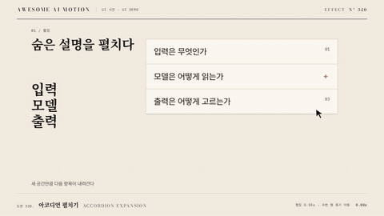

# Nº 320 아코디언 펼치기 · Accordion Expansion



[MP4](clip.mp4) · [HTML](index.html)

**접힌 영역이 고정된 가장자리에서 펼쳐지고 주변 항목이 새 공간만큼 밀려난다.**

A panel expands from a fixed edge while adjacent content moves aside.

| Family | Level | Purpose | Media | Runtime |
|---|---|---|---|---|
| UI 시연 · UI DEMO | 기본 | 설명 | 설명 영상, 제품 시연, 웹 UI | gsap |

다른 이름 / Also known as: Anchored panel expand, 고정 모서리 패널 확장, Anchored Expand, 고정 변 확장, anchored-layout-expand, 아코디언 펼침, Accordion Disclosure, Expandable Toolbar, 도구 모음 펼치기, Code fold expansion, 코드 접기와 펼치기

## 선택 기준 / Selection

내용의 추가와 공간적 종속 관계를 보여준다. / Explains added content and its spatial relationship to the surrounding layout.

- 상세 설정을 단계적으로 공개할 때 / Reveal detailed settings progressively.
- 코드 접기를 풀어 내부를 설명할 때 / Unfold code to explain its contents.

좋은 예 / Good: 상단을 고정한 패널이 높이 240px로 펴지고 아래 항목이 함께 밀린다
나쁜 예 / Bad: 높이만 늘어나고 아래 항목이 겹친 채 남는다
주의 / Avoid: 측정 전에 숨긴 내용 높이를 0으로 취급하지 않는다

## 파라미터 / Parameters

| Parameter | Default | Range | Note |
|---|---|---|---|
| 펼침 | 450ms | 300~650ms | 레이아웃 변경 시간 |
| 목표 높이 | 240px | 120~480px | 실제 scrollHeight로 교체 |
| 내용 지연 | 80ms | 40~120ms | 공간 확보 후 공개 |
| 이징 | power3.out | power2.out~power3.out | 감속 정착 |

## 구현 / Implementation (GSAP)

```js
const panel = document.querySelector('.panel');
const height = panel.scrollHeight;
gsap.set(panel,{height:0,overflow:'hidden'});
tl.to(panel,{height,duration:0.45,ease:'power3.out'},0);
tl.fromTo('.panel-content',{opacity:0},{opacity:1,duration:0.25},0.08);
```

## 프롬프트 / Prompts

### 한국어 · Claude Code
```text
<파일>의 <대상>에 아코디언 펼치기을 적용한다. 상단 앵커를 고정하고 측정 높이 240px까지 450ms 펼치며 내용은 80ms 늦게 공개한다. 초기 상태를 명시한 paused 타임라인으로 만들고 고정 좌표와 시간만 사용해 seek를 재현한다.
```

### 한국어 · Codex
```text
<파일>에서 <대상>의 아코디언 펼치기 장면에 적용한다. 상단 앵커를 고정하고 측정 높이 240px까지 450ms 펼치며 내용은 80ms 늦게 공개한다. 0.11초·0.29초·0.65초 시점을 캡처해 시작 상태, 중간 관계, 최종 정착과 겹침 여부를 확인한다.
```

### English · Claude Code
```text
Apply Accordion Expansion to <target> in <file>. Anchor the top edge, expand to the measured 240px height in 450ms, and reveal the content after an 80ms delay. Define the initial state and use a paused timeline with fixed coordinates and timings for repeatable seeking.
```

### English · Codex
```text
Implement Accordion Expansion in the scene for <target> in <file>. Anchor the top edge, expand to the measured 240px height in 450ms, and reveal the content after an 80ms delay. Capture at 0.11s, 0.29s, 0.65s to verify the initial state, intermediate relationships, final settling, and unwanted overlap.
```

예시 / Example: 아코디언 펼치기를 `.hero`에 적용해. / Apply Accordion Expansion to `.hero`.

## 적용 / Application

- HyperFrames: paused 타임라인에 아코디언 펼치기의 초기 상태와 종료 상태를 함께 기록하고 0.45초까지 seek로 재현한다.
- ReelForge: 씬 워커 브리프에 아코디언 펼치기 대상 선택자와 펼침 450ms, 목표 높이 240px, 내용 지연 80ms를 싣고 최종 상태 유지 시간을 지정한다.
- Scrolline Deck: 진행률 0~1을 0.45초 구간에 매핑하고 scrub에서는 스프링 대신 power3.out으로 위치를 계산한다.

조합 / Pair with: [점진적 공개 · Progressive Disclosure](../progressive-disclosure/) · [레이아웃 재배치 · Layout Reflow](../layout-reflow/)

출처 / Sources: [heygen-com/hyperframes](https://raw.githubusercontent.com/heygen-com/hyperframes/main/registry/components/panel-reveal/registry-item.json) (Apache-2.0) · [heygen-com/hyperframes](https://raw.githubusercontent.com/heygen-com/hyperframes/main/registry/components/card-resize/registry-item.json) (Apache-2.0) · [heygen-com/hyperframes](https://raw.githubusercontent.com/heygen-com/hyperframes/main/registry/components/menu-morph/registry-item.json) (Apache-2.0) · [motiondivision/motion](https://motion.dev/docs/react-layout-animations) (MIT) · [pmndrs/react-spring](https://www.react-spring.dev/examples) (MIT)

[목록 / Catalog](../../references/catalog.md) · [index.json](../../index.json)
