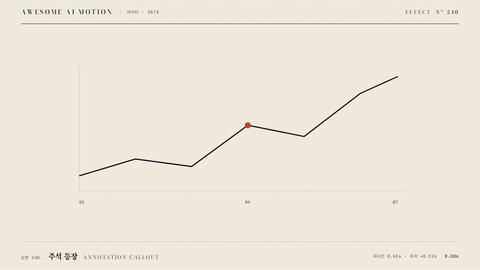

# Nº 240 주석 등장 · Annotation Callout



[MP4](clip.mp4) · [HTML](index.html)

**그래프의 한 점에서 지시선을 그린 뒤 주석을 보여주는 표현**

An animation that draws a leader line from a point on a chart and then reveals an annotation.

| Family | Level | Purpose | Media | Runtime |
|---|---|---|---|---|
| 데이터 · DATA | 기본 | 강조, 설명 | 설명 영상, 데이터 스토리, 발표 | gsap |

다른 이름 / Also known as: 데이터 주석, Chart callout, Bubble Pointer Reveal, 말풍선 꼬리 등장, Popover and Tooltip, 팝오버와 툴팁, Anchored step tooltip, 앵커 안내 말풍선

## 선택 기준 / Selection

주목할 데이터 지점과 그 의미 / Highlights a significant data point and its meaning.

- 주목할 데이터 지점과 그 의미를 보여줄 때 / When highlighting a significant data point and its meaning
- 완성된 그래프의 한 점에 선택 비율 주석을 붙인다와 같은 장면을 만들 때 / When adding a selection-rate annotation to a point on a completed chart

좋은 예 / Good: 완성된 그래프의 한 점에 선택 비율 주석을 붙인다
나쁜 예 / Bad: 여러 지시선을 동시에 그려 어떤 점을 설명하는지 모호하다
주의 / Avoid: 최종 상태를 0.5초 이상 유지한다 · 동일 화면에서 불필요한 주홍 강조를 추가하지 않는다

## 파라미터 / Parameters

| Parameter | Default | Range | Note |
|---|---|---|---|
| 지시선 지속 | 0.65s | 0.4~0.9s | 점에서 주석 방향으로 그리기 |
| 주석 등장 | 1.22s | 1.1~1.5s | 선 완성 후 표시 |
| 텍스트 스태거 | 0.12s | 0.06~0.16s | 본문 다음 보조 수치 |
| 점 반지름 | 8px | 5~10px | 그래프 초점 표시 |

이징 / Ease: `none / power3.out`

## 구현 / Implementation (GSAP)

```js
gsap.set('#call',{strokeDasharray:1,strokeDashoffset:1});
tl.to('#call',{strokeDashoffset:0,autoRound:false,duration:.65,ease:'none'},.45);
tl.fromTo('.note,.sub',{y:8,opacity:0},{y:0,opacity:1,duration:.35,stagger:.12},1.22);
```

## 프롬프트 / Prompts

### 한국어 · Claude Code
```text
<대상>에 주석 등장 효과를 적용해. 완성된 그래프의 한 점에 선택 비율 주석을 붙인다. 지시선 지속 0.65s; 주석 등장 1.22s; 텍스트 스태거 0.12s; 점 반지름 8px로 만들고 이징은 none / power3.out를 써. GSAP 타임라인 하나로 제어하고 2.5초부터 3초까지 완성 상태를 유지해.
```

### 한국어 · Codex
```text
<파일>의 데이터 장면에 주석 등장 효과를 구현해. 지시선 지속 0.65s; 주석 등장 1.22s; 텍스트 스태거 0.12s; 점 반지름 8px를 적용하고 이징은 none / power3.out로 지정해. 0초, 0.75초, 1.75초, 2.9초를 캡처해서 시작 상태와 진행 변화, 최종 상태의 잘림과 겹침을 확인해. Math.random과 타이머 없이 타임라인으로 재생하고 마지막 0.5초 이상 정지해.
```

### English · Claude Code
```text
Apply Annotation Callout to <target>. Add a selection-rate annotation to a point on a completed chart. Use these settings: leader-line duration 0.65s; annotation reveal at 1.22s; text stagger 0.12s; dot radius 8px; ease none / power3.out. Control everything with a single GSAP timeline and hold the completed state from 2.5 to 3 seconds.
```

### English · Codex
```text
Implement Annotation Callout in the data scene in <file>. Use these settings: leader-line duration 0.65s; annotation reveal at 1.22s; text stagger 0.12s; dot radius 8px; ease none / power3.out. Capture at 0, 0.75, 1.75, and 2.9 seconds to check the initial state, progression, and any clipping or overlap in the final state. Play using a timeline without Math.random or timers, and hold still for at least the final 0.5 seconds.
```

예시 / Example: 주석 등장를 `.hero`에 적용해. / Apply Annotation Callout to `.hero`.

## 적용 / Application

- HyperFrames: 하나의 paused GSAP 타임라인에 모든 동작을 넣고 3초 seek 가능한 장면으로 만든다
- ReelForge: 데이터 도형과 라벨을 분리하고 동일 시작 시각과 지속 시간을 씬 타임라인에 연결한다
- Scrolline Deck: 시간을 스크롤 진행률로 매핑하고 마지막 구간에서 최종값과 주석을 유지한다

조합 / Pair with: [선 그리기 · Line Draw](../line-draw/) · [스포트라이트 · Spotlight](../spotlight/) · [확대 콜아웃 · Zoom Callout](../zoom-callout/)

출처 / Sources: [GSAP Timeline 공식 문서](https://gsap.com/docs/v3/GSAP/Timeline/) (문서 참조) · [IanLunn/Hover](https://github.com/IanLunn/Hover) (MIT personal/open-source + paid commercial) · [shadcn-ui/ui](https://github.com/shadcn-ui/ui) (MIT) · [ui.aceternity.com](https://ui.aceternity.com/components/tooltip-card) (unknown) · [ibelick/motion-primitives](https://github.com/ibelick/motion-primitives) (MIT) · [DavidHDev/react-bits](https://github.com/DavidHDev/react-bits) (MIT + Commons Clause v1.0) · [heygen-com/hyperframes](https://raw.githubusercontent.com/heygen-com/hyperframes/main/registry/components/vox-annotate/registry-item.json) (Apache-2.0) · motion dictionary 4-explainer-learning.md#B. 공개 순서와 시선 유도 (own)

[목록 / Catalog](../../references/catalog.md) · [index.json](../../index.json)
