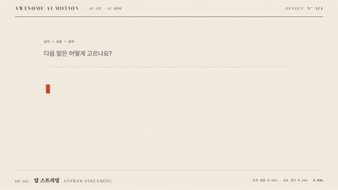

# Nº 314 답 스트리밍 · Answer Streaming



[MP4](clip.mp4) · [HTML](index.html)

**답변을 토큰 묶음 단위로 순서대로 표시하고 새 묶음의 농도를 점차 높이는 동작**

An animation that reveals an answer in sequential token groups and gradually increases the opacity of each new group.

| Family | Level | Purpose | Media | Runtime |
|---|---|---|---|---|
| UI 시연 · UI DEMO | 기본 | 설명, 피드백 | 제품 시연, 설명 영상, 웹 UI | gsap |

다른 이름 / Also known as: 토큰 스트리밍, Answer stream, 답변 스트리밍, 답변 스트림, Word stream replacement, 단어 스트림 교체

## 선택 기준 / Selection

답변이 생성되는 과정과 현재 출력 위치 / Shows the answer generation process and the current output position.

- AI 답변을 10개 묶음으로 0.18초마다 표시하고 끝에 주홍 커서 블록을 둔다 / When revealing an AI answer in 10 groups every 0.18 seconds with a vermilion cursor block at the end
- 답변이 생성되는 과정과 현재 출력 위치을 보여 줄 때 / When showing the answer generation process and current output position

좋은 예 / Good: AI 답변을 10개 묶음으로 0.18초마다 표시하고 끝에 주홍 커서 블록을 둔다
나쁜 예 / Bad: 답 전체를 한 번에 페이드해 생성 순서가 보이지 않는다
주의 / Avoid: 답 전체를 한 번에 페이드해 생성 순서가 보이지 않는다 · 동작 종료 뒤 최소 0.5초 읽기 시간을 둔다

## 파라미터 / Parameters

| Parameter | Default | Range | Note |
|---|---|---|---|
| 묶음 수 | 10개 | 6~16개 | 글자보다 큰 출력 단위 |
| 묶음 간격 | 0.18s | 0.12~0.25s | 순차 출력 속도 |
| 초기 농도 | 0.22 | 0.15~0.4 | 새로 나온 묶음만 옅게 |
| 농도 정착 | 0.26s | 0.15~0.35s | opacity 1로 정착 |

이징 / Ease: `none`

## 구현 / Implementation (GSAP)

```js
const tl = Motion.timeline();
const chunks=['AI는 ','앞의 말을 ','읽고, ','올 수 있는 ','말마다 ','확률을 ','매긴 뒤 ','하나를 ','고릅','니다.'];
document.querySelector('#tokens').innerHTML=chunks.map(s=>`<span class="token">${s}</span>`).join('');
document.querySelectorAll('.token').forEach((el,i)=>{const at=.3+i*.18;tl.set(el,{display:'inline',opacity:.22},at);tl.to(el,{opacity:1,duration:.26,ease:'none'},at);});
tl.to('.lead',{opacity:1,duration:.2},2.2);
```

## 프롬프트 / Prompts

### 한국어 · Claude Code
```text
<대상> 답변에 AI는 앞의 말을 읽고, 올 수 있는 말마다 확률을 매긴 뒤 하나를 고릅니다.를 10개 span 묶음으로 스트리밍해줘. 0.3초부터 0.18초마다 한 묶음을 표시하고 opacity 0.22에서 1까지 0.26초 동안 none으로 진하게 해. 답 끝에는 주홍 15×34px 커서 블록을 두고 2.4~3초는 정지해.
```

### 한국어 · Codex
```text
<파일>의 답변 출력에 10개 토큰 묶음 span을 적용해. GSAP 타임라인에서 0.3+i*0.18초에 display inline과 opacity 0.22를 설정하고 0.26초 동안 opacity 1로 바꿔. 0.73초, 1.23초, 2.9초를 캡처해 순차 출력, 새 묶음의 옅은 농도, 완성 문장과 끝 커서를 확인해.
```

### English · Claude Code
```text
Stream "AI reads the preceding words, assigns a probability to each possible next word, and then picks one." in the <target> answer as 10 span groups. Starting at 0.3 seconds, reveal one group every 0.18 seconds and increase its opacity from 0.22 to 1 over 0.26 seconds with ease none. Place a vermilion 15×34px cursor block at the end of the answer and hold still from 2.4 to 3 seconds.
```

### English · Codex
```text
Apply 10 token-group spans to the answer output in <file>. In a GSAP timeline, set display to inline and opacity to 0.22 at 0.3+i*0.18 seconds, then change opacity to 1 over 0.26 seconds. Capture at 0.73, 1.23, and 2.9 seconds to check sequential output, the low opacity of each new group, the completed sentence, and the end cursor.
```

예시 / Example: 답 스트리밍를 `.hero`에 적용해. / Apply Answer Streaming to `.hero`.

## 적용 / Application

- HyperFrames: 공용 하네스의 paused 타임라인에 모든 동작을 넣어 초 단위 seek로 검증한다
- ReelForge: UI 요소와 강조 요소를 분리하고 동일한 타이밍 수치를 씬 파라미터로 옮긴다
- Scrolline Deck: 3초 타임라인을 스크롤 진행률 0~1로 매핑하고 마지막 0.5초에 완성 상태를 유지한다

조합 / Pair with: [타이핑 입력 · Typing Input](../typing-input/) · [토큰 쪼개기 · Token Split](../token-split/) · [다음 말 고르기 · Next-token Pick](../next-token/)

출처 / Sources: [GSAP Timeline 공식 문서](https://gsap.com/docs/v3/GSAP/Timeline/) (공식 문서 개념 참조) · [heygen-com/hyperframes](https://raw.githubusercontent.com/heygen-com/hyperframes/main/registry/components/streaming-text/registry-item.json) (Apache-2.0) · [heygen-com/hyperframes](https://raw.githubusercontent.com/heygen-com/hyperframes/main/registry/blocks/ai-chat-reveal/registry-item.json) (Apache-2.0) · [heygen-com/hyperframes](https://raw.githubusercontent.com/heygen-com/hyperframes/main/registry/blocks/chatgpt-exchange/registry-item.json) (Apache-2.0) · [heygen-com/hyperframes](https://raw.githubusercontent.com/heygen-com/hyperframes/main/registry/blocks/claude-exchange/registry-item.json) (Apache-2.0) · [greensock/GSAP](https://gsap.com/docs/v3/Plugins/TextPlugin/) (GSAP Standard License)

[목록 / Catalog](../../references/catalog.md) · [index.json](../../index.json)
