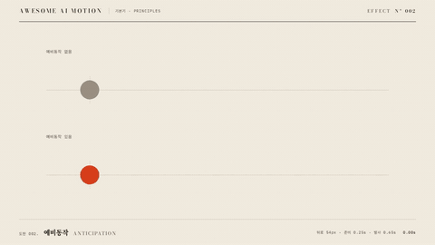

# Nº 002 예비동작 · Anticipation



[MP4](clip.mp4) · [HTML](index.html)

**주 동작 전에 반대 방향으로 짧게 움직여 다음 움직임을 예고하는 기법**

A brief movement in the opposite direction prepares the viewer for the main action.

| Family | Level | Purpose | Media | Runtime |
|---|---|---|---|---|
| 기본기 · PRINCIPLES | 기본 | 주목 끌기, 설명, 비교 | 설명 영상, 숏폼, 웹 UI | gsap |

다른 이름 / Also known as: 준비 동작, Wind-up, 예비 동작, anticipation-windup-chain, nudge-curve, Anticipatory back motion, 반대 방향 예비 동작, Anticipation Pose

## 선택 기준 / Selection

출발할 방향과 힘의 축적. 갑작스러운 이동을 따라보기 쉽게 한다 / Signals the direction of travel and a buildup of force, making sudden motion easier to follow.

- 캐릭터나 아이콘의 발사 방향을 예고할 때 / Signal the launch direction of a character or icon.
- 큰 이동 전에 시선을 준비시킬 때 / Prepare the viewer's attention before a large movement.

좋은 예 / Good: 주홍 점이 0.25초 동안 왼쪽 54px 물러나 납작해진 뒤 오른쪽으로 발사된다
나쁜 예 / Bad: 예비동작이 주 동작보다 길어서 사용자의 반응을 지연한다
주의 / Avoid: 즉시 응답해야 하는 반복 입력에는 넣지 않는다 · 예비 이동을 주 이동보다 크게 하지 않는다

## 파라미터 / Parameters

| Parameter | Default | Range | Note |
|---|---|---|---|
| 예비 거리 | 54px | 24~70px | 주 이동과 반대 방향 |
| 예비 지속 | 0.25s | 0.15~0.30s | 짧지만 눈에 보이는 준비 |
| 가로 변형 | 1.30 | 1.15~1.40 | 세로 배율은 가로 배율의 역수 |
| 발사 지속 | 0.65s | 0.4~0.9s | 준비 후 빠르게 출발 |

이징 / Ease: `power2.inOut 준비 / power3.out 발사`

## 구현 / Implementation (GSAP)

```js
tl.to('#plain',{x:730,duration:.65,ease:'power3.out'},.6);
tl.to('#ready',{x:-54,scaleX:1.3,scaleY:1/1.3,duration:.25,ease:'power2.inOut'},.6);
tl.to('#ready',{x:730,scaleX:1,scaleY:1,duration:.65,ease:'power3.out'},.85);
```

## 프롬프트 / Prompts

### 한국어 · Claude Code
```text
GSAP으로 <대상>에 예비동작을 넣어줘. 0.60초부터 0.25초 동안 왼쪽 54px 이동하고 scaleX 1.3, scaleY 1/1.3으로 납작하게 해. 0.85초부터 0.65초 동안 x 730px으로 발사하며 원형으로 돌아오고, 3.00초까지 도착 상태를 유지해.
```

### 한국어 · Codex
```text
<파일>의 아래 비교 줄에 예비동작을 적용해. 0.60초부터 0.25초간 x -54px, scaleX 1.3, scaleY 1/1.3, ease power2.inOut으로 준비하고 0.85초부터 0.65초간 x 730px, scale 1, ease power3.out으로 발사해. 0.73초에서 역방향 압축이 보이고 1.73초와 2.90초에서 같은 도착 상태인지 캡처해 확인해.
```

### English · Claude Code
```text
Add anticipation to <target> with GSAP. Starting at 0.60 seconds, move 54px left over 0.25 seconds and squash it with scaleX 1.3 and scaleY 1/1.3. Starting at 0.85 seconds, launch it to x 730px over 0.65 seconds while restoring its circular shape. Hold the arrival state until 3.00 seconds.
```

### English · Codex
```text
Apply anticipation to the lower comparison row in <file>. Starting at 0.60 seconds, prepare over 0.25 seconds with x -54px, scaleX 1.3, scaleY 1/1.3, and ease power2.inOut. Starting at 0.85 seconds, launch over 0.65 seconds with x 730px, scale 1, and ease power3.out. Capture at 0.73 seconds to verify the backward squash, and at 1.73 and 2.90 seconds to verify identical arrival states.
```

예시 / Example: 예비동작를 `.hero`에 적용해. / Apply Anticipation to `.hero`.

## 적용 / Application

- HyperFrames: 예비 tween과 발사 tween을 같은 paused 타임라인에 연속으로 배치한다
- ReelForge: 이동 비트 앞에 반대 방향 54px 준비 비트를 0.25초 넣는다
- Scrolline Deck: 전체 이동 진행률 앞부분에 짧은 역방향 변위를 배정한다

조합 / Pair with: [스쿼시 앤 스트레치 · Squash & Stretch](../squash-stretch/) · [이징 · Easing](../easing-curves/) · [팔로스루 · Follow-through](../follow-through/)

출처 / Sources: [Twelve basic principles of animation, Anticipation](https://en.wikipedia.org/wiki/Twelve_basic_principles_of_animation) (개념 인용) · motion dictionary 1-principles.md#3. 디즈니 12원칙 전체 (own) · [greensock/GSAP](https://gsap.com/docs/v3/Eases/) (GSAP Standard License) · [motiondesign.school](https://motiondesign.school/blog/animation-principles-in-logo-animation/) (unknown)

[목록 / Catalog](../../references/catalog.md) · [index.json](../../index.json)
