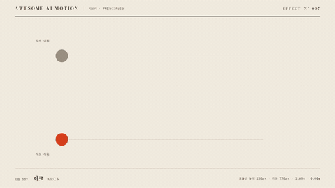

# Nº 007 아크 · Arcs



[MP4](clip.mp4) · [HTML](index.html)

**물체가 직선 대신 휘어진 궤적을 따라 이동하는 기법**

An object follows a curved trajectory instead of a straight line.

| Family | Level | Purpose | Media | Runtime |
|---|---|---|---|---|
| 기본기 · PRINCIPLES | 기본 | 설명, 비교, 순서·흐름 | 설명 영상, 숏폼, 발표 | gsap |

다른 이름 / Also known as: 곡선 이동, 포물선 궤적, Arc layout transfer, 곡선 레이아웃 이동, Projectile arc, 포물선 발사, Directional acceleration, 방향 가속 궤적

## 선택 기준 / Selection

회전과 반발에서 나오는 자연스러운 흐름 / Conveys the natural flow of rotation and bouncing motion.

- 공의 반발이나 던지기 궤적을 설명할 때 / Explain the trajectory of a bouncing or thrown ball.
- 직선 이동보다 유연한 공간 이동을 만들 때 / Create more fluid movement through space than a straight-line translation.

좋은 예 / Good: 점이 770px 이동하면서 높이 230px의 포물선을 그리고 지나간 자리에 점선이 남는다
나쁜 예 / Bad: 높이를 지나치게 키워 점이 화면 밖으로 나가거나 궤적의 방향을 읽을 수 없다
주의 / Avoid: 정확한 직선 추적을 설명할 때 사용하지 않는다 · 점선 궤적을 움직이는 점보다 강하게 강조하지 않는다

## 파라미터 / Parameters

| Parameter | Default | Range | Note |
|---|---|---|---|
| 수평 거리 | 770px | 300~850px | 양 끝점의 수평 간격 |
| 최고 높이 | 230px | 80~260px | 시작과 도착 기준선에서의 높이 |
| 지속 시간 | 1.65s | 1.0~2.0s | 곡선 전체의 이동 시간 |
| 궤적 점 간격 | 진행률 0.025 | 0.02~0.05 | 미리 계산한 점을 통과 시각에 표시 |

이징 / Ease: `none, 포물선 위치 수식`

## 구현 / Implementation (GSAP)

```js
const progress = {p:0};
tl.to('#straight',{x:770,duration:1.65,ease:'none'},.3);
tl.to(progress,{p:1,duration:1.65,ease:'none',onUpdate:()=>
  gsap.set('#arc',{x:770*progress.p,y:-4*230*progress.p*(1-progress.p)})
},.3);
```

## 프롬프트 / Prompts

### 한국어 · Claude Code
```text
GSAP으로 <대상> 점을 0.30초부터 1.65초 동안 오른쪽 770px 옮기며 최고 높이 230px의 포물선을 그려줘. 진행률 p에 따라 x=770*p, y=-4*230*p*(1-p)를 계산하고 0.025 간격의 회색 궤적 점을 통과한 뒤 남겨. 위에는 같은 시간의 회색 직선 비교를 두고 2.35초부터 3.00초까지 도착 상태를 유지해.
```

### 한국어 · Codex
```text
<파일>의 아래 이동 점에 프록시 p를 0에서 1로 tween하는 아크를 넣어. 시작 0.30초, 지속 1.65초, ease none으로 x 770*p와 y -4*230*p*(1-p)를 적용하고 궤적 점 41개를 순차 표시해. 0.73초와 1.23초에서 상승과 정점 근처를 확인하고 2.23초와 2.90초에서 완성 점선과 도착 위치가 같은지 캡처해 확인해.
```

### English · Claude Code
```text
Use GSAP to move the <target> dot 770px to the right starting at 0.30 seconds over 1.65 seconds, following a parabola with a peak height of 230px. For progress p, calculate x=770*p and y=-4*230*p*(1-p). Leave gray trajectory dots behind after passing them, spaced at 0.025 progress intervals. Above it, show a gray straight-line comparison with the same timing. Hold the arrival state from 2.35 to 3.00 seconds.
```

### English · Codex
```text
Add an arc to the lower moving dot in <file> by tweening proxy p from 0 to 1. Start at 0.30 seconds with duration 1.65 seconds and ease none. Apply x 770*p and y -4*230*p*(1-p), and reveal 41 trajectory dots sequentially. Capture at 0.73 and 1.23 seconds to check the ascent and near-apex position. Capture at 2.23 and 2.90 seconds to verify identical completed dotted paths and arrival positions.
```

예시 / Example: 아크를 `.hero`에 적용해. / Apply Arcs to `.hero`.

## 적용 / Application

- HyperFrames: 진행률 프록시 하나로 x와 포물선 y를 계산한다. MotionPath 플러그인은 필요 없다
- ReelForge: 수평 거리와 최고 높이를 파라미터로 두고 진행률별 위치를 계산한다
- Scrolline Deck: 스크롤 진행률 p를 x=D*p, y=-4*H*p*(1-p)에 직접 대입한다

조합 / Pair with: [스쿼시 앤 스트레치 · Squash & Stretch](../squash-stretch/) · [예비동작 · Anticipation](../anticipation/) · [타이밍과 간격 · Timing & Spacing](../timing-spacing/)

출처 / Sources: [Twelve basic principles of animation, Arc](https://en.wikipedia.org/wiki/Twelve_basic_principles_of_animation) (개념 인용) · [motiondivision/motion](https://motion.dev/docs/react-layout-animations) (MIT) · [greensock/GSAP](https://gsap.com/docs/v3/Plugins/MotionPathPlugin/) (GSAP Standard License) · [greensock/GSAP](https://gsap.com/docs/v3/Plugins/Physics2DPlugin/) (GSAP Standard License) · [heygen-com/hyperframes](https://raw.githubusercontent.com/heygen-com/hyperframes/main/registry/components/arc-motion-path/registry-item.json) (Apache-2.0) · [helpx.adobe.com](https://helpx.adobe.com/after-effects/desktop/animate-in-after-effects/animation-keyframes/keyframe-interpolation.html) (unknown) · motion dictionary 1-principles.md#3. 디즈니 12원칙 전체 (own) · [heygen-com/hyperframes](https://raw.githubusercontent.com/heygen-com/hyperframes/main/registry/components/offset-path-traveler/registry-item.json) (Apache-2.0)

[목록 / Catalog](../../references/catalog.md) · [index.json](../../index.json)
