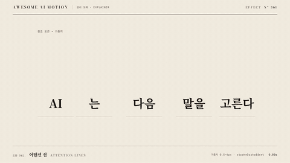

# Nº 361 어텐션 선 · Attention Lines



[MP4](clip.mp4) · [HTML](index.html)

**한 토큰이 참조하는 다른 토큰을 굵기와 진하기가 다른 호로 연결하는 움직임**

An animation that connects one token to the tokens it references using arcs of varying thickness and opacity.

| Family | Level | Purpose | Media | Runtime |
|---|---|---|---|---|
| 원리 도해 · EXPLAINER | 기본 | 설명, 순서·흐름 | 설명 영상, 발표, 스크롤덱 | gsap |

다른 이름 / Also known as: 주의 가중치, Attention Weights, Attention weight encoding, 어텐션 선 굵기

## 선택 기준 / Selection

같은 문장 안에서도 참조 비중은 토큰마다 다르다 / Shows that tokens in the same sentence carry different attention weights.

- 어텐션 가중치를 설명할 때 / When explaining attention weights
- 어떤 앞말에 집중하는지 보여줄 때 / When showing which preceding words receive attention

좋은 예 / Good: 고른다에서 다음으로 향하는 호가 가장 굵게 그려진다
나쁜 예 / Bad: 모든 호를 같은 굵기로 그려 가중치 차이가 사라진다
주의 / Avoid: 예시 가중치를 실제 모델 측정치로 오해시키지 않는다 · 모든 연결을 주홍으로 칠하지 않는다

## 파라미터 / Parameters

| Parameter | Default | Range | Note |
|---|---|---|---|
| 선 굵기 | 0.5~6px | 0.5~8px | 가중치 비례 |
| 호 그리기 | 1.15s | 0.8~1.4s | 출발점부터 연결 |
| 시간차 | 0.12s | 0.06~0.15s | 연결 순서 |
| 진하기 | 0.25~0.9 | 0.2~1 | 굵기와 함께 비중 표시 |

이징 / Ease: `power2.inOut`

## 구현 / Implementation (GSAP)

```js
const tl = Motion.timeline();
tl.from('.source',{color:'var(--ink)',duration:.3},.3);
tl.to('path',{strokeDashoffset:0,duration:1.15,stagger:.12,ease:'power2.inOut'},.45);
tl.to('.weights',{opacity:1,duration:.35},1.9);
```

## 프롬프트 / Prompts

### 한국어 · Claude Code
```text
<대상>의 마지막 토큰을 주홍으로 강조하고 다른 네 토큰으로 SVG 호를 그린다. pathLength를 1로 두고 0.45초부터 strokeDashoffset을 1에서 0으로 1.15초 power2.inOut, 0.12초 stagger로 바꾼다. 선 굵기는 1.5, 0.5, 6, 3px이고 진하기는 0.35, 0.25, 0.9, 0.6으로 한다. 3초 타임라인 하나로 만들고 마지막 0.6초는 정지한다.
```

### 한국어 · Codex
```text
<파일>의 <대상>에 <대상>의 마지막 토큰을 주홍으로 강조하고 다른 네 토큰으로 SVG 호를 그린다. pathLength를 1로 두고 0.45초부터 strokeDashoffset을 1에서 0으로 1.15초 power2.inOut, 0.12초 stagger로 바꾼다. 선 굵기는 1.5, 0.5, 6, 3px이고 진하기는 0.35, 0.25, 0.9, 0.6으로 한다. 0.24초, 1.25초, 2.9초를 캡처해 출발 토큰, 호의 성장, 가중치별 굵기 차이를 확인한다. 시간은 GSAP 타임라인만 사용한다.
```

### English · Claude Code
```text
Highlight the last token in <target> in vermilion and draw SVG arcs to four other tokens. Set pathLength to 1. Starting at 0.45 seconds, animate strokeDashoffset from 1 to 0 over 1.15 seconds with power2.inOut and a 0.12-second stagger. Use stroke widths of 1.5, 0.5, 6, 3px and opacities of 0.35, 0.25, 0.9, 0.6. Use a single 3-second timeline and hold still for the final 0.6 seconds.
```

### English · Codex
```text
In <target> in <file>, Highlight the last token in <target> in vermilion and draw SVG arcs to four other tokens. Set pathLength to 1. Starting at 0.45 seconds, animate strokeDashoffset from 1 to 0 over 1.15 seconds with power2.inOut and a 0.12-second stagger. Use stroke widths of 1.5, 0.5, 6, 3px and opacities of 0.35, 0.25, 0.9, 0.6. Capture at 0.24, 1.25, and 2.9 seconds to check the source token, arc growth, and stroke-width differences by weight. Use only a GSAP timeline for timing.
```

예시 / Example: 어텐션 선를 `.hero`에 적용해. / Apply Attention Lines to `.hero`.

## 적용 / Application

- HyperFrames: 3초 paused GSAP 타임라인 하나로 구성하고 Motion.ready()로 seek를 노출한다. SVG pathLength=1과 dashoffset 1→0을 사용하고 굵기와 opacity를 고정 가중치로 둔다.
- ReelForge: 3초 장면 안의 요소를 분리하고 transform과 opacity 트랙으로 같은 순서를 구현한다. SVG pathLength=1과 dashoffset 1→0을 사용하고 굵기와 opacity를 고정 가중치로 둔다.
- Scrolline Deck: 0.3~2.4초 동작을 스크롤 진행률 10~80%로 매핑하고 끝 20%를 완성 상태로 둔다. SVG pathLength=1과 dashoffset 1→0을 사용하고 굵기와 opacity를 고정 가중치로 둔다.

조합 / Pair with: [토큰 쪼개기 · Token Split](../token-split/) · [선 그리기 · Line Draw](../line-draw/) · [하이라이트 스윕 · Highlight Sweep](../highlight-sweep/)

출처 / Sources: [Attention Is All You Need](https://arxiv.org/abs/1706.03762) (개념 참고) · motion dictionary 3-type-data-ui.md#30. 어텐션 선 굵기 · Attention weight encoding (own)

[목록 / Catalog](../../references/catalog.md) · [index.json](../../index.json)
