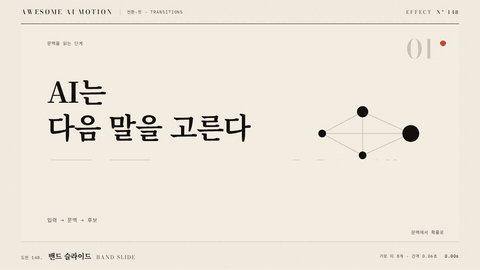

# Nº 148 밴드 슬라이드 · Band Slide



[MP4](clip.mp4) · [HTML](index.html)

**가로나 세로로 나눈 영상 띠가 조금씩 다른 시점이나 방향으로 이동하며 다음 화면이 나타난다**

Video bands split horizontally or vertically slide at slightly different timings to reveal the next screen.

| Family | Level | Purpose | Media | Runtime |
|---|---|---|---|---|
| 전환·컷 · TRANSITIONS | 기본 | 전환, 순서·흐름 | 발표, 설명 영상, 웹 UI | gsap |

다른 이름 / Also known as: 띠 슬라이드

## 선택 기준 / Selection

영상 띠들이 조금씩 다른 타이밍으로 밀려 나가고 다음 화면이 드러난다. 줄 단위의 리듬이 있다 / Gives a line-by-line rhythm to the whole frame.

- 목록, 표, 가로줄 구조의 화면을 줄 단위로 바꿔 넘길 때 / When switching a list, table, or row-structured screen line by line
- 발표 섹션 전환에서 정돈된 리듬을 만들 때 / To create a tidy rhythm in presentation section transitions

좋은 예 / Good: 화면을 가로 띠 8개로 나눠 40ms 간격으로 순서대로 오른쪽으로 밀려 나가며 750ms 안에 다음 화면이 완전히 드러난다
나쁜 예 / Bad: 띠 시차가 0.15초 이상이라 전체가 늦어지거나, 띠 경계에 1px 틈이 생겨 선이 보인다
주의 / Avoid: 띠 시차는 0.02~0.06초로 한다 · 띠 경계는 1px 겹치게 clip한다

## 파라미터 / Parameters

| Parameter | Default | Range | Note |
|---|---|---|---|
| 지속 | 750ms | 600~900ms | 띠 하나당 0.5s |
| 띠 수 | 8 | 6~12 | 135px 높이 |
| 시차 | 40ms | 20~60ms | 순차 |
| 이동량 | 1920px |  | 화면 폭 |
| 이징 | power3.inOut | power2~power4 |  |

## 구현 / Implementation (GSAP)

```js
for (let i = 0; i < 8; i++) {
  tl.to(`.band-${i}`, { x: 1920, duration: 0.47, ease: 'power3.inOut' }, i * 0.04);
} // 마지막 띠 종료 = 0.28 + 0.47 = 0.75s
```

## 프롬프트 / Prompts

### 한국어 · Claude Code
```text
<대상> 화면 전환에 밴드 슬라이드를 넣어줘. 화면을 가로 띠 8개(각 135px)로 나눠 각 띠가 x 1920까지 0.47초 power3.inOut으로 밀려 나가고, 띠 i는 i*0.04초 늦게 출발해. 마지막 띠가 0.75초에 끝나게 하고, 다음 장면은 아래에 미리 깔아 줘. 타임라인 하나로 seek 가능하게 해줘.
```

### 한국어 · Codex
```text
<파일>에 밴드 슬라이드를 구현해. 띠 8개, .band-i x 0에서 1920, duration 0.47, power3.inOut, position i*0.04. 0.15초, 0.3초, 0.5초, 0.75초 시점을 캡처해 띠가 위에서 아래로 순서대로 밀려 나가는지, 0.75초에 이전 장면이 없는지, 띠 경계에 틈이 없는지 확인해.
```

### English · Claude Code
```text
Add a Band Slide to <target>. Split the frame into 8 horizontal bands of 135px; each slides to x 1920 over 0.47s with power3.inOut, band i starting i*0.04s later, so the last band ends at 0.75s. Place the next scene underneath in advance. One seekable GSAP timeline.
```

### English · Codex
```text
Implement Band Slide in <file>. 8 bands; .band-i x 0 to 1920, duration 0.47, power3.inOut, position i*0.04. Capture at 0.15s, 0.3s, 0.5s, and 0.75s to confirm bands leave in order from top to bottom, the previous scene is gone at 0.75s, and there are no gaps at band boundaries.
```

예시 / Example: 밴드 슬라이드를 `.hero`에 적용해. / Apply Band Slide to `.hero`.

## 적용 / Application

- HyperFrames: 띠 8개를 clipPath 또는 overflow hidden 복제로 만들고 tl.to의 position을 i*0.04로 깐다. paused 타임라인에서 seek해도 순차가 유지된다
- ReelForge: 씬 워커 브리프에 띠 수 8, 시차 40ms, 방향을 싣고 다음 장면이 아래에 깔려 있도록 한다
- Scrolline Deck: scrub에서는 시차를 진행률 간격 0.05로 환산하고 각 띠의 이징은 ease-out 하나만 쓴다

조합 / Pair with: [스플릿 슬라이드 · Split Slide](../split-slide/) · [스태거 · Stagger](../stagger/) · [와이프 · Wipe](../wipe/)

출처 / Sources: [Adobe](https://helpx.adobe.com/premiere/desktop/add-video-effects/effects-and-transitions-library/list-of-video-transitions.html) (unknown)

[목록 / Catalog](../../references/catalog.md) · [index.json](../../index.json)
