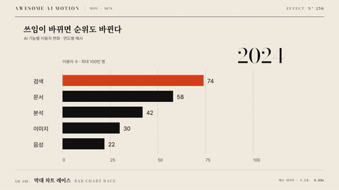

# Nº 250 막대 차트 레이스 · Bar Chart Race



[MP4](clip.mp4) · [HTML](index.html)

**시계열이 진행하며 막대 길이와 순위가 바뀌고 선두의 강조가 이동한다.**

Bar lengths and vertical ranks interpolate between time steps.

| Family | Level | Purpose | Media | Runtime |
|---|---|---|---|---|
| 데이터 · DATA | 고급 | 데이터 증명, 비교 | 설명 영상, 발표, 데이터 스토리 | svg |

다른 이름 / Also known as: 막대 순위 경주, Racing bars

## 선택 기준 / Selection

시간에 따른 경쟁과 추월을 보여준다. / Shows competition and overtaking over time.

- 연도별 상위 8개 제품의 매출과 순위가 함께 바뀐다. / Compare changing ranks over time.
- 시간에 따른 경쟁과 추월을 보여준다. 기준값과 대상을 함께 표시할 때. / Keep the encoded values, labels, and visual state synchronized.

좋은 예 / Good: 연도별 상위 8개 제품의 매출과 순위가 함께 바뀐다.
나쁜 예 / Bad: 축 범위 변화는 숨긴 채 길이만 비교한다.
주의 / Avoid: 연도와 축 최댓값을 항상 표시한다.

## 파라미터 / Parameters

| Parameter | Default | Range | Note |
|---|---|---|---|
| 전체 지속 | 12000ms | 8000~20000ms | 12개 단계 기준 |
| 단계 지속 | 1000ms | 600~1600ms | 순위 이동을 읽게 한다 |
| 표시 막대 | 8 | 5~12 | 동점은 고정 키로 정렬 |
| 행 간격 | 64px | 48~80px | 1920x1080 기준 |

이징 / Ease: `none`

## 구현 / Implementation (GSAP)

```js
const tl=gsap.timeline({paused:true});
frames.forEach((rows,k)=>{
 const ranked=[...rows].sort((a,b)=>b.value-a.value||a.id.localeCompare(b.id));
 const max=Math.max(1,...rows.map(r=>r.value));
 ranked.forEach((r,i)=>tl.to(bars[r.id],{attr:{width:900*r.value/max},y:i*64,duration:1,ease:'none'},k));
});
```

## 프롬프트 / Prompts

### 한국어 · Claude Code
```text
<파일>의 <대상>에 막대 차트 레이스을 적용해. 각 시점의 값과 정렬된 y 좌표를 보간하고 축 최대값을 함께 갱신한다. 전체 지속 12000ms; 단계 지속 1000ms; 표시 막대 8; 행 간격 64px을 적용한다. GSAP 코어의 paused 타임라인 하나로 seek 가능하게 만들고 임의 난수와 타이머를 쓰지 마.
```

### 한국어 · Codex
```text
<파일>의 설명 장면에서 <대상>에 막대 차트 레이스을 적용해. 각 시점의 값과 정렬된 y 좌표를 보간하고 축 최대값을 함께 갱신한다. 전체 지속 12000ms; 단계 지속 1000ms; 표시 막대 8; 행 간격 64px을 적용한다. 0초, 6초, 12초를 캡처해 시작 상태, 중간 진행, 최종 상태를 확인하고 같은 시각으로 다시 seek했을 때 좌표와 라벨이 같은지 검증해.
```

### English · Claude Code
```text
Implement Bar Chart Race on <target> in <file>. Animate 12 time steps over 12000ms, with 1000ms per step, 8 visible bars, and 64px row spacing. Update the axis maximum and year label at the same time. Use one paused GSAP core timeline, support seeking, and avoid random values and timers.
```

### English · Codex
```text
Implement Bar Chart Race on <target> in <file>. Animate 12 time steps over 12000ms, with 1000ms per step, 8 visible bars, and 64px row spacing. Update the axis maximum and year label at the same time. Use one paused GSAP core timeline, support seeking, and avoid random values and timers. Capture at 0s, 6s, and 12s to check the initial state, intermediate motion, and final state. Seek to each time again and verify identical geometry and labels.
```

예시 / Example: 막대 차트 레이스를 `.hero`에 적용해. / Apply Bar Chart Race to `.hero`.

## 적용 / Application

- HyperFrames: paused 타임라인에 막대 차트 레이스 상태를 넣고 seek 시 12초의 좌표와 색을 다시 계산한다.
- ReelForge: 씬 워커 브리프에 전체 지속 12000ms; 단계 지속 1000ms; 표시 막대 8; 행 간격 64px을 싣고 연도별 상위 8개 제품의 매출과 순위가 함께 바뀐다.
- Scrolline Deck: 진행률 0~1을 12초 구간에 매핑한다. scrub에서는 스프링 대신 power2.out을 쓰고 역방향에서도 라벨과 도형을 함께 갱신한다.

조합 / Pair with: [순위 재배치 · Rank Transition](../rank-transition/) · [카운트업 · Count-up](../count-up/)

출처 / Sources: [heygen-com/hyperframes](https://raw.githubusercontent.com/heygen-com/hyperframes/main/registry/blocks/bar-chart-race/registry-item.json) (Apache-2.0) · [Observable @d3](https://observablehq.com/@d3/bar-chart-race) (unknown) · [apache/echarts](https://echarts.apache.org/handbook/en/basics/release-note/v5-feature/) (Apache-2.0)

[목록 / Catalog](../../references/catalog.md) · [index.json](../../index.json)
