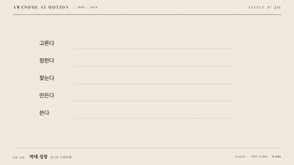

# Nº 241 막대 성장 · Bar Grow



[MP4](clip.mp4) · [HTML](index.html)

**막대가 기준점에서 값에 비례하는 길이까지 자라는 표현**

An animation in which bars grow from a baseline to lengths proportional to their values.

| Family | Level | Purpose | Media | Runtime |
|---|---|---|---|---|
| 데이터 · DATA | 기본 | 설명, 데이터 증명 | 설명 영상, 데이터 스토리, 발표 | gsap |

다른 이름 / Also known as: 막대 확장, Bar reveal, Scroll Progress Indicator, 스크롤 진행 표시, stat-bars-and-fills, directional-fill, Progress fill

## 선택 기준 / Selection

후보별 확률의 차이와 순위 / Shows differences in probability and ranking among candidates.

- 후보별 확률의 차이와 순위를 보여줄 때 / When showing differences in candidate probabilities and ranking
- 다음 단어 후보 확률을 같은 척도에서 길이로 비교한다와 같은 장면을 만들 때 / When comparing next-word candidate probabilities by length on a shared scale

좋은 예 / Good: 다음 단어 후보 확률을 같은 척도에서 길이로 비교한다
나쁜 예 / Bad: 각 막대를 같은 길이로 키워 확률 차이를 숨긴다
주의 / Avoid: 최종 상태를 0.5초 이상 유지한다 · 동일 화면에서 불필요한 주홍 강조를 추가하지 않는다

## 파라미터 / Parameters

| Parameter | Default | Range | Note |
|---|---|---|---|
| 확률 | 62·21·9·5·3% | 합계 100% | 길이는 동일 척도로 비교 |
| 지속 | 1.05s | 0.7~1.4s | 막대 성장 시간 |
| 스태거 | 0.08s | 0.04~0.12s | 위에서 아래로 출발 |
| 척도 | 10px/% | 6~12px/% | 62% 막대 길이 620px |

이징 / Ease: `power2.out`

## 구현 / Implementation (GSAP)

```js
tl.fromTo('.bar', {scaleX:0}, {scaleX:1,duration:1.05,stagger:.08,ease:'power2.out'},
  .3);
tl.to('.pct', {opacity:1,duration:.25,stagger:.08}, 1.4);
```

## 프롬프트 / Prompts

### 한국어 · Claude Code
```text
<대상>에 막대 성장 효과를 적용해. 다음 단어 후보 확률을 같은 척도에서 길이로 비교한다. 확률 62·21·9·5·3%; 지속 1.05s; 스태거 0.08s; 척도 10px/%로 만들고 이징은 power2.out를 써. GSAP 타임라인 하나로 제어하고 2.5초부터 3초까지 완성 상태를 유지해.
```

### 한국어 · Codex
```text
<파일>의 데이터 장면에 막대 성장 효과를 구현해. 확률 62·21·9·5·3%; 지속 1.05s; 스태거 0.08s; 척도 10px/%를 적용하고 이징은 power2.out로 지정해. 0초, 0.75초, 1.75초, 2.9초를 캡처해서 시작 상태와 진행 변화, 최종 상태의 잘림과 겹침을 확인해. Math.random과 타이머 없이 타임라인으로 재생하고 마지막 0.5초 이상 정지해.
```

### English · Claude Code
```text
Apply Bar Grow to <target>. Compare next-word candidate probabilities by bar length on a shared scale. Use these settings: probabilities 62·21·9·5·3%; duration 1.05s; stagger 0.08s; scale 10px/%; ease power2.out. Control everything with a single GSAP timeline and hold the completed state from 2.5 to 3 seconds.
```

### English · Codex
```text
Implement Bar Grow in the data scene in <file>. Use these settings: probabilities 62·21·9·5·3%; duration 1.05s; stagger 0.08s; scale 10px/%; ease power2.out. Capture at 0, 0.75, 1.75, and 2.9 seconds to check the initial state, progression, and any clipping or overlap in the final state. Play using a timeline without Math.random or timers, and hold still for at least the final 0.5 seconds.
```

예시 / Example: 막대 성장를 `.hero`에 적용해. / Apply Bar Grow to `.hero`.

## 적용 / Application

- HyperFrames: 하나의 paused GSAP 타임라인에 모든 동작을 넣고 3초 seek 가능한 장면으로 만든다
- ReelForge: 데이터 도형과 라벨을 분리하고 동일 시작 시각과 지속 시간을 씬 타임라인에 연결한다
- Scrolline Deck: 시간을 스크롤 진행률로 매핑하고 마지막 구간에서 최종값과 주석을 유지한다

조합 / Pair with: [카운트업 · Count-up](../count-up/) · [스태거 · Stagger](../stagger/) · [다음 말 고르기 · Next-token Pick](../next-token/)

출처 / Sources: [GSAP Timeline 공식 문서](https://gsap.com/docs/v3/GSAP/Timeline/) (문서 참조) · [magicuidesign/magicui](https://magicui.design/docs/components/scroll-progress) (MIT) · [ibelick/motion-primitives](https://motion-primitives.com/docs/scroll-progress) (MIT) · [ui.aceternity.com](https://ui.aceternity.com/components/tracing-beam) (unknown) · [heygen-com/hyperframes](https://raw.githubusercontent.com/heygen-com/hyperframes/main/registry/components/animated-bar-chart/registry-item.json) (Apache-2.0) · [heygen-com/hyperframes](https://raw.githubusercontent.com/heygen-com/hyperframes/main/registry/blocks/data-chart/registry-item.json) (Apache-2.0) · [heygen-com/hyperframes](https://raw.githubusercontent.com/heygen-com/hyperframes/main/registry/components/chart-story/registry-item.json) (Apache-2.0)

[목록 / Catalog](../../references/catalog.md) · [index.json](../../index.json)
