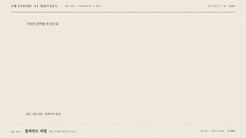

# Nº 029 블라인드 리빌 · Blinds Reveal



[MP4](clip.mp4) · [HTML](index.html)

**여러 띠나 블라인드가 조금씩 다른 시점에 열려 전체 이미지를 완성한다.**

Staggered strips open to assemble a complete image.

| Family | Level | Purpose | Media | Runtime |
|---|---|---|---|---|
| 등장·퇴장 · ENTRANCE & EXIT | 중급 | 주목 끌기, 전환 | 설명 영상, 웹 UI, 숏폼 | gsap |

다른 이름 / Also known as: Stripe Reveal, 줄무늬 셔터 리빌, line-sweep-diagonal-stripes, blinds-stripe-reveal

## 선택 기준 / Selection

분할된 조각이 합쳐지는 리듬을 느낀다. / Creates a rhythm of separate pieces becoming a whole.

- 포스터를 리듬 있게 공개할 때 / Use when presenting blinds reveal in a content reveal scene.
- 이미지를 띠 단위로 열 때 / Use for a focused title, image, or card with a clearly visible final state.

좋은 예 / Good: 여섯 띠가 0.05초씩 늦게 열려 0.65초에 사진을 완성한다.
나쁜 예 / Bad: 띠마다 이미지 좌표가 달라 완성 사진이 끊긴다.
주의 / Avoid: 띠마다 이미지 좌표가 달라 완성 사진이 끊긴다. · 완료 자세에서 내용이 가려지지 않게 한다.

## 파라미터 / Parameters

| Parameter | Default | Range | Note |
|---|---|---|---|
| 지속 | 0.4s | 0.28~0.56s | 0초부터 시작하는 공개 구간 |
| 띠 수 | 6 | 4~10 | 동일 이미지 좌표 유지 |
| 띠 간격 | 0.05s | 0.03~0.08s | 왼쪽부터 공개 |
| 이징 | power3.out | power2.out, power3.out, sine.inOut | 움직임의 가속과 감속 |

## 구현 / Implementation (GSAP)

```js
const strips = gsap.utils.toArray('.strip-window');
gsap.set(strips, {clipPath:'inset(0 100% 0 0)'});
tl.to(strips, {clipPath:'inset(0 0% 0 0)', duration:0.4, stagger:0.05, ease:'power3.out'}, 0);
```

## 프롬프트 / Prompts

### 한국어 · Claude Code
```text
<파일>에서 <대상>에 블라인드 리빌을 적용해. 0.4초, 띠 수 6; 띠 간격 0.05s, 이징 power3.out로 구현해. paused 타임라인으로 seek 가능하게 하고 완료 자세를 유지해.
```

### 한국어 · Codex
```text
<파일>의 <대상> 레이어에 블라인드 리빌을 적용해. 0.4초, 띠 수 6; 띠 간격 0.05s, power3.out를 사용하고 0초, 0.2초, 0.4초 캡처로 시작값, 중간 변화, 완료 자세를 확인해. 동일 시점을 두 번 seek해 같은 결과인지 검증해.
```

### English · Claude Code
```text
Apply Blinds Reveal to <target> in <file>. Use a 0.4s segment with power3.out; implement these explicit settings: Strip count: 6, Strip delay: 0.05s. Use a paused, seekable timeline and hold the final pose.
```

### English · Codex
```text
Apply Blinds Reveal to the <target> layer in <file> with Strip count: 6, Strip delay: 0.05s, using the supplied core snippet and a 0.4s segment with power3.out. Capture at 0s, 0.2s, and 0.4s to verify the initial pose, intermediate change, and final pose. Seek to the same timestamp twice and confirm identical output.
```

예시 / Example: 블라인드 리빌를 `.hero`에 적용해. / Apply Blinds Reveal to `.hero`.

## 적용 / Application

- HyperFrames: paused 타임라인에 0.4초 구간을 넣고 seek로 자세를 계산한다. 시작값과 완료값을 명시한다.
- ReelForge: 씬 워커 브리프에 블라인드 리빌, 0.4초, 띠 수 6; 띠 간격 0.05s, power3.out를 싣고 대상 레이어를 지정한다.
- Scrolline Deck: 진행률 0~1을 0.4초 구간에 매핑한다. scrub에서는 스프링 대신 ease-out으로 같은 시작값과 완료값을 보간한다.

조합 / Pair with: [페이드 슬라이드 · Fade Slide](../fade-slide/) · [스태거 · Stagger](../stagger/) · [스케일 팝 · Scale Pop](../scale-pop/)

출처 / Sources: gongnyang/reelforge (`gongnyang/reelforge:skills/reelforge/references/grammar/04-masks-mattes.md#line-sweep-diagonal-stripes`) (Apache-2.0) · gongnyang/reelforge (`gongnyang/reelforge:skills/reelforge/references/grammar/04-masks-mattes.md#blinds-stripe-reveal`) (Apache-2.0) · gongnyang/reelforge (`gongnyang/reelforge:skills/reelforge/references/gallery/gallery-index.json`) (Apache-2.0) · gongnyang/reelforge (`gongnyang/reelforge:skills/reelforge/references/gallery/fragments/object/blinds-stripe-triplet.html`) (Apache-2.0) · gongnyang/reelforge (`gongnyang/reelforge:skills/reelforge/references/gallery/fragments/object/blinds-stripe-triplet.meta.json`) (Apache-2.0)

[목록 / Catalog](../../references/catalog.md) · [index.json](../../index.json)
