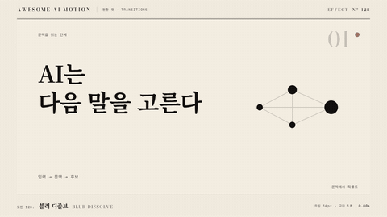

# Nº 128 블러 디졸브 · Blur Dissolve



[MP4](clip.mp4) · [HTML](index.html)

**두 장면이 흐려진 채 겹쳐 교체되고 새 장면이 다시 선명해지는 전환**

Two scenes overlap while blurred, swap, and the new scene sharpens back into focus.

| Family | Level | Purpose | Media | Runtime |
|---|---|---|---|---|
| 전환·컷 · TRANSITIONS | 기본 | 전환, 분위기 | 설명 영상, 발표, 숏폼 | css |

다른 이름 / Also known as: Blur through, Defocus dissolve, 초점 흐림 디졸브, Linear blur dissolve, 직선 블러 디졸브, Horizontal blur dissolve, 가로 블러 디졸브, VR spherical blur transition, 구면 블러 전환

## 선택 기준 / Selection

시간이 흐르거나 기억 속으로 들어가는 부드러운 분위기 변화. 컷의 각진 느낌 없이 초점이 옮겨 간다 / A soft shift in time or mood, as if focus is moving instead of the picture being cut.

- 시간이 지났거나 장소가 바뀌는 장면 사이를 부드럽게 이을 때 / Bridge a time skip or location change smoothly.
- 같은 톤의 두 화면을 컷 없이 이어 붙일 때 / Join two shots of a similar tone without a hard cut.

좋은 예 / Good: 앞 장면이 0.35초 동안 12px까지 흐려지며 사라지고, 뒤 장면이 12px 흐림에서 선명해지며 0.7초 안에 자리를 잡는다
나쁜 예 / Bad: 블러를 40px 이상 걸어 화면이 뭉개진 채 오래 머물거나, 흐림 없이 단순 페이드만 걸어 효과가 안 보인다
주의 / Avoid: 최대 블러 20px 초과 금지(해상도 높은 영상에서 렌더가 느려지고 뭉개진다) · 글자가 핵심인 장면은 블러 정점에서 글자가 읽히지 않으므로 정점 시간을 0.15초 이내로 줄인다

## 파라미터 / Parameters

| Parameter | Default | Range | Note |
|---|---|---|---|
| 전체 지속 | 0.7s | 0.5~1.0s | 교차점은 50% |
| 최대 블러 | 12px | 6~20px | 1920x1080 기준 |
| 교차 opacity | 0→1 / 1→0 | 선형~power1 | 정점에서 두 장면 합이 1 |
| 이징 | power1.inOut | sine~power2 | 강하게 걸면 블러가 튄다 |

## 구현 / Implementation (GSAP)

```js
tl.to('.a', { filter: 'blur(12px)', opacity: 0, duration: 0.7, ease: 'power1.inOut' }, 0)
  .fromTo('.b', { filter: 'blur(12px)', opacity: 0 },
    { filter: 'blur(0px)', opacity: 1, duration: 0.7, ease: 'power1.inOut' }, 0);
```

## 프롬프트 / Prompts

### 한국어 · Claude Code
```text
<대상A>와 <대상B> 장면 사이에 블러 디졸브를 GSAP로 만들어줘. A는 0.7초 동안 blur 0에서 12px로 흐려지며 opacity 0으로, B는 blur 12px에서 0으로 선명해지며 opacity 1로 가게 하고 이징은 power1.inOut, 시작 시각은 둘 다 같게 해. paused 타임라인 하나로 seek가 되게 해.
```

### 한국어 · Codex
```text
<파일>의 장면 경계에 블러 디졸브를 넣어. 앞 레이어 filter blur(0)에서 blur(12px)로, 뒤 레이어는 blur(12px)에서 blur(0)로 0.7초 동안 보간하고 ease power1.inOut을 쓴다. 0.35초 시점을 캡처해 두 장면이 모두 흐리고 절반씩 보이는지, 0.7초에 뒤 장면이 완전히 선명한지 확인해.
```

### English · Claude Code
```text
Build a blur dissolve between <targetA> and <targetB> in GSAP. Over 0.7 seconds, A blurs from 0 to 12px while fading to opacity 0, and B goes from 12px blur to 0 while fading to opacity 1. Use power1.inOut, start both at the same time, and keep everything in a single paused timeline that supports seeking.
```

### English · Codex
```text
Add a blur dissolve at the scene boundary in <file>. Tween the outgoing layer from blur(0) to blur(12px) and the incoming layer from blur(12px) to blur(0) over 0.7 seconds with ease power1.inOut. Capture at 0.35 seconds to confirm both scenes are blurred and half visible, and at 0.7 seconds to confirm the new scene is fully sharp.
```

예시 / Example: 블러 디졸브를 `.hero`에 적용해. / Apply Blur Dissolve to `.hero`.

## 적용 / Application

- HyperFrames: 두 레이어를 겹치고 filter와 opacity를 같은 paused 타임라인에서 보간한다. 블러 반경은 seek마다 같은 값이 나오도록 타임라인 값으로만 쓴다
- ReelForge: 씬 워커 브리프에 blurPx=12, durationMs=700, crossPoint=0.5를 실어 두 씬의 경계에서만 호출하게 한다
- Scrolline Deck: 진행률 p를 0~1로 받아 blur = 12*sin(pi*p)로 매핑한다. scrub에서는 스프링 대신 ease-out을 쓰고 정점이 진행률 0.5에 오게 한다

조합 / Pair with: [크로스페이드 · Crossfade](../crossfade/) · [블러 해제 · Blur Resolve](../blur-resolve/) · [딥 투 컬러 · Dip to Color](../dip-to-color/)

출처 / Sources: [heygen-com/hyperframes](https://raw.githubusercontent.com/heygen-com/hyperframes/main/registry/blocks/transitions-blur/registry-item.json) (Apache-2.0) · [gl-transitions/gl-transitions](https://github.com/gl-transitions/gl-transitions/blob/master/transitions/DefocusBlur.glsl) (MIT) · [remotion-dev/remotion](https://github.com/remotion-dev/remotion/blob/main/packages/template-prompt-to-video/src/lib/utils.ts) (Remotion License) · [mifi/editly](https://github.com/mifi/editly#transition-types) (MIT) · [gl-transitions/gl-transitions](https://github.com/gl-transitions/gl-transitions/blob/master/transitions/LinearBlur.glsl) (MIT)

[목록 / Catalog](../../references/catalog.md) · [index.json](../../index.json)
