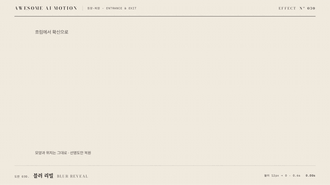

# Nº 030 블러 리빌 · Blur Reveal



[MP4](clip.mp4) · [HTML](index.html)

**흐릿한 글자나 이미지가 선명해지면서 나타난다.**

Blurred text or imagery resolves into sharp focus.

| Family | Level | Purpose | Media | Runtime |
|---|---|---|---|---|
| 등장·퇴장 · ENTRANCE & EXIT | 기본 | 주목 끌기, 전환 | 설명 영상, 웹 UI, 숏폼 | gsap |

다른 이름 / Also known as: Blur Resolve, 블러에서 선명, blur-dissolve-in, etch, Blur to focus entrance, 흐림에서 선명한 등장

## 선택 기준 / Selection

안개 속에서 내용이 확정되는 느낌을 준다. / Makes content feel as if it is emerging from mist.

- 짧은 제목이 초점을 찾게 할 때 / Use when presenting blur reveal in a content reveal scene.
- 이미지를 부드럽게 공개할 때 / Use for a focused title, image, or card with a clearly visible final state.

좋은 예 / Good: 제목이 12px 흐림에서 0.6초 동안 선명해진다.
나쁜 예 / Bad: 긴 본문에 블러를 오래 유지해 읽기를 지연한다.
주의 / Avoid: 긴 본문에 블러를 오래 유지해 읽기를 지연한다. · 완료 자세에서 내용이 가려지지 않게 한다.

## 파라미터 / Parameters

| Parameter | Default | Range | Note |
|---|---|---|---|
| 지속 | 0.6s | 0.42~0.84s | 0초부터 시작하는 공개 구간 |
| 시작 블러 | 12px | 6~16px | 작은 글자는 낮게 |
| 시작 불투명도 | 0 | 0~0.2 | 완료 시 1 |
| 이징 | power2.out | power2.out, power3.out, sine.inOut | 움직임의 가속과 감속 |

## 구현 / Implementation (GSAP)

```js
gsap.set('.target', {filter:'blur(12px)', opacity:0});
tl.to('.target', {filter:'blur(0px)', opacity:1, duration:0.6, ease:'power2.out'}, 0);
tl.set('.target', {filter:'none'}, 0.6);
```

## 프롬프트 / Prompts

### 한국어 · Claude Code
```text
<파일>에서 <대상>에 블러 리빌을 적용해. 0.6초, 시작 블러 12px; 시작 불투명도 0, 이징 power2.out로 구현해. paused 타임라인으로 seek 가능하게 하고 완료 자세를 유지해.
```

### 한국어 · Codex
```text
<파일>의 <대상> 레이어에 블러 리빌을 적용해. 0.6초, 시작 블러 12px; 시작 불투명도 0, power2.out를 사용하고 0초, 0.3초, 0.6초 캡처로 시작값, 중간 변화, 완료 자세를 확인해. 동일 시점을 두 번 seek해 같은 결과인지 검증해.
```

### English · Claude Code
```text
Apply Blur Reveal to <target> in <file>. Use a 0.6s segment with power2.out; implement these explicit settings: Initial blur: 12px, Initial opacity: 0. Use a paused, seekable timeline and hold the final pose.
```

### English · Codex
```text
Apply Blur Reveal to the <target> layer in <file> with Initial blur: 12px, Initial opacity: 0, using the supplied core snippet and a 0.6s segment with power2.out. Capture at 0s, 0.3s, and 0.6s to verify the initial pose, intermediate change, and final pose. Seek to the same timestamp twice and confirm identical output.
```

예시 / Example: 블러 리빌를 `.hero`에 적용해. / Apply Blur Reveal to `.hero`.

## 적용 / Application

- HyperFrames: paused 타임라인에 0.6초 구간을 넣고 seek로 자세를 계산한다. 시작값과 완료값을 명시한다.
- ReelForge: 씬 워커 브리프에 블러 리빌, 0.6초, 시작 블러 12px; 시작 불투명도 0, power2.out를 싣고 대상 레이어를 지정한다.
- Scrolline Deck: 진행률 0~1을 0.6초 구간에 매핑한다. scrub에서는 스프링 대신 ease-out으로 같은 시작값과 완료값을 보간한다.

조합 / Pair with: [페이드 슬라이드 · Fade Slide](../fade-slide/) · [스태거 · Stagger](../stagger/) · [스케일 팝 · Scale Pop](../scale-pop/)

출처 / Sources: [greensock/GSAP](https://gsap.com/docs/v3/GSAP/CorePlugins/CSS/) (GSAP Standard License) · [motiondivision/motion](https://motion.dev/docs/animate) (MIT) · gongnyang/reelforge (`gongnyang/reelforge:skills/reelforge/references/grammar/05-text-animator.md#blur-dissolve-in`) (Apache-2.0) · local/embedded-captions (`claude-skill:embedded-captions/references/motion-vocabulary.md`) (unknown) · local/music-to-video (`claude-skill:music-to-video/references/motion-primitive-catalog.md#blur-resolve`) (unknown)

[목록 / Catalog](../../references/catalog.md) · [index.json](../../index.json)
