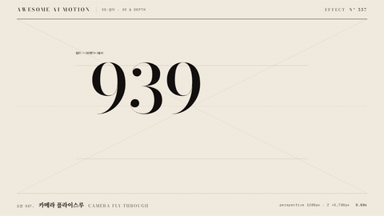

# Nº 557 카메라 플라이스루 · Camera Fly-through



[MP4](clip.mp4) · [HTML](index.html)

**깊이 900px 간격의 일곱 평면을 카메라가 통과하며 마지막 핵심어에 멈춘다**

A camera flies through seven planes spaced 900px apart and stops on the final keyword.

| Family | Level | Purpose | Media | Runtime |
|---|---|---|---|---|
| 3D·깊이 · 3D & DEPTH | 고급 | 주목 끌기, 순서·흐름, 전환 | 설명 영상, 숏폼, 스크롤덱, 발표 | gsap |

다른 이름 / Also known as: 깊이 관통, Z camera travel

## 선택 기준 / Selection

정보 층을 통과하는 깊이와 전진감 / Depth and forward momentum through successive information layers.

- 여러 정보 층을 관통해 핵심 결론으로 들어갈 때 / Travel through layers of information to reach a conclusion.
- 입력에서 출력까지 전진하는 흐름을 보여줄 때 / Show forward progress from input to output.

좋은 예 / Good: 원근 1200px에서 월드 Z를 −300px부터 5400px로 옮기고 가까운 평면을 투명하게 통과해 다음 말에 정지한다
나쁜 예 / Bad: 각 평면에 scale만 걸어 깊이 간격과 실제 Z 이동이 보이지 않는다
주의 / Avoid: 눈앞의 평면을 불투명하게 남겨 화면을 막지 않는다 · 원근값을 너무 작게 잡아 글자를 왜곡하지 않는다

## 파라미터 / Parameters

| Parameter | Default | Range | Note |
|---|---|---|---|
| 원근 | 1200px | 900~1600px | 고정 scene에 적용 |
| 깊이 간격 | 900px | 750~1100px | 평면 7장 |
| 월드 Z 이동 | −300 → 5400px | 4500~7000px | 마지막 평면의 Z를 0으로 정렬 |
| 이동 시간 | 3.3s | 2.8~3.5s | 0.2초 시작 후 0.5초 홀드 |
| 통과 페이드 | 상대 Z 100~650px | 100~750px | 카메라에 가까워지면 사라짐 |

이징 / Ease: `sine.inOut`

## 구현 / Implementation (GSAP)

```js
const camera = {z:-300};
planes.forEach((el,i)=>gsap.set(el,{z:-i*900}));
function draw(){
  world.style.transform = `translateZ(${camera.z}px)`;
  planes.forEach((el,i)=>{const d=camera.z-i*900; el.style.opacity=Math.max(0,Math.min(1,(d+1000)/600,(650-d)/550));});
}
tl.to(camera,{z:5400,duration:3.3,ease:'sine.inOut',onUpdate:draw},.2);
```

## 프롬프트 / Prompts

### 한국어 · Claude Code
```text
<대상>에 고정 무대에 perspective 1200px를 두고 preserve-3d 월드 안의 평면 7장을 Z 0부터 −5400px까지 900px 간격으로 배치한다. 월드 Z를 −300px에서 5400px로 3.3초간 sine.inOut 이동하고 상대 Z 100~650px에서 가까운 평면을 투명하게 만든 뒤 마지막 핵심어를 0.5초 홀드한다. 종이·먹·주홍 한 점과 큰 숫자·세리프 문장을 사용하고 타이머 없이 한 GSAP 타임라인으로 구현한다.
```

### 한국어 · Codex
```text
<파일>에 고정 무대에 perspective 1200px를 두고 preserve-3d 월드 안의 평면 7장을 Z 0부터 −5400px까지 900px 간격으로 배치한다. 월드 Z를 −300px에서 5400px로 3.3초간 sine.inOut 이동하고 상대 Z 100~650px에서 가까운 평면을 투명하게 만든 뒤 마지막 핵심어를 0.5초 홀드한다. 0.3초·1.0초·2.3초·3.8초를 캡처해 평면이 확대되며 관통하고 마지막 주홍 핵심어가 잘리지 않는지 확인한다.
```

### English · Claude Code
```text
Apply this effect to <대상>. Use perspective 1,200px and preserve-3d. Space seven planes 900px apart from Z 0 to −5,400px, move the world from −300px to 5,400px in 3.3 seconds with sine.inOut, and fade each near plane at relative Z 100 to 650px. Hold the final keyword for 0.5 seconds. Use paper, ink, a single scarlet focus, large numerals and serif text in one seekable GSAP timeline.
```

### English · Codex
```text
Implement in <파일>. Use perspective 1,200px and preserve-3d. Space seven planes 900px apart from Z 0 to −5,400px, move the world from −300px to 5,400px in 3.3 seconds with sine.inOut, and fade each near plane at relative Z 100 to 650px. Hold the final keyword for 0.5 seconds. Capture 0.3, 1.0, 2.3 and 3.8 seconds to verify plane crossings, scale growth and an intact final keyword.
```

예시 / Example: 카메라 플라이스루를 `.hero`에 적용해. / Apply Camera Fly-through to `.hero`.

## 적용 / Application

- HyperFrames: 고정 무대에 perspective 1200px를 두고 preserve-3d 월드 안의 평면 7장을 Z 0부터 −5400px까지 900px 간격으로 배치한다. 월드 Z를 −300px에서 5400px로 3.3초간 sine.inOut 이동하고 상대 Z 100~650px에서 가까운 평면을 투명하게 만든 뒤 마지막 핵심어를 0.5초 홀드한다 하나의 paused 타임라인에서 프록시와 월드 이동을 관리한다.
- ReelForge: 고정 무대에 perspective 1200px를 두고 preserve-3d 월드 안의 평면 7장을 Z 0부터 −5400px까지 900px 간격으로 배치한다. 월드 Z를 −300px에서 5400px로 3.3초간 sine.inOut 이동하고 상대 Z 100~650px에서 가까운 평면을 투명하게 만든 뒤 마지막 핵심어를 0.5초 홀드한다 효과 씬의 월드 이동과 단계 수를 파라미터로 노출한다.
- Scrolline Deck: 고정 무대에 perspective 1200px를 두고 preserve-3d 월드 안의 평면 7장을 Z 0부터 −5400px까지 900px 간격으로 배치한다. 월드 Z를 −300px에서 5400px로 3.3초간 sine.inOut 이동하고 상대 Z 100~650px에서 가까운 평면을 투명하게 만든 뒤 마지막 핵심어를 0.5초 홀드한다 재생 시간 대신 스크롤 진행률 0~1을 같은 진행 구간으로 매핑한다.

조합 / Pair with: [패럴랙스 · Parallax](../parallax/) · [랙 포커스 · Rack Focus](../rack-focus/) · [줌 전환 · Zoom Through](../zoom-through/)

출처 / Sources: [GSAP Tween documentation](https://gsap.com/docs/v3/GSAP/Tween/) (공식 문서 개념 참조)

[목록 / Catalog](../../references/catalog.md) · [index.json](../../index.json)
