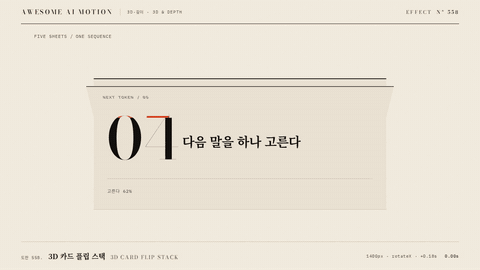

# Nº 558 3D 카드 플립 스택 · 3D Card Flip Stack



[MP4](clip.mp4) · [HTML](index.html)

**겹친 종이 다섯 장이 순차로 뒤집혀 뒤로 쌓이는 3D 전환**

Five overlapping paper sheets flip in sequence and stack behind a frontal final card.

| Family | Level | Purpose | Media | Runtime |
|---|---|---|---|---|
| 3D·깊이 · 3D & DEPTH | 고급 | 주목 끌기, 설명, 전환 | 설명 영상, 숏폼, 발표 | gsap |

## 선택 기준 / Selection

순서가 넘어가며 최종 선택이 남는 느낌 / A sequence advances and leaves the final selection in focus.

- 다섯 단계의 마지막 결과를 드러낼 때 / Reveal the result of a five-step sequence.
- 종이 도판을 넘기며 선택을 보여줄 때 / Show selection by turning editorial paper sheets.

좋은 예 / Good: 종이 네 장이 0.18초 간격으로 넘어가고 주홍 05가 정면에 선다
나쁜 예 / Bad: 그림자와 둥근 테두리로 카드 UI처럼 꾸민다
주의 / Avoid: 종이 면은 paper2만 쓴다 · 그림자를 쓰지 않는다 · 앞면 문장 읽기가 필요하면 속도를 낮춘다

## 파라미터 / Parameters

| Parameter | Default | Range | Note |
|---|---|---|---|
| 원근 | 1400px | 900~1600px | 스택 부모에 적용 |
| 시차 | 0.18s | 0.15~0.25s | 카드 출발 간격 |
| 플립 각도 | -115° | -100~-135° | 회전 뒤 -22도로 쌓인다 |
| 뒷층 깊이 | -420px | -300~-550px | 각 장마다 -55px 추가 |

이징 / Ease: `power2.inOut / power2.out / power3.out / sine.inOut`

## 구현 / Implementation (GSAP)

```js
for(let i=0;i<4;i++){
  const start=.38+i*.18;
  tl.to('#card'+i,{rotationX:-115,y:-145,z:90,duration:.65,ease:'power2.inOut'},start);
  tl.to('#card'+i,{rotationX:-22,y:-115-i*16,z:-420-i*55,duration:.75,ease:'power2.out'},start+.65);
}
tl.to('#card4',{rotationX:0,y:0,z:0,duration:1.1,ease:'power3.out'},1.1);
```

## 프롬프트 / Prompts

### 한국어 · Claude Code
```text
<대상>에 원근 1400px에서 종이 5장을 z 65px 간격으로 겹친다. 네 장을 0.38+i*0.18초에 rotateX -115도로 0.65초 회전하고 0.75초 동안 z -420-i*55px, rotateX -22도로 뒤에 쌓는다. 마지막 주홍 05는 정면으로 1.1초 동안 올라오고 3.3초부터 홀드. 종이·먹·주홍 한 곳으로 구성하고 한 paused GSAP 타임라인을 쓴다.
```

### 한국어 · Codex
```text
<파일>에 원근 1400px에서 종이 5장을 z 65px 간격으로 겹친다. 네 장을 0.38+i*0.18초에 rotateX -115도로 0.65초 회전하고 0.75초 동안 z -420-i*55px, rotateX -22도로 뒤에 쌓는다. 마지막 주홍 05는 정면으로 1.1초 동안 올라오고 3.3초부터 홀드. 0.33초, 1.67초, 2.33초, 3.87초 캡처로 깊이 변화, 잘림, 마지막 정지를 확인한다.
```

### English · Claude Code
```text
Apply this effect to <대상>. Use perspective 1400px and five paper sheets separated by 65px in z. Flip four sheets to rotateX -115deg for 0.65s starting at 0.38+i*0.18s, then stack them at z -420-i*55px and rotateX -22deg over 0.75s. Bring the vermilion 05 sheet to the front over 1.1s and hold from 3.3s. Use paper, ink and one vermilion focus with a single paused GSAP timeline.
```

### English · Codex
```text
Implement in <파일>. Use perspective 1400px and five paper sheets separated by 65px in z. Flip four sheets to rotateX -115deg for 0.65s starting at 0.38+i*0.18s, then stack them at z -420-i*55px and rotateX -22deg over 0.75s. Bring the vermilion 05 sheet to the front over 1.1s and hold from 3.3s. Capture at 0.33s, 1.67s, 2.33s and 3.87s to verify depth, clipping and the final hold.
```

예시 / Example: 3D 카드 플립 스택를 `.hero`에 적용해. / Apply 3D Card Flip Stack to `.hero`.

## 적용 / Application

- HyperFrames: 원근 1400px에서 종이 5장을 z 65px 간격으로 겹친다. 네 장을 0.38+i*0.18초에 rotateX -115도로 0.65초 회전하고 0.75초 동안 z -420-i*55px, rotateX -22도로 뒤에 쌓는다. 마지막 주홍 05는 정면으로 1.1초 동안 올라오고 3.3초부터 홀드. 한 paused 타임라인으로 seek한다.
- ReelForge: 원근 1400px에서 종이 5장을 z 65px 간격으로 겹친다. 네 장을 0.38+i*0.18초에 rotateX -115도로 0.65초 회전하고 0.75초 동안 z -420-i*55px, rotateX -22도로 뒤에 쌓는다. 마지막 주홍 05는 정면으로 1.1초 동안 올라오고 3.3초부터 홀드. 장면의 월드 래퍼 안에 배치한다.
- Scrolline Deck: 원근 1400px에서 종이 5장을 z 65px 간격으로 겹친다. 네 장을 0.38+i*0.18초에 rotateX -115도로 0.65초 회전하고 0.75초 동안 z -420-i*55px, rotateX -22도로 뒤에 쌓는다. 마지막 주홍 05는 정면으로 1.1초 동안 올라오고 3.3초부터 홀드. 4초 타임라인을 스크롤 진행률 0~1에 대응한다.

조합 / Pair with: [스태거 · Stagger](../stagger/) · [오버랩 · Overlapping Action](../overlapping-action/) · [3D 원근 틸트 리빌 · Perspective Tilt Reveal](../perspective-tilt/)

출처 / Sources: [GSAP CSSPlugin 3D transforms](https://gsap.com/docs/v3/GSAP/CorePlugins/CSS/) (공식 문서 개념 참고)

[목록 / Catalog](../../references/catalog.md) · [index.json](../../index.json)
