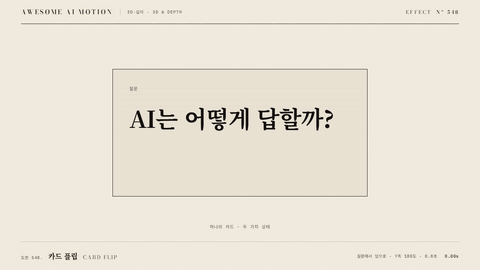

# Nº 548 카드 플립 · Card Flip



[MP4](clip.mp4) · [HTML](index.html)

**카드가 세로축이나 가로축으로 180도 돌아 앞면에서 뒷면으로 바뀌는 움직임**

A card rotates 180 degrees around its vertical or horizontal axis to swap front for back.

| Family | Level | Purpose | Media | Runtime |
|---|---|---|---|---|
| 3D·깊이 · 3D & DEPTH | 기본 | 설명, 전환 | 숏폼, 웹 UI, 설명 영상 | css |

다른 이름 / Also known as: 카드 뒤집기, 3D card flip, 3D 카드 뒤집기, Rotate and Flip, 회전과 뒤집기, 3D Layer Flip, 3D 레이어 플립

## 선택 기준 / Selection

같은 대상의 다른 면이나 다른 상태가 있다는 것을 물리적으로 보여 준다. 화면이 갈리지 않고 한 장이 뒤집혔다는 연속성이 남는다 / Shows that one object has another side or state. Because the same card turns over, the change reads as continuous rather than a cut.

- 질문 카드를 뒤집어 답을 보여 줄 때 / Flip a question card to reveal the answer.
- 전과 후, 문제와 해결처럼 한 대상의 두 상태를 대비할 때 / Contrast two states of one object, such as before and after.
- 제품 카드 앞면의 이름에서 뒷면의 사양으로 넘어갈 때 / Move from a product card's name on the front to its specs on the back.

좋은 예 / Good: 질문 카드가 0.8초 동안 Y축으로 돌아 뒷면에 답이 나타나고, 90도 지점에서 면이 바뀌는 순간 카드 폭이 가장 얇아진다
나쁜 예 / Bad: 회전이 0.3초 이하로 빨라 뒷면을 읽을 틈이 없거나, 뒷면 글자가 좌우 반전된 채 나온다
주의 / Avoid: backface-visibility를 숨기지 않으면 두 면이 겹쳐 보인다 · perspective 없이 돌리면 납작하게 줄어들기만 해 입체감이 사라진다 · 한 화면에서 3장 넘게 동시에 뒤집지 않는다

## 파라미터 / Parameters

| Parameter | Default | Range | Note |
|---|---|---|---|
| 회전 시간 | 0.8s | 0.5~1.2s | 짧으면 면 교체가 안 읽힘 |
| 회전각 | 180deg | 180 또는 -180 | 한 방향으로만 돌린다 |
| perspective | 900px | 700~1400px | 작을수록 원근이 과장됨 |
| 뒷면 정지 | 1.2s | 0.8~2.0s | 뒷면을 읽는 시간 |
| 이징 | power2.inOut | power1~power3 | 중간에 가장 빠르게 |

## 구현 / Implementation (GSAP)

```js
gsap.set('.stage', { perspective: 900 });
gsap.set('.card', { transformStyle: 'preserve-3d' });
// .face { backface-visibility: hidden } .back { transform: rotateY(180deg) }
tl.to('.card', { rotationY: 180, duration: 0.8, ease: 'power2.inOut' }, 0.5);
```

## 프롬프트 / Prompts

### 한국어 · Claude Code
```text
GSAP 타임라인으로 <대상> 카드를 Y축으로 180도 뒤집어 줘. 부모에 perspective 900px, 카드에 transform-style preserve-3d를 주고 두 면은 backface-visibility hidden으로 겹쳐 놓아. 0.5초에 시작해 0.8초 동안 power2.inOut으로 돌리고 뒷면을 1.2초 보여 줘. transform만 쓰고 paused 타임라인 하나로 seek 가능하게 해.
```

### 한국어 · Codex
```text
<파일>의 카드에 플립을 적용해. .stage perspective 900px, .card preserve-3d, 앞뒤 면은 backface-visibility hidden에 뒷면 rotateY(180deg). tween은 position 0.5, duration 0.8, rotationY 180, ease power2.inOut. 0.5초, 0.9초, 1.4초 시점을 캡처해 시작은 앞면, 0.9초 근처에서 폭이 가장 좁고, 1.4초에는 뒷면 글자가 정방향인지 확인해.
```

### English · Claude Code
```text
Use GSAP to flip <target> 180 degrees around the Y axis. Give the parent perspective 900px and the card transform-style preserve-3d, with both faces stacked and backface-visibility hidden. Start at 0.5 seconds, rotate for 0.8 seconds with power2.inOut, then hold the back for 1.2 seconds. Use transforms only and one paused timeline so it can be seeked.
```

### English · Codex
```text
Apply a card flip in <file>. .stage perspective 900px, .card preserve-3d, both faces backface-visibility hidden, back face rotateY(180deg). Tween at position 0.5, duration 0.8, rotationY 180, ease power2.inOut. Capture at 0.5, 0.9 and 1.4 seconds: front face at the start, narrowest width near 0.9, and un-mirrored back text at 1.4.
```

예시 / Example: 카드 플립를 `.hero`에 적용해. / Apply Card Flip to `.hero`.

## 적용 / Application

- HyperFrames: card 요소의 rotationY만 paused 타임라인에 걸고 두 면은 정적 마크업으로 둔다. seek 시 면 교체가 90도에서 일어나는지 0.9초 캡처로 본다
- ReelForge: 씬 워커 브리프에 앞면 문구, 뒷면 문구, 회전축(Y/X), 회전 시간 0.8s를 파라미터로 싣는다. 뒷면은 별도 슬롯으로 받는다
- Scrolline Deck: 진행률 0~1을 rotationY 0~180에 직선 매핑하고 이징은 ease-out으로 둔다. 스프링은 scrub에서 튀므로 쓰지 않는다

조합 / Pair with: [이징 · Easing](../easing-curves/) · [3D 원근 틸트 리빌 · Perspective Tilt Reveal](../perspective-tilt/) · [타일 플립 · Tile Flip](../tile-flip/) · [크로스페이드 · Crossfade](../crossfade/)

출처 / Sources: [heygen-com/hyperframes](https://raw.githubusercontent.com/heygen-com/hyperframes/main/registry/blocks/transitions-3d/registry-item.json) (Apache-2.0) · [pmndrs/react-spring](https://www.react-spring.dev/examples) (MIT) · [animate-css/animate.css](https://github.com/animate-css/animate.css) (Hippocratic-2.1) · [helpx.adobe.com](https://helpx.adobe.com/after-effects/desktop/work-with-layers/3d-layers/3d-layers.html) (unknown) · local/HyperFrames-skills (`claude-skill:hyperframes-animation/transitions/css-3d.md`) (unknown)

[목록 / Catalog](../../references/catalog.md) · [index.json](../../index.json)
