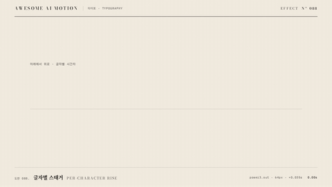

# Nº 088 글자별 스태거 · Per-character Rise



[MP4](clip.mp4) · [HTML](index.html)

**글자들이 아래에서 위로 시간차를 두고 올라오며 불투명해지는 효과**

Characters rise from below and fade in with a staggered delay.

| Family | Level | Purpose | Media | Runtime |
|---|---|---|---|---|
| 타이포 · TYPOGRAPHY | 기본 | 주목 끌기, 순서·흐름 | 설명 영상, 숏폼, 웹 UI | gsap |

다른 이름 / Also known as: 글자 상승, Character stagger, 글자 시간차 등장, 글자 순차 등장, Text Scale Cascade, 글자 스케일 캐스케이드, scale-jump-stairstep, word-pop

## 선택 기준 / Selection

제목의 읽는 방향과 순차적 등장 / Communicates the reading direction and sequential entrance of a title.

- 짧은 제목을 읽는 순서대로 등장시킬 때 / Reveal a short title in reading order.
- 문장이 한 덩어리로 나타나는 것보다 리듬을 주고 싶을 때 / Add rhythm to a sentence's entrance.

좋은 예 / Good: 각 글자가 아래 64px에서 0.035초 간격으로 출발해 같은 기준선에 정렬된다
나쁜 예 / Bad: 글자 간격이 너무 커 문장이 서로 떨어진 덩어리로 읽힌다
주의 / Avoid: 긴 본문을 글자마다 움직이지 않는다 · 출발 거리와 간격을 동시에 크게 늘리지 않는다

## 파라미터 / Parameters

| Parameter | Default | Range | Note |
|---|---|---|---|
| 글자 간격 | 0.035s | 0.02~0.06s | 공백 span을 포함한다 |
| 상승 거리 | 64px | 32~80px | 양의 y에서 0으로 이동한다 |
| 글자 지속 | 0.62s | 0.40~0.80s | 불투명도와 이동을 같이 끝낸다 |
| 시작 시각 | 0.30s | 0.20~0.40s | 첫 글자 출발 |

이징 / Ease: `power3.out`

## 구현 / Implementation (GSAP)

```js
tl.fromTo('.char', {y:64, opacity:0}, {
 y:0, opacity:1, duration:.62,
 stagger:.035, ease:'power3.out'
}, .3);
```

## 프롬프트 / Prompts

### 한국어 · Claude Code
```text
<대상>에 이 효과를 적용하라. AI는 다음 말을 고른다를 공백을 보존한 개별 span으로 나누어라. 0.30초부터 글자마다 0.035초 간격으로 y 64px와 opacity 0에서 y 0과 opacity 1로 0.62초 동안 power3.out으로 상승시켜라. 3초 타임라인 안에서 마지막 0.6초는 완성 상태로 정지하라.
```

### 한국어 · Codex
```text
<파일>의 텍스트 장면에 적용하라. AI는 다음 말을 고른다를 공백을 보존한 개별 span으로 나누어라. 0.30초부터 글자마다 0.035초 간격으로 y 64px와 opacity 0에서 y 0과 opacity 1로 0.62초 동안 power3.out으로 상승시켜라. 0.43초에 글자별 높이와 불투명도가 다른지, 0.75초에 앞 글자가 먼저 도착하는지, 2.7초에 전체 정렬된 문장이 유지되는지 확인하라.
```

### English · Claude Code
```text
Apply this effect to <target>. Split "AI picks the next word" into individual spans while preserving spaces. Starting at 0.30 seconds, stagger characters by 0.035 seconds and animate from y 64px and opacity 0 to y 0 and opacity 1 over 0.62 seconds with power3.out. Within a 3-second timeline, hold the completed state for the final 0.6 seconds.
```

### English · Codex
```text
Apply this to the text scene in <file>. Split "AI picks the next word" into individual spans while preserving spaces. Starting at 0.30 seconds, stagger characters by 0.035 seconds and animate from y 64px and opacity 0 to y 0 and opacity 1 over 0.62 seconds with power3.out. Verify different character heights and opacities at 0.43 seconds, that earlier characters arrive first at 0.75 seconds, and that the fully aligned sentence holds at 2.7 seconds.
```

예시 / Example: 글자별 스태거를 `.hero`에 적용해. / Apply Per-character Rise to `.hero`.

## 적용 / Application

- HyperFrames: 단일 paused GSAP 타임라인으로 구현하고 프레임 시각에서 seek한다. 폰트 로딩 후 고정한 글자 배치를 사용한다.
- ReelForge: 텍스트 씬 안의 span에 이 효과의 시간과 간격을 적용하고 마지막 완성 상태를 0.6초 이상 유지한다.
- Scrolline Deck: 스크롤 진행률을 0~3초 타임라인 시각으로 매핑하고 역방향 seek에서도 같은 문자와 상태를 복원한다.

조합 / Pair with: [스태거 · Stagger](../stagger/) · [마스크 리빌 · Mask Reveal](../mask-reveal/) · [타자기 · Typewriter](../typewriter/)

출처 / Sources: [GSAP Timeline 공식 문서](https://gsap.com/docs/v3/GSAP/Timeline/) (공식 문서 개념 참조) · [heygen-com/hyperframes](https://raw.githubusercontent.com/heygen-com/hyperframes/main/registry/components/bottom-up-letters/registry-item.json) (Apache-2.0) · [heygen-com/hyperframes](https://raw.githubusercontent.com/heygen-com/hyperframes/main/registry/components/top-down-letters/registry-item.json) (Apache-2.0) · [heygen-com/hyperframes](https://raw.githubusercontent.com/heygen-com/hyperframes/main/registry/components/logo-brand-close/registry-item.json) (Apache-2.0) · [pixel-point/animate-text](https://raw.githubusercontent.com/pixel-point/animate-text/master/skills/animate-text/assets/specs/per-character-rise.json) (unknown)

[목록 / Catalog](../../references/catalog.md) · [index.json](../../index.json)
