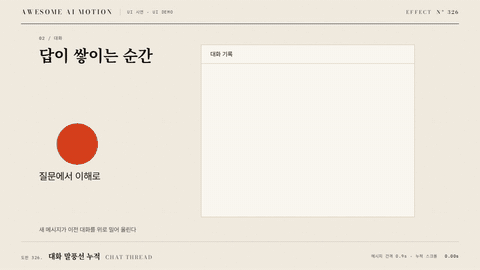

# Nº 326 대화 말풍선 누적 · Chat Thread



[MP4](clip.mp4) · [HTML](index.html)

**메시지 말풍선이 차례로 나타나고 이전 대화가 위로 밀려 올라간다.**

Messages appear in sequence while the previous conversation shifts upward.

| Family | Level | Purpose | Media | Runtime |
|---|---|---|---|---|
| UI 시연 · UI DEMO | 중급 | 순서·흐름 | 설명 영상, 제품 시연, 웹 UI | gsap |

다른 이름 / Also known as: 대화 쌓기

## 선택 기준 / Selection

질문과 답의 관계, 시간 순서를 보여준다. / Clarifies conversational order and the relationship between question and answer.

- 질문과 답을 시간 순서로 제시할 때 / Present questions and answers chronologically.
- 챗봇 응답 과정을 소개할 때 / Introduce a chatbot response flow.

좋은 예 / Good: 900ms 간격으로 메시지가 등장하고 새 높이만큼 스레드가 올라간다
나쁜 예 / Bad: 답이 질문보다 먼저 나타나 대화 순서가 뒤집힌다
주의 / Avoid: 메시지 등장 간격을 본문 읽기 시간보다 줄이지 않는다

## 파라미터 / Parameters

| Parameter | Default | Range | Note |
|---|---|---|---|
| 등장 | 120ms | 120~250ms | 말풍선 확대 |
| 시작 배율 | 0.75 | 0.75~0.95 | 최종 1 |
| 메시지 간격 | 900ms | 900~2000ms | 짧은 메시지 기준 |
| 행 높이 | 96px | 64~160px | 실측 높이와 여백의 합 |

이징 / Ease: `power2.out`

## 구현 / Implementation (GSAP)

```js
const bubbles = gsap.utils.toArray('.bubble');
gsap.set(bubbles,{opacity:0,scale:0.75});
bubbles.forEach((bubble,i) => {
  tl.to(bubble,{opacity:1,scale:1,duration:0.12,ease:'power2.out'},i*0.9);
  tl.to('.thread',{y:-i*96,duration:0.25,ease:'power2.out'},i*0.9);
});
```

## 프롬프트 / Prompts

### 한국어 · Claude Code
```text
<파일>의 <대상>에 대화 말풍선 누적을 적용한다. 짧은 메시지 3개를 900ms 간격으로 120ms 등장시키고 새 메시지마다 스레드를 실측 높이 96px씩 올린다. 초기 상태를 명시한 paused 타임라인으로 만들고 고정 좌표와 시간만 사용해 seek를 재현한다.
```

### 한국어 · Codex
```text
<파일>에서 <대상>의 대화 말풍선 누적 장면에 적용한다. 짧은 메시지 3개를 900ms 간격으로 120ms 등장시키고 새 메시지마다 스레드를 실측 높이 96px씩 올린다. 0.51초·1.33초·2.25초 시점을 캡처해 시작 상태, 중간 관계, 최종 정착과 겹침 여부를 확인한다.
```

### English · Claude Code
```text
Apply Chat Thread to <target> in <file>. Reveal three short messages at 900ms intervals with 120ms entrances and shift the thread upward by each measured 96px row. Define the initial state and use a paused timeline with fixed coordinates and timings for repeatable seeking.
```

### English · Codex
```text
Implement Chat Thread in the scene for <target> in <file>. Reveal three short messages at 900ms intervals with 120ms entrances and shift the thread upward by each measured 96px row. Capture at 0.51s, 1.33s, 2.25s to verify the initial state, intermediate relationships, final settling, and unwanted overlap.
```

예시 / Example: 대화 말풍선 누적를 `.hero`에 적용해. / Apply Chat Thread to `.hero`.

## 적용 / Application

- HyperFrames: paused 타임라인에 대화 말풍선 누적의 초기 상태와 종료 상태를 함께 기록하고 2.05초까지 seek로 재현한다.
- ReelForge: 씬 워커 브리프에 대화 말풍선 누적 대상 선택자와 등장 120ms, 시작 배율 0.75, 메시지 간격 900ms를 싣고 최종 상태 유지 시간을 지정한다.
- Scrolline Deck: 진행률 0~1을 2.05초 구간에 매핑하고 scrub에서는 스프링 대신 power3.out으로 위치를 계산한다.

조합 / Pair with: [답 스트리밍 · Answer Streaming](../answer-stream/) · [타이핑 입력 · Typing Input](../typing-input/)

출처 / Sources: [heygen-com/hyperframes](https://raw.githubusercontent.com/heygen-com/hyperframes/main/registry/components/chat-message/registry-item.json) (Apache-2.0) · [heygen-com/hyperframes](https://raw.githubusercontent.com/heygen-com/hyperframes/main/registry/components/chat-thread/registry-item.json) (Apache-2.0) · [heygen-com/hyperframes](https://raw.githubusercontent.com/heygen-com/hyperframes/main/registry/blocks/thread-message-stack/registry-item.json) (Apache-2.0) · [heygen-com/hyperframes](https://raw.githubusercontent.com/heygen-com/hyperframes/main/registry/blocks/message-thread-reveal/registry-item.json) (Apache-2.0) · local/HyperFrames-skills (`claude-skill:hyperframes-animation/blueprints/transcript-scroll-artifact-reveal.md`) (unknown)

[목록 / Catalog](../../references/catalog.md) · [index.json](../../index.json)
