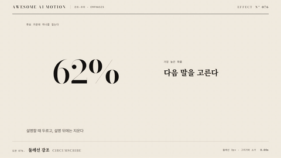

# Nº 076 둘레선 강조 · Circumscribe



[MP4](clip.mp4) · [HTML](index.html)

**대상 바깥에 원이나 사각 테두리가 그려졌다가 지워지는 임시 강조**

A circle or rectangle is drawn around a target and then erased.

| Family | Level | Purpose | Media | Runtime |
|---|---|---|---|---|
| 강조·주의 · EMPHASIS | 기본 | 강조, 설명 | 설명 영상, 발표, 웹 UI | svg |

다른 이름 / Also known as: Temporary circumscription, 임시 둘레선 강조, CircleIndicate, ShowCreationThenDestructionAround, ShowCreationThenFadeAround

## 선택 기준 / Selection

설명하는 대상의 범위를 분명히 한다. 잠깐 두르고 물러나 화면을 어지럽히지 않는다 / Makes the extent of what is being explained clear, then steps back.

- 수식·코드 조각·차트 영역을 잠깐 짚어 설명할 때 / When briefly circling a formula, code piece or chart region
- 화면에서 여러 개 중 하나를 지정할 때 / When picking one item out of several on screen

좋은 예 / Good: 수치 주위 여백 12px에 선 3px 사각형이 0.6초에 그려지고 0.4초 유지된 뒤 0.3초에 지워진다
나쁜 예 / Bad: 테두리를 영구히 남겨 다음 강조와 겹치거나, 대상에 붙어 글자를 자른다
주의 / Avoid: 여백 8~16px · 유지 후 반드시 지운다 · 한 번에 하나만

## 파라미터 / Parameters

| Parameter | Default | Range | Note |
|---|---|---|---|
| 그리기 | 0.6s | 0.4~0.8s | stroke 그리기 |
| 유지 | 0.4s | 0.3~0.8s | 읽는 시간 |
| 여백 | 12px | 8~16px | 대상 경계 바깥 |
| 선 두께 | 3px | 2~4px | 1920x1080 기준 |

이징 / Ease: `power2.inOut`

## 구현 / Implementation (GSAP)

```js
tl.fromTo('.box', { strokeDashoffset: 1 }, { strokeDashoffset: 0, duration: 0.6, ease: 'power2.inOut' }, 0.4)
  .to('.box', { opacity: 0, duration: 0.3 }, 1.4);
```

## 프롬프트 / Prompts

### 한국어 · Claude Code
```text
GSAP으로 <대상> 주위에 둘레선 강조를 넣어줘. 대상 bbox에서 12px 바깥의 사각형 stroke 3px을 0.4초에 시작해 0.6초 동안 strokeDashoffset 1에서 0으로 그리고, 1.4초에 0.3초 동안 opacity 0으로 지워. pathLength=1, 색은 <강조색>. paused 타임라인에 넣어.
```

### 한국어 · Codex
```text
<파일>의 <대상>에 circumscribe를 적용해. .box rect(margin 12, stroke 3, pathLength 1)를 fromTo(dashoffset 1→0, 0.6s, power2.inOut, position 0.4), 이후 opacity 0(0.3s, position 1.4). 0.7초·1.2초·2.0초를 캡처해 그리는 중, 완성, 소멸 상태를 확인해.
```

### English · Claude Code
```text
Add a circumscribe around <target> with GSAP. A rectangle 12px outside the bbox with stroke 3px starts at 0.4s and draws strokeDashoffset 1 to 0 over 0.6s, then fades to opacity 0 over 0.3s at 1.4s. pathLength=1, color <accent>. Paused timeline.
```

### English · Codex
```text
Apply circumscribe to <target> in <file>. fromTo on the .box rect (margin 12, stroke 3, pathLength 1) dashoffset 1 to 0, 0.6s, power2.inOut, position 0.4, then opacity 0 over 0.3s at 1.4. Capture at 0.7s, 1.2s and 2.0s to check drawing, complete and erased states.
```

예시 / Example: 둘레선 강조를 `.hero`에 적용해. / Apply Circumscribe to `.hero`.

## 적용 / Application

- HyperFrames: rect에 pathLength=1을 주고 dashoffset으로 그린다. 유지 시간은 빈 tween이 아니라 지운 시작 시각으로 표현한다
- ReelForge: 브리프에 대상 bbox, 여백, 색, 모양(원/사각)을 싣는다
- Scrolline Deck: scrub에서는 그리기를 진행률 0~0.4, 지우기를 0.7~1로 나누고 중간은 유지

조합 / Pair with: [테두리 리빌 · Border Reveal](../border-reveal/) · [밑줄 드로우 · Underline Draw](../underline-draw/) · [스포트라이트 · Spotlight](../spotlight/)

출처 / Sources: [ManimCommunity/manim](https://github.com/ManimCommunity/manim/blob/main/manim/animation/indication.py) (MIT) · [3b1b/manim](https://github.com/3b1b/manim/blob/master/manimlib/animation/indication.py) (MIT)

[목록 / Catalog](../../references/catalog.md) · [index.json](../../index.json)
