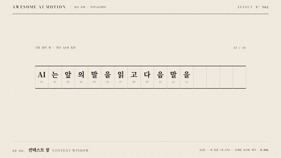

# Nº 362 컨텍스트 창 · Context Window



[MP4](clip.mp4) · [HTML](index.html)

**고정 길이 창에 새 토큰을 넣고 가장 오래된 토큰부터 밀어내는 움직임**

An animation that inserts new tokens into a fixed-length window and pushes out the oldest tokens first.

| Family | Level | Purpose | Media | Runtime |
|---|---|---|---|---|
| 원리 도해 · EXPLAINER | 기본 | 설명, 순서·흐름 | 설명 영상, 발표, 스크롤덱 | gsap |

다른 이름 / Also known as: 슬라이딩 창, Sliding Window

## 선택 기준 / Selection

유지할 수 있는 문맥 길이에 한계가 있다 / Shows that the amount of context that can be retained is limited.

- 컨텍스트 길이 제한을 설명할 때 / When explaining context length limits
- 슬라이딩 방식의 최근 문맥 유지를 보여줄 때 / When showing how a sliding window retains recent context

좋은 예 / Good: 16칸을 채우면 왼쪽 토큰이 떨어지고 오른쪽 새 토큰이 들어온다
나쁜 예 / Bad: 창을 무한히 늘려 고정 용량을 보이지 않는다
주의 / Avoid: 모든 모델이 자동으로 이 방식으로 문맥을 제거한다고 단정하지 않는다 · 제거 토큰이 남은 토큰을 가리지 않게 한다

## 파라미터 / Parameters

| Parameter | Default | Range | Note |
|---|---|---|---|
| 창 용량 | 16 | 8~24 | 고정 칸 수 |
| 새 토큰 간격 | 0.19s | 0.16~0.3s | 연속 누적 |
| 칸 간격 | 60px | 40~70px | 창 폭과 글꼴에 맞춤 |
| 제거 이동 | -80px, 125px | 60~140px | 왼쪽 아래로 낙하 |
| 제거 지속 | 0.24s | 0.2~0.35s | 빠른 퇴장 |

이징 / Ease: `power2.out, power2.inOut`

## 구현 / Implementation (GSAP)

```js
const tl = Motion.timeline();
const tokens = [...document.querySelectorAll('.tok')], count={n:12};
tokens.forEach((el,i)=>gsap.set(el,{x:i<12?i*60:960,y:i<12?0:-65,opacity:i<12?1:0}));
for(let j=12;j<20;j++){ const at=.3+(j-12)*.19;
 tl.to(tokens[j],{x:Math.min(j,15)*60,y:0,opacity:1,color:'var(--verm)',duration:.17,ease:'power2.out'},at).to(tokens[j-1],{color:'var(--ink)',duration:.1},at);
 if(j>=16){ for(let k=j-15;k<j;k++)tl.to(tokens[k],{x:(k-j+15)*60,duration:.17,ease:'power2.inOut'},at); tl.to(tokens[j-16],{x:-80,y:125,opacity:0,duration:.24,ease:'power2.out'},at); }
 if(j<16)tl.to(count,{n:j+1,duration:.17,onUpdate:()=>document.querySelector('.count').textContent=Math.round(count.n)+' / 16'},at);
}
tl.to('.lead',{opacity:1,duration:.25},2.05);
```

## 프롬프트 / Prompts

### 한국어 · Claude Code
```text
<대상>에 폭 960px, 60px 간격의 16칸 컨텍스트 창을 만든다. 12개 토큰으로 시작하고 0.3초부터 0.19초마다 새 토큰 8개를 오른쪽에 넣는다. 16칸 이후 기존 토큰은 0.17초에 한 칸 왼쪽으로 옮기고 가장 오래된 토큰은 x -80px, y 125px, opacity 0으로 0.24초 power2.out 제거한다. 새 토큰만 주홍으로 표시한다. 3초 타임라인 하나로 만들고 마지막 0.6초는 정지한다.
```

### 한국어 · Codex
```text
<파일>의 <대상>에 <대상>에 폭 960px, 60px 간격의 16칸 컨텍스트 창을 만든다. 12개 토큰으로 시작하고 0.3초부터 0.19초마다 새 토큰 8개를 오른쪽에 넣는다. 16칸 이후 기존 토큰은 0.17초에 한 칸 왼쪽으로 옮기고 가장 오래된 토큰은 x -80px, y 125px, opacity 0으로 0.24초 power2.out 제거한다. 새 토큰만 주홍으로 표시한다. 0.24초, 1.25초, 2.9초를 캡처해 16칸 유지, 오래된 순서의 제거, 마지막 16개 토큰을 확인한다. 시간은 GSAP 타임라인만 사용한다.
```

### English · Claude Code
```text
Create a 16-slot context window in <target> with a width of 960px and 60px spacing. Start with 12 tokens and insert 8 new tokens on the right every 0.19 seconds starting at 0.3 seconds. Once all 16 slots are occupied, move the existing tokens one slot left over 0.17 seconds and remove the oldest token by animating to x -80px, y 125px, opacity 0 over 0.24 seconds with power2.out. Show only the new tokens in vermilion. Use a single 3-second timeline and hold still for the final 0.6 seconds.
```

### English · Codex
```text
In <target> in <file>, Create a 16-slot context window in <target> with a width of 960px and 60px spacing. Start with 12 tokens and insert 8 new tokens on the right every 0.19 seconds starting at 0.3 seconds. Once all 16 slots are occupied, move the existing tokens one slot left over 0.17 seconds and remove the oldest token by animating to x -80px, y 125px, opacity 0 over 0.24 seconds with power2.out. Show only the new tokens in vermilion. Capture at 0.24, 1.25, and 2.9 seconds to check the 16-slot limit, removal in oldest-first order, and the final 16 tokens. Use only a GSAP timeline for timing.
```

예시 / Example: 컨텍스트 창를 `.hero`에 적용해. / Apply Context Window to `.hero`.

## 적용 / Application

- HyperFrames: 3초 paused GSAP 타임라인 하나로 구성하고 Motion.ready()로 seek를 노출한다. 16칸을 유지하며 각 추가 비트에 기존 토큰 x를 한 칸 줄이고 가장 오래된 요소를 y와 opacity로 제거한다.
- ReelForge: 3초 장면 안의 요소를 분리하고 transform과 opacity 트랙으로 같은 순서를 구현한다. 16칸을 유지하며 각 추가 비트에 기존 토큰 x를 한 칸 줄이고 가장 오래된 요소를 y와 opacity로 제거한다.
- Scrolline Deck: 0.3~2.4초 동작을 스크롤 진행률 10~80%로 매핑하고 끝 20%를 완성 상태로 둔다. 16칸을 유지하며 각 추가 비트에 기존 토큰 x를 한 칸 줄이고 가장 오래된 요소를 y와 opacity로 제거한다.

조합 / Pair with: [타이핑 입력 · Typing Input](../typing-input/) · [화면 스크롤 · UI Scroll](../ui-scroll/) · [토큰 쪼개기 · Token Split](../token-split/)

출처 / Sources: [Hugging Face Transformers, KV cache strategies](https://huggingface.co/docs/transformers/kv_cache) (개념 참고)

[목록 / Catalog](../../references/catalog.md) · [index.json](../../index.json)
