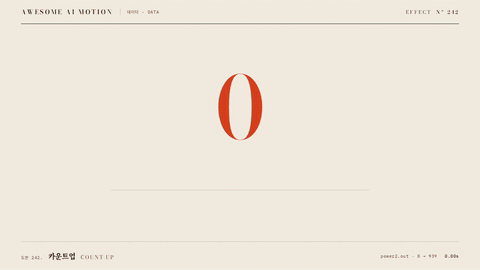

# Nº 242 카운트업 · Count-up



[MP4](clip.mp4) · [HTML](index.html)

**숫자가 0에서 목표값까지 감속하며 증가하는 표현**

An animation in which a number increases from 0 to its target value while decelerating.

| Family | Level | Purpose | Media | Runtime |
|---|---|---|---|---|
| 데이터 · DATA | 기본 | 설명, 데이터 증명 | 설명 영상, 데이터 스토리, 발표 | gsap |

다른 이름 / Also known as: 숫자 증가, Number counter, Interpolated count ticker, 보간 숫자 티커, Count up, Number tween, Large Number Count Up, 대형 숫자 카운트업

## 선택 기준 / Selection

수치의 누적과 최종 규모 / Communicates numerical accumulation and the final magnitude.

- 수치의 누적과 최종 규모를 보여줄 때 / When showing numerical accumulation and the final magnitude
- 토큰 수가 0에서 939로 올라간 뒤 토큰 단위를 보여준다와 같은 장면을 만들 때 / When counting tokens from 0 to 939 and then revealing the token unit

좋은 예 / Good: 토큰 수가 0에서 939로 올라간 뒤 토큰 단위를 보여준다
나쁜 예 / Bad: 모든 통계가 동시에 빨리 바뀌어 최종값을 읽기 어렵다
주의 / Avoid: 최종 상태를 0.5초 이상 유지한다 · 동일 화면에서 불필요한 주홍 강조를 추가하지 않는다

## 파라미터 / Parameters

| Parameter | Default | Range | Note |
|---|---|---|---|
| 목표값 | 939 | 1~999999 | 정수로 반올림해 표시 |
| 지속 | 1.65s | 1.0~2.0s | 도착 전 감속을 읽을 시간 |
| 출발 | 0.30s | 0.2~0.4s | 초기 0 홀드 |
| 단위 등장 | 2.02s | 1.9~2.3s | 숫자 도착 뒤 표시 |

이징 / Ease: `power2.out`

## 구현 / Implementation (GSAP)

```js
const counter = {value:0};
tl.to(counter, {value:939, duration:1.65, ease:'power2.out', onUpdate:()=>{document.querySelector('#value').textContent=Math.round(counter.value);}}, .3);
tl.fromTo('#unit', {y:12,opacity:0}, {y:0,opacity:1,duration:.3}, 2.02);
```

## 프롬프트 / Prompts

### 한국어 · Claude Code
```text
<대상>에 카운트업 효과를 적용해. 토큰 수가 0에서 939로 올라간 뒤 토큰 단위를 보여준다. 목표값 939; 지속 1.65s; 출발 0.30s; 단위 등장 2.02s로 만들고 이징은 power2.out를 써. GSAP 타임라인 하나로 제어하고 2.5초부터 3초까지 완성 상태를 유지해.
```

### 한국어 · Codex
```text
<파일>의 데이터 장면에 카운트업 효과를 구현해. 목표값 939; 지속 1.65s; 출발 0.30s; 단위 등장 2.02s를 적용하고 이징은 power2.out로 지정해. 0초, 0.75초, 1.75초, 2.9초를 캡처해서 시작 상태와 진행 변화, 최종 상태의 잘림과 겹침을 확인해. Math.random과 타이머 없이 타임라인으로 재생하고 마지막 0.5초 이상 정지해.
```

### English · Claude Code
```text
Apply Count-up to <target>. Count tokens from 0 to 939, then show the token unit. Use these settings: target value 939; duration 1.65s; start 0.30s; unit reveal at 2.02s; ease power2.out. Control everything with a single GSAP timeline and hold the completed state from 2.5 to 3 seconds.
```

### English · Codex
```text
Implement Count-up in the data scene in <file>. Use these settings: target value 939; duration 1.65s; start 0.30s; unit reveal at 2.02s; ease power2.out. Capture at 0, 0.75, 1.75, and 2.9 seconds to check the initial state, progression, and any clipping or overlap in the final state. Play using a timeline without Math.random or timers, and hold still for at least the final 0.5 seconds.
```

예시 / Example: 카운트업를 `.hero`에 적용해. / Apply Count-up to `.hero`.

## 적용 / Application

- HyperFrames: 하나의 paused GSAP 타임라인에 모든 동작을 넣고 3초 seek 가능한 장면으로 만든다
- ReelForge: 데이터 도형과 라벨을 분리하고 동일 시작 시각과 지속 시간을 씬 타임라인에 연결한다
- Scrolline Deck: 시간을 스크롤 진행률로 매핑하고 마지막 구간에서 최종값과 주석을 유지한다

조합 / Pair with: [막대 성장 · Bar Grow](../bar-grow/) · [이징 · Easing](../easing-curves/) · [단위 격자 · Unit Grid Fill](../unit-grid/)

출처 / Sources: [GSAP Timeline 공식 문서](https://gsap.com/docs/v3/GSAP/Timeline/) (문서 참조) · [Flourish](https://helpcenter.flourish.studio/hc/en-us/articles/8761548263823-Number-ticker-an-overview) (unknown) · [Flourish](https://flourish.studio/blog/number-ticker-countdown-templates/) (unknown) · [apache/echarts](https://echarts.apache.org/handbook/en/basics/release-note/v5-feature/) (Apache-2.0) · [pqina/flip](https://github.com/pqina/flip) (MIT) · [motion-canvas/motion-canvas](https://github.com/motion-canvas/motion-canvas) (MIT) · [heygen-com/hyperframes](https://raw.githubusercontent.com/heygen-com/hyperframes/main/registry/components/count-up/registry-item.json) (Apache-2.0) · [heygen-com/hyperframes](https://raw.githubusercontent.com/heygen-com/hyperframes/main/registry/components/decline-chart/registry-item.json) (Apache-2.0)

[목록 / Catalog](../../references/catalog.md) · [index.json](../../index.json)
