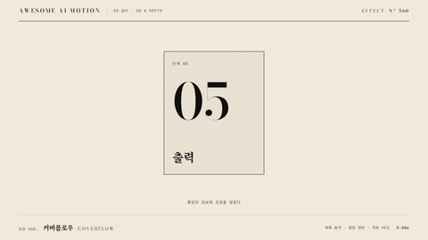

# Nº 560 커버플로우 · Coverflow



[MP4](clip.mp4) · [HTML](index.html)

**카드가 곡면 배열을 따라 이동하며 중앙 카드는 크고 정면, 옆 카드는 비스듬히 작아지는 목록**

Cards travel along a curved arrangement: the center card faces front and large, side cards tilt away and shrink.

| Family | Level | Purpose | Media | Runtime |
|---|---|---|---|---|
| 3D·깊이 · 3D & DEPTH | 중급 | 순서·흐름, 비교 | 웹 UI, 제품 시연, 발표 | css |

다른 이름 / Also known as: Coverflow depth carousel, 커버플로 깊이 캐러셀, Depth Gallery Rotation, 입체 갤러리 회전

## 선택 기준 / Selection

선택 항목과 주변 항목의 깊이 차를 보여 준다. 지금 보는 것과 곧 보게 될 것이 한 화면에서 구분된다 / Shows the depth difference between the selected item and its neighbors, so what is current and what is next are distinct.

- 앨범, 제품, 템플릿을 넘겨 가며 고를 때 / Browse albums, products or templates.
- 다음 항목을 살짝 보여 주며 순서를 안내할 때 / Preview the next item while guiding sequence.
- 여러 후보 중 하나를 선택하는 흐름을 설명할 때 / Explain choosing one from several candidates.

좋은 예 / Good: 카드 7장 중 중앙 카드는 정면으로 크게, 좌우는 rotateY 45도와 작은 scale로 배열되고, 넘길 때 600ms에 옆 카드가 중앙으로 옮겨 온다
나쁜 예 / Bad: 측면 카드가 너무 기울어져 내용이 전혀 안 보이거나, 전환 중 z 순서가 바뀌지 않아 카드가 겹쳐 잘못 보인다
주의 / Avoid: 측면 카드 rotateY는 60도 이하로 한다 · 전환 중 z-index를 중앙 거리에 따라 다시 계산한다 · 카드는 9장을 넘기지 않는다

## 파라미터 / Parameters

| Parameter | Default | Range | Note |
|---|---|---|---|
| 전환 시간 | 0.6s | 0.4~0.9s | 한 칸 이동 |
| perspective | 900px | 700~1400px | 부모 |
| 측면 회전 | 45deg | 30~60deg | 중앙 거리 부호 |
| 카드 수 | 7 | 5~9 | 홀수 권장 |
| 이징 | power2.inOut | power1~power3 |  |

## 구현 / Implementation (GSAP)

```js
const place = (c, d) => gsap.to(c, { x: d * 320 + Math.sign(d) * 120, z: -Math.abs(d) * 160,
  rotationY: -Math.sign(d) * 45 * Math.min(1, Math.abs(d)), scale: 1 - Math.min(0.3, Math.abs(d) * 0.1),
  zIndex: 100 - Math.abs(d), duration: 0.6, ease: 'power2.inOut' });
cards.forEach((c, i) => tl.add(place(c, i - 1), 0.5)); // 중앙 인덱스가 0→1로 이동
```

## 프롬프트 / Prompts

### 한국어 · Claude Code
```text
GSAP으로 <카드 7장>을 커버플로우로 배치하고 한 칸 넘기는 전환을 만들어 줘. 부모 perspective 900px, 중앙 카드는 정면 scale 1, 좌우 카드는 rotateY ±45도, 거리마다 z -160px, scale 0.1씩 축소. 0.5초에 0.6초 power2.inOut으로 모든 카드가 한 칸씩 왼쪽으로 이동하고 z-index가 중앙 거리에 따라 바뀌게 해.
```

### 한국어 · Codex
```text
<파일>에 coverflow를 적용해. 카드 i의 중앙 거리 d에서 x=d*320+sign(d)*120, z=-|d|*160, rotationY=-sign(d)*45*min(1,|d|), scale=1-min(0.3,|d|*0.1)로 계산하고 position 0.5, duration 0.6, ease power2.inOut으로 한 칸 이동한다. 0.4초와 1.3초를 캡처해 중앙 카드가 바뀌고 겹침 순서가 맞는지 확인해.
```

### English · Claude Code
```text
Use GSAP to lay out <7 cards> as a coverflow and animate a one-step shift. Parent perspective 900px, the center card faces front at scale 1, side cards rotateY +/-45 degrees, z -160px and 0.1 less scale per step of distance. At 0.5 seconds move all cards one slot left over 0.6 seconds with power2.inOut and recompute z-index by distance from center.
```

### English · Codex
```text
Apply coverflow in <file>. For center distance d compute x=d*320+sign(d)*120, z=-|d|*160, rotationY=-sign(d)*45*min(1,|d|), scale=1-min(0.3,|d|*0.1) and tween at position 0.5, duration 0.6, ease power2.inOut for a one-slot shift. Capture 0.4s and 1.3s: the center card has changed and stacking order is correct.
```

예시 / Example: 커버플로우를 `.hero`에 적용해. / Apply Coverflow to `.hero`.

## 적용 / Application

- HyperFrames: 중앙 거리 d의 순수 함수로 위치를 계산해 paused 타임라인에서 d를 보간한다. zIndex 재계산은 정수 스냅을 피하고 z로 정렬한다
- ReelForge: 브리프에 카드 7장, 선택 순서, 측면 회전 45, 전환 0.6s를 싣는다
- Scrolline Deck: 진행률 0~1을 중앙 인덱스 d의 연속 값에 매핑한다. 진행률이 멈추는 곳에서 가장 가까운 정수로 스냅한다

조합 / Pair with: [캐러셀 슬라이드 · Carousel Slide](../carousel-slide/) · [웨이브 캐러셀 · Wave Carousel](../wave-carousel/) · [카드 스택 셔플 · Card Stack Shuffle](../card-stack-shuffle/)

출처 / Sources: [motion.dev examples](https://motion.dev/examples/react-carousel-coverflow) (unknown) · [DavidHDev/react-bits](https://github.com/DavidHDev/react-bits) (MIT + Commons Clause v1.0) · [ui.aceternity.com](https://ui.aceternity.com/components/3d-marquee) (unknown)

[목록 / Catalog](../../references/catalog.md) · [index.json](../../index.json)
