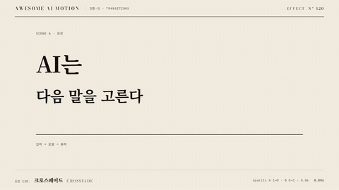

# Nº 120 크로스페이드 · Crossfade



[MP4](clip.mp4) · [HTML](index.html)

**장면 A의 불투명도가 낮아지는 동안 장면 B의 불투명도가 함께 높아지는 전환**

Scene A fades out as scene B fades in at the same time.

| Family | Level | Purpose | Media | Runtime |
|---|---|---|---|---|
| 전환·컷 · TRANSITIONS | 기본 | 전환, 순서·흐름 | 설명 영상, 숏폼, 발표, 스크롤덱 | gsap |

다른 이름 / Also known as: Dissolve, 디졸브, 교차 페이드, Cross dissolve, fade(), fadeTransition, Non-Additive Dissolve

## 선택 기준 / Selection

두 장면이 잠시 공존하며 문장과 확률 정보가 이어진다 / Briefly lets both scenes coexist, connecting the sentence to probability information.

- 문장에서 관련 데이터 장면으로 부드럽게 넘어갈 때 / Move smoothly from a sentence to a related data scene.
- 시간이나 분위기가 이어지는 두 장면을 연결할 때 / Connect two scenes that share a continuous sense of time or atmosphere.

좋은 예 / Good: 문장이 0.8초 동안 사라지며 후보 확률 막대가 같은 시간에 나타난다
나쁜 예 / Bad: A를 먼저 완전히 지운 뒤 B를 켜서 중간에 빈 화면을 만든다
주의 / Avoid: 겹치는 두 장면의 본문을 오래 읽게 하지 않는다 · 각 장면에 주홍 초점을 따로 두지 않는다

## 파라미터 / Parameters

| Parameter | Default | Range | Note |
|---|---|---|---|
| 전환 시작 | 0.35s | 0.3~0.8s | 시작 장면을 먼저 보여준다 |
| 겹침 지속 | 0.8s | 0.5~1.2s | 중간 시점에 두 장면을 확인한다 |
| 불투명도 | A 1→0, B 0→1 | 0~1 | 같은 시각에 반대 방향으로 변화 |
| 완성 홀드 | 1.65s | 0.5~2s | 주석 등장 완료 후 정지 |

이징 / Ease: `none`

## 구현 / Implementation (GSAP)

```js
tl.to('#A', {opacity:0, duration:0.8, ease:'none'}, 0.35);
tl.to('#B', {opacity:1, duration:0.8, ease:'none'}, 0.35);
tl.to('.lead', {opacity:1, duration:0.2}, 1.3);
```

## 프롬프트 / Prompts

### 한국어 · Claude Code
```text
<대상>의 장면 A와 B를 같은 좌표에 배치해 크로스페이드를 만들어줘. 0.35초부터 0.8초 동안 A opacity를 1에서 0, B를 0에서 1로 동시에 바꾸고 ease는 none으로 해. 1.5초부터 3초까지 완성 장면을 정지하고 주홍 초점은 한 곳만 둬.
```

### 한국어 · Codex
```text
<파일>의 장면 전환에 GSAP opacity 크로스페이드를 적용해. 시작 0.35초, 지속 0.8초, ease none으로 A 1→0과 B 0→1을 같은 타임라인에 넣어. 0.23초, 0.75초, 2.9초를 캡처해 시작 A, 두 장면의 반투명 겹침, 완성 B 홀드를 확인해.
```

### English · Claude Code
```text
Create a crossfade by placing scenes A and B of <target> at the same coordinates. Starting at 0.35 seconds over 0.8 seconds, simultaneously animate A opacity from 1 to 0 and B opacity from 0 to 1 with ease none. Hold the completed scene from 1.5 to 3 seconds and use only one vermilion focal point.
```

### English · Codex
```text
Apply a GSAP opacity crossfade to the scene transition in <file>. In the same timeline, animate A from 1 to 0 and B from 0 to 1 with start 0.35 seconds, duration 0.8 seconds, and ease none. Capture at 0.23, 0.75, and 2.9 seconds to check initial scene A, the translucent overlap of both scenes, and the completed scene B hold.
```

예시 / Example: 크로스페이드를 `.hero`에 적용해. / Apply Crossfade to `.hero`.

## 적용 / Application

- HyperFrames: 장면 둘을 같은 좌표에 배치하고 하나의 paused GSAP 타임라인으로 전환한다. 전환 뒤 완성 장면을 홀드한다
- ReelForge: 전환 비트의 시작 시각과 지속 시간을 고정하고 장면 레이어 두 개를 함께 렌더한다
- Scrolline Deck: 전환 구간의 진행률을 하나의 타임라인에 연결하고 양 끝에 읽기 위한 정지 구간을 둔다

조합 / Pair with: [와이프 · Wipe](../wipe/) · [매치컷 · Match Cut](../match-cut/) · [타이밍과 간격 · Timing & Spacing](../timing-spacing/)

출처 / Sources: [Dissolve (filmmaking)](https://en.wikipedia.org/wiki/Dissolve_(filmmaking)) (개념 인용) · [heygen-com/hyperframes](https://raw.githubusercontent.com/heygen-com/hyperframes/main/registry/blocks/transitions-dissolve/registry-item.json) (Apache-2.0) · [motiondivision/motion](https://motion.dev/docs/react-animate-presence) (MIT) · [greensock/GSAP](https://gsap.com/docs/v3/Plugins/Flip/) (GSAP Standard License) · [pmndrs/react-spring](https://www.react-spring.dev/docs/components/use-transition) (MIT) · [motion.dev examples](https://motion.dev/examples/react-curtains-fade) (unknown) · [heygen-com/hyperframes](https://raw.githubusercontent.com/heygen-com/hyperframes/main/registry/components/sticky-mock-swap/registry-item.json) (Apache-2.0) · [heygen-com/hyperframes](https://raw.githubusercontent.com/heygen-com/hyperframes/main/registry/components/skeleton-reveal/registry-item.json) (Apache-2.0)

[목록 / Catalog](../../references/catalog.md) · [index.json](../../index.json)
