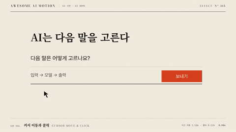

# Nº 315 커서 이동과 클릭 · Cursor Move & Click



[MP4](clip.mp4) · [HTML](index.html)

**커서가 곡선으로 목표 단추에 도착하고 눌림과 파문으로 클릭을 알리는 동작**

An animation in which a cursor follows a curved path to a target button and signals a click with a pressed state and ripple.

| Family | Level | Purpose | Media | Runtime |
|---|---|---|---|---|
| UI 시연 · UI DEMO | 중급 | 설명, 피드백 | 제품 시연, 설명 영상, 웹 UI | gsap |

다른 이름 / Also known as: 클릭 피드백, Cursor click, 커서 클릭, physics-press-reaction, cursor-click-ripple, Press release, 누름과 복구

## 선택 기준 / Selection

포인터의 목적지와 입력이 수락된 순간 / Shows the pointer destination and the moment input is accepted.

- 질문을 보낸 뒤 보내기 단추가 0.12초 눌리고 원형 파문이 퍼진다 / When the Send button depresses for 0.12 seconds and emits a circular ripple after a question is sent
- 포인터의 목적지와 입력이 수락된 순간을 보여 줄 때 / When showing the pointer destination and the moment input is accepted

좋은 예 / Good: 질문을 보낸 뒤 보내기 단추가 0.12초 눌리고 원형 파문이 퍼진다
나쁜 예 / Bad: 커서가 단추 밖에서 클릭하거나 파문이 다른 영역까지 강조한다
주의 / Avoid: 커서가 단추 밖에서 클릭하거나 파문이 다른 영역까지 강조한다 · 동작 종료 뒤 최소 0.5초 읽기 시간을 둔다

## 파라미터 / Parameters

| Parameter | Default | Range | Note |
|---|---|---|---|
| 이동 지속 | 1.10s | 0.7~1.4s | 곡선 경로가 읽히는 시간 |
| 이동 거리 | 740px | 400~850px | 도착점은 단추 안쪽 |
| 곡선 높이 | 150px | 60~180px | sin 곡선으로 중간을 들어 올린다 |
| 눌림 | 0.94 / 0.12s | 0.90~0.97 / 0.08~0.18s | scale로 단추 피드백 |
| 파문 | 0.65s / 2.4배 | 0.4~0.8s / 1.8~2.8배 | 확대하며 사라진다 |

이징 / Ease: `power2.inOut`

## 구현 / Implementation (GSAP)

```js
const tl = Motion.timeline();
const p={t:0};
tl.to(p,{t:1,duration:1.1,ease:'power2.inOut',onUpdate:()=>{const t=p.t;gsap.set('.pointer',{x:740*t,y:-78*t-150*Math.sin(Math.PI*t)});}},.3);
tl.to('.send',{scale:.94,duration:.12,ease:'power2.in'},1.4).to('.send',{scale:1,duration:.22,ease:'power2.out'},1.52);
tl.fromTo('.ripple',{scale:.45,opacity:.85},{scale:2.4,opacity:0,duration:.65,ease:'power2.out'},1.43);
tl.to('.lead',{opacity:1,duration:.2},2.12);
```

## 프롬프트 / Prompts

### 한국어 · Claude Code
```text
<대상> 커서를 0.3초부터 1.1초 동안 power2.inOut으로 x 740px, y -78px 옮겨줘. y에 -150*sin(π*t)를 더해 곡선을 만들고 1.4초에 보내기 단추를 0.12초 동안 scale 0.94로 누른 뒤 0.22초에 복원해. 주홍 파문은 1.43초부터 0.65초 동안 scale 0.45에서 2.4로 키우며 지우고 2.32초부터 정지해.
```

### 한국어 · Codex
```text
<파일>의 보내기 시연에 커서 곡선 이동과 클릭 피드백을 적용해. 하나의 paused GSAP 타임라인과 t 프록시로 x=740*t, y=-78*t-150*sin(π*t)를 0.3~1.4초에 계산하고 단추 scale 0.94 눌림을 추가해. 0.73초, 1.45초, 1.73초, 2.9초를 캡처해 경로, 눌림, 주홍 파문, 완성 홀드를 확인해.
```

### English · Claude Code
```text
Move the <target> cursor by x 740px, y -78px over 1.1 seconds starting at 0.3 seconds, using power2.inOut. Add -150*sin(π*t) to y to create a curved path. At 1.4 seconds, press the Send button to scale 0.94 over 0.12 seconds, then restore it over 0.22 seconds. Starting at 1.43 seconds, enlarge a vermilion ripple from scale 0.45 to 2.4 while fading it out over 0.65 seconds. Hold still from 2.32 seconds.
```

### English · Codex
```text
Apply curved cursor motion and click feedback to the send demonstration in <file>. Use a single paused GSAP timeline and a t proxy to calculate x=740*t, y=-78*t-150*sin(π*t) from 0.3 to 1.4 seconds, and add the button press at scale 0.94. Capture at 0.73, 1.45, 1.73, and 2.9 seconds to check the path, pressed state, vermilion ripple, and final hold.
```

예시 / Example: 커서 이동과 클릭를 `.hero`에 적용해. / Apply Cursor Move & Click to `.hero`.

## 적용 / Application

- HyperFrames: 공용 하네스의 paused 타임라인에 모든 동작을 넣어 초 단위 seek로 검증한다
- ReelForge: UI 요소와 강조 요소를 분리하고 동일한 타이밍 수치를 씬 파라미터로 옮긴다
- Scrolline Deck: 3초 타임라인을 스크롤 진행률 0~1로 매핑하고 마지막 0.5초에 완성 상태를 유지한다

조합 / Pair with: [아크 · Arcs](../arc-motion/) · [예비동작 · Anticipation](../anticipation/) · [스포트라이트 · Spotlight](../spotlight/)

출처 / Sources: [GSAP Timeline 공식 문서](https://gsap.com/docs/v3/GSAP/Timeline/) (공식 문서 개념 참조) · [heygen-com/hyperframes](https://raw.githubusercontent.com/heygen-com/hyperframes/main/registry/components/oversized-cursor/registry-item.json) (Apache-2.0) · [heygen-com/hyperframes](https://raw.githubusercontent.com/heygen-com/hyperframes/main/registry/components/press-ripple/registry-item.json) (Apache-2.0) · [heygen-com/hyperframes](https://raw.githubusercontent.com/heygen-com/hyperframes/main/registry/blocks/vpn-youtube-spot/registry-item.json) (Apache-2.0) · [heygen-com/hyperframes](https://raw.githubusercontent.com/heygen-com/hyperframes/main/registry/components/gesture-tap/registry-item.json) (Apache-2.0) · [heygen-com/hyperframes](https://raw.githubusercontent.com/heygen-com/hyperframes/main/registry/components/touch-indicator/registry-item.json) (Apache-2.0) · motion dictionary 4-explainer-learning.md#B. 공개 순서와 시선 유도 (own) · [Screen Studio](https://screen.studio/) (unknown)

[목록 / Catalog](../../references/catalog.md) · [index.json](../../index.json)
