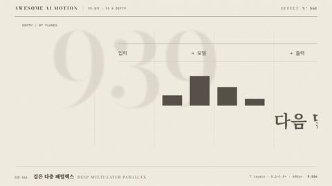

# Nº 561 깊은 다층 패럴랙스 · Deep Multi-layer Parallax



[MP4](clip.mp4) · [HTML](index.html)

**7겹 지면이 서로 다른 속도로 흘러 깊이를 드러내는 카메라 이동**

A horizontal camera move reveals depth through seven independently paced editorial layers.

| Family | Level | Purpose | Media | Runtime |
|---|---|---|---|---|
| 3D·깊이 · 3D & DEPTH | 고급 | 주목 끌기, 설명, 전환 | 설명 영상, 숏폼, 발표 | gsap |

## 선택 기준 / Selection

먼 층의 안정감과 가까운 층의 빠른 흐름 / Stable distant planes and fast foreground motion communicate spatial depth.

- 넓은 도판을 가로질러 시선을 옮길 때 / Move attention across a wide editorial canvas.
- 평면 정보에 깊이와 흐름을 줄 때 / Give flat information a clear sense of depth.

좋은 예 / Good: 7겹 도판이 60~1080px 이동하고 전경 글자가 크게 지나간다
나쁜 예 / Bad: 모든 층을 같은 속도로 옮겨 깊이가 사라진다
주의 / Avoid: 전경 글자는 blur 2px를 넘기지 않는다 · 완성 도판의 숫자와 문장을 겹치지 않는다

## 파라미터 / Parameters

| Parameter | Default | Range | Note |
|---|---|---|---|
| 레이어 수 | 7 | 5~9 | 각 층을 별도 래퍼로 둔다 |
| 카메라 이동 | 600px | 400~900px | 월드와 층 보정 이동을 합한다 |
| 속도비 | 0.1,0.25,0.45,0.7,0.95,1.3,1.8 | 0.1~1.8 | 가까울수록 크게 움직인다 |
| 전경 흐림 | 2px | 1~2px | 전경만 약간 흐리게 둔다 |

이징 / Ease: `sine.inOut`

## 구현 / Implementation (GSAP)

```js
tl.to('.world',{x:-600,duration:3,ease:'sine.inOut'},.3);
document.querySelectorAll('.layer').forEach(layer=>{
  const ratio=Number(layer.dataset.ratio);
  tl.to(layer,{x:-600*(ratio-1),duration:3,ease:'sine.inOut'},.3);
});
```

## 프롬프트 / Prompts

### 한국어 · Claude Code
```text
<대상>에 월드 x를 600px 이동하고 7개 층을 0.1, 0.25, 0.45, 0.7, 0.95, 1.3, 1.8배로 보정한다. 0.3초 시작, 3초 sine.inOut, 전경 blur 2px, 마지막 0.7초 홀드. 종이·먹·주홍 한 곳으로 구성하고 한 paused GSAP 타임라인을 쓴다.
```

### 한국어 · Codex
```text
<파일>에 월드 x를 600px 이동하고 7개 층을 0.1, 0.25, 0.45, 0.7, 0.95, 1.3, 1.8배로 보정한다. 0.3초 시작, 3초 sine.inOut, 전경 blur 2px, 마지막 0.7초 홀드. 0.33초, 1.67초, 2.33초, 3.87초 캡처로 깊이 변화, 잘림, 마지막 정지를 확인한다.
```

### English · Claude Code
```text
Apply this effect to <대상>. Move the world 600px with seven layer ratios of 0.1, 0.25, 0.45, 0.7, 0.95, 1.3 and 1.8. Start at 0.3s, animate for 3s using sine.inOut, blur foreground text by 2px and hold for 0.7s. Use paper, ink and one vermilion focus with a single paused GSAP timeline.
```

### English · Codex
```text
Implement in <파일>. Move the world 600px with seven layer ratios of 0.1, 0.25, 0.45, 0.7, 0.95, 1.3 and 1.8. Start at 0.3s, animate for 3s using sine.inOut, blur foreground text by 2px and hold for 0.7s. Capture at 0.33s, 1.67s, 2.33s and 3.87s to verify depth, clipping and the final hold.
```

예시 / Example: 깊은 다층 패럴랙스를 `.hero`에 적용해. / Apply Deep Multi-layer Parallax to `.hero`.

## 적용 / Application

- HyperFrames: 월드 x를 600px 이동하고 7개 층을 0.1, 0.25, 0.45, 0.7, 0.95, 1.3, 1.8배로 보정한다. 0.3초 시작, 3초 sine.inOut, 전경 blur 2px, 마지막 0.7초 홀드. 한 paused 타임라인으로 seek한다.
- ReelForge: 월드 x를 600px 이동하고 7개 층을 0.1, 0.25, 0.45, 0.7, 0.95, 1.3, 1.8배로 보정한다. 0.3초 시작, 3초 sine.inOut, 전경 blur 2px, 마지막 0.7초 홀드. 장면의 월드 래퍼 안에 배치한다.
- Scrolline Deck: 월드 x를 600px 이동하고 7개 층을 0.1, 0.25, 0.45, 0.7, 0.95, 1.3, 1.8배로 보정한다. 0.3초 시작, 3초 sine.inOut, 전경 blur 2px, 마지막 0.7초 홀드. 4초 타임라인을 스크롤 진행률 0~1에 대응한다.

조합 / Pair with: [패럴랙스 · Parallax](../parallax/) · [팬 · Pan](../pan/) · [랙 포커스 · Rack Focus](../rack-focus/)

출처 / Sources: [GSAP CSSPlugin 3D transforms](https://gsap.com/docs/v3/GSAP/CorePlugins/CSS/) (공식 문서 개념 참고)

[목록 / Catalog](../../references/catalog.md) · [index.json](../../index.json)
