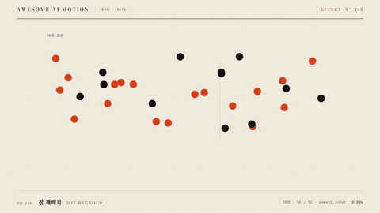

# Nº 243 점 재배치 · Dot Regroup



[MP4](clip.mp4) · [HTML](index.html)

**흩어진 점이 분류별 규칙적인 무리로 이동하는 표현**

An animation that moves scattered dots into orderly groups by category.

| Family | Level | Purpose | Media | Runtime |
|---|---|---|---|---|
| 데이터 · DATA | 중급 | 설명, 데이터 증명 | 설명 영상, 데이터 스토리, 발표 | gsap |

다른 이름 / Also known as: 점 군집화, Dot clustering, Particle text assembly, 입자 글자 조립, Scatter Regroup, 산점 재배열, Scatter regroup and re-encoding

## 선택 기준 / Selection

개별 표본의 소속과 집단별 규모 / Shows which group each sample belongs to and the size of each group.

- 개별 표본의 소속과 집단별 규모를 보여줄 때 / When showing sample membership and group sizes
- 30개 표본을 18개와 12개로 나누어 개수 차이를 보여준다와 같은 장면을 만들 때 / When splitting 30 samples into groups of 18 and 12 to show the difference in count

좋은 예 / Good: 30개 표본을 18개와 12개로 나누어 개수 차이를 보여준다
나쁜 예 / Bad: 점들이 겹친 채 도착해 각 집단의 개수를 셀 수 없다
주의 / Avoid: 최종 상태를 0.5초 이상 유지한다 · 동일 화면에서 불필요한 주홍 강조를 추가하지 않는다

## 파라미터 / Parameters

| Parameter | Default | Range | Note |
|---|---|---|---|
| 총 점 수 | 30 | 10~60 | 하나의 점은 하나의 표본 |
| 집단 크기 | 18 / 12 | 합계 30 | 주홍 집단 18개 |
| 지속 | 1.35s | 1.0~1.7s | 이동 경로를 읽는 시간 |
| 시드 | 808 | 1~9999 | 초기 위치를 재현 |

이징 / Ease: `power2.inOut`

## 구현 / Implementation (GSAP)

```js
const rand=Motion.rand(808),dots=document.querySelector('#dots');
for(let i=0;i<30;i++){const d=document.createElement('div');d.className='particle'+(i<18?' selected':'');dots.appendChild(d);const col=i<18?i%6:(i-18)%4,row=i<18?Math.floor(i/6):Math.floor((i-18)/4);gsap.set(d,{x:90+rand()*955,y:105+rand()*275});tl.to(d,{x:(i<18?138:764)+col*61,y:180+row*67,duration:1.35,ease:'power2.inOut'},.3+i*.014);}
tl.to('.label',{opacity:1,duration:.3},2.12);
```

## 프롬프트 / Prompts

### 한국어 · Claude Code
```text
<대상>에 점 재배치 효과를 적용해. 30개 표본을 18개와 12개로 나누어 개수 차이를 보여준다. 총 점 수 30; 집단 크기 18 / 12; 지속 1.35s; 시드 808로 만들고 이징은 power2.inOut를 써. GSAP 타임라인 하나로 제어하고 2.5초부터 3초까지 완성 상태를 유지해.
```

### 한국어 · Codex
```text
<파일>의 데이터 장면에 점 재배치 효과를 구현해. 총 점 수 30; 집단 크기 18 / 12; 지속 1.35s; 시드 808를 적용하고 이징은 power2.inOut로 지정해. 0초, 0.75초, 1.75초, 2.9초를 캡처해서 시작 상태와 진행 변화, 최종 상태의 잘림과 겹침을 확인해. Math.random과 타이머 없이 타임라인으로 재생하고 마지막 0.5초 이상 정지해.
```

### English · Claude Code
```text
Apply Dot Regroup to <target>. Split 30 samples into groups of 18 and 12 to show the difference in count. Use these settings: total dots 30; group sizes 18 / 12; duration 1.35s; seed 808; ease power2.inOut. Control everything with a single GSAP timeline and hold the completed state from 2.5 to 3 seconds.
```

### English · Codex
```text
Implement Dot Regroup in the data scene in <file>. Use these settings: total dots 30; group sizes 18 / 12; duration 1.35s; seed 808; ease power2.inOut. Capture at 0, 0.75, 1.75, and 2.9 seconds to check the initial state, progression, and any clipping or overlap in the final state. Play using a timeline without Math.random or timers, and hold still for at least the final 0.5 seconds.
```

예시 / Example: 점 재배치를 `.hero`에 적용해. / Apply Dot Regroup to `.hero`.

## 적용 / Application

- HyperFrames: 하나의 paused GSAP 타임라인에 모든 동작을 넣고 3초 seek 가능한 장면으로 만든다
- ReelForge: 데이터 도형과 라벨을 분리하고 동일 시작 시각과 지속 시간을 씬 타임라인에 연결한다
- Scrolline Deck: 시간을 스크롤 진행률로 매핑하고 마지막 구간에서 최종값과 주석을 유지한다

조합 / Pair with: [단위 격자 · Unit Grid Fill](../unit-grid/) · [스태거 · Stagger](../stagger/) · [임베딩 공간 · Embedding Space](../embedding-space/)

출처 / Sources: [GSAP Timeline 공식 문서](https://gsap.com/docs/v3/GSAP/Timeline/) (문서 참조) · [heygen-com/hyperframes](https://raw.githubusercontent.com/heygen-com/hyperframes/main/registry/components/particle-text-dissolve/registry-item.json) (Apache-2.0) · [heygen-com/hyperframes](https://raw.githubusercontent.com/heygen-com/hyperframes/main/registry/blocks/code-particle-assemble/registry-item.json) (Apache-2.0) · [DavidHDev/react-bits](https://github.com/DavidHDev/react-bits) (MIT + Commons Clause v1.0) · [Heer & Robertson 2007](https://sites.stat.columbia.edu/gelman/communication/HeerRobertson2007.pdf) (unknown) · [Flourish](https://app.flourish.studio/@flourish/scatter) (unknown) · [the-pudding/pop-love-songs](https://github.com/the-pudding/pop-love-songs) (MIT) · [NilsRodrigues/d3-scattertrans](https://github.com/NilsRodrigues/d3-scattertrans) (MIT)

[목록 / Catalog](../../references/catalog.md) · [index.json](../../index.json)
