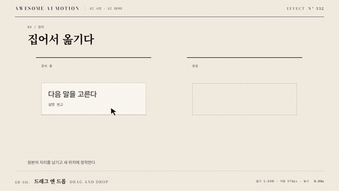

# Nº 332 드래그 앤 드롭 · Drag and Drop



[MP4](clip.mp4) · [HTML](index.html)

**커서가 요소를 집어 들어 반투명 복사본과 이동하고 새 위치에 놓는다.**

Lift a translucent copy, carry it with the cursor, and settle it in a new slot.

| Family | Level | Purpose | Media | Runtime |
|---|---|---|---|---|
| UI 시연 · UI DEMO | 중급 | 순서·흐름 | 설명 영상, 제품 시연, 웹 UI | gsap |

다른 이름 / Also known as: Cursor drag, 커서 드래그, Drag and drop demonstration, 드래그 놓기 시연

## 선택 기준 / Selection

옮기기, 순서 바꾸기, 크기 변경을 보여준다. / Shows ownership, relocation, and a clear drop result.

- 목록 순서를 바꾸는 제품 시연 / Demonstrate list reordering.
- 파일을 드롭 영역으로 옮기는 안내 / Guide a file into a drop zone.

좋은 예 / Good: 커서와 반투명 카드가 320px 이동한 뒤 카드가 새 슬롯에 정착한다
나쁜 예 / Bad: 커서가 카드보다 먼저 도착해 무엇을 옮기는지 알 수 없다
주의 / Avoid: 이동 중 원본과 복사본을 모두 불투명하게 두지 않는다

## 파라미터 / Parameters

| Parameter | Default | Range | Note |
|---|---|---|---|
| 들기 | 160ms | 100~220ms | 이동 전 잡는 동작 |
| 확대 | 1.05 | 1.02~1.08 | 원본 기준 배율 |
| 복사본 투명도 | 0.65 | 0.5~0.8 | 드래그 중 상태 |
| 이동 | 800ms | 600~1200ms | 320px 이동 기준 |
| 놓기 | 250ms | 180~350ms | 최종 슬롯 정착 |

이징 / Ease: `power2.inOut`

## 구현 / Implementation (GSAP)

```js
tl.to('.ghost', {scale:1.05, opacity:0.65, duration:0.16}, 0);
tl.to(['.cursor','.ghost'], {x:320, y:120, duration:0.8, ease:'power2.inOut'}, 0.16);
tl.to('.ghost', {scale:1, opacity:1, duration:0.25}, 0.96);
```

## 프롬프트 / Prompts

### 한국어 · Claude Code
```text
<파일>의 <대상>에 드래그 앤 드롭을 적용한다. 복사본의 시작 좌표를 커서와 맞추고 320px, 120px 이동 후 최종 슬롯에 놓는다. 초기 상태를 명시한 paused 타임라인으로 만들고 고정 좌표와 시간만 사용해 seek를 재현한다.
```

### 한국어 · Codex
```text
<파일>에서 <대상>의 드래그 앤 드롭 장면에 적용한다. 복사본의 시작 좌표를 커서와 맞추고 320px, 120px 이동 후 최종 슬롯에 놓는다. 0.30초·0.79초·1.41초 시점을 캡처해 시작 상태, 중간 관계, 최종 정착과 겹침 여부를 확인한다.
```

### English · Claude Code
```text
Apply Drag and Drop to <target> in <file>. Align the copy with the cursor, move both by 320px and 120px, then settle the copy in the destination slot. Define the initial state and use a paused timeline with fixed coordinates and timings for repeatable seeking.
```

### English · Codex
```text
Implement Drag and Drop in the scene for <target> in <file>. Align the copy with the cursor, move both by 320px and 120px, then settle the copy in the destination slot. Capture at 0.30s, 0.79s, 1.41s to verify the initial state, intermediate relationships, final settling, and unwanted overlap.
```

예시 / Example: 드래그 앤 드롭를 `.hero`에 적용해. / Apply Drag and Drop to `.hero`.

## 적용 / Application

- HyperFrames: paused 타임라인에 드래그 앤 드롭의 초기 상태와 종료 상태를 함께 기록하고 1.21초까지 seek로 재현한다.
- ReelForge: 씬 워커 브리프에 드래그 앤 드롭 대상 선택자와 들기 160ms, 확대 1.05, 복사본 투명도 0.65를 싣고 최종 상태 유지 시간을 지정한다.
- Scrolline Deck: 진행률 0~1을 1.21초 구간에 매핑하고 scrub에서는 스프링 대신 power3.out으로 위치를 계산한다.

조합 / Pair with: [커서 이동과 클릭 · Cursor Move & Click](../cursor-click/) · [레이아웃 재배치 · Layout Reflow](../layout-reflow/)

출처 / Sources: [heygen-com/hyperframes](https://raw.githubusercontent.com/heygen-com/hyperframes/main/registry/components/swipe-rail/registry-item.json) (Apache-2.0) · [greensock/GSAP](https://gsap.com/docs/v3/Plugins/Draggable/) (GSAP Standard License) · [juliangarnier/anime](https://animejs.com/documentation/draggable) (MIT) · [motiondivision/motion](https://motion.dev/docs/react-drag) (MIT) · local/HyperFrames-skills (`claude-skill:hyperframes-animation/rules/cursor-drag.md`) (unknown)

[목록 / Catalog](../../references/catalog.md) · [index.json](../../index.json)
