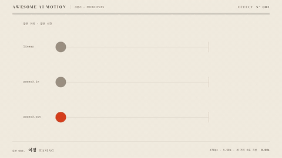

# Nº 003 이징 · Easing



[MP4](clip.mp4) · [HTML](index.html)

**같은 거리와 시간을 유지하면서 진행률에 따른 속도를 바꾸는 움직임**

Easing changes velocity over the course of an animation while keeping its distance and duration constant.

| Family | Level | Purpose | Media | Runtime |
|---|---|---|---|---|
| 기본기 · PRINCIPLES | 기본 | 비교, 설명, 피드백 | 설명 영상, 웹 UI, 발표 | gsap |

다른 이름 / Also known as: 속도 곡선, Ease, Easing curves, 이징 곡선, speed-graph-power-family, keyframe-velocity-to-cubic-bezier, easy-ease-linear-hold-usage

## 선택 기준 / Selection

출발과 정지의 무게감. ease-out은 빠르게 반응한 뒤 부드럽게 멈춘다 / Adds weight to starts and stops; ease-out responds quickly and then settles smoothly.

- 동일한 이동의 속도감을 비교할 때 / Compare the perceived speed of otherwise identical movements.
- UI가 빠르게 반응하고 부드럽게 멈추게 할 때 / Make UI motion respond quickly and stop smoothly.

좋은 예 / Good: 670px 이동을 1.5초로 통일하고 linear, power3.in, power3.out을 나란히 비교한다
나쁜 예 / Bad: 지속 시간과 거리를 함께 바꿔 이징만의 차이를 구별할 수 없게 한다
주의 / Avoid: 비교 줄마다 거리와 시간을 바꾸지 않는다 · 모든 움직임에 강한 가속을 적용하지 않는다

## 파라미터 / Parameters

| Parameter | Default | Range | Note |
|---|---|---|---|
| 이동 거리 | 670px | 300~800px | 비교 줄에 동일하게 적용 |
| 지속 시간 | 1.50s | 0.6~1.8s | 동시 출발과 동시 도착 |
| 시작 시각 | 0.30s | 0.2~0.4s | 초기 상태를 보여 준다 |
| 이징 | power3.out | none / power3.in / power3.out | 속도 곡선만 바꾼다 |

이징 / Ease: `none / power3.in / power3.out`

## 구현 / Implementation (GSAP)

```js
[['#linear','none'],['#in','power3.in'],['#out','power3.out']].forEach(([s,ease]) => {
  tl.to(s,{x:670,duration:1.5,ease},.3);
});
tl.to('.graph,.arrived',{opacity:1,duration:.25},1.9);
```

## 프롬프트 / Prompts

### 한국어 · Claude Code
```text
GSAP으로 <대상>을 세 줄에 배치하고 오른쪽 670px 이동을 비교해줘. 0.30초에 함께 출발해 1.50초 동안 none, power3.in, power3.out을 각각 적용하고 마지막 줄만 주홍으로 해. 1.90초에 작은 이징 그래프를 표시하고 3.00초까지 멈춰 있어.
```

### 한국어 · Codex
```text
<파일>의 scene에 세 이징 비교 줄을 넣어. 모든 점은 0.30초부터 1.50초 동안 transform x로 670px 이동하고 ease는 none, power3.in, power3.out이다. 0.73초와 1.23초 캡처에서 점 위치가 다르고 2.23초와 2.90초에서는 도착 위치와 그래프가 같은지 확인해.
```

### English · Claude Code
```text
Arrange <target> in three rows with GSAP to compare a 670px movement to the right. Start all three at 0.30 seconds and animate for 1.50 seconds using none, power3.in, and power3.out respectively. Make only the last row vermilion. Show small easing graphs at 1.90 seconds and hold until 3.00 seconds.
```

### English · Codex
```text
Add three easing comparison rows to the scene in <file>. Move every dot 670px using transform x, starting at 0.30 seconds over 1.50 seconds, with eases none, power3.in, and power3.out. Capture at 0.73 and 1.23 seconds to verify different dot positions, and at 2.23 and 2.90 seconds to verify identical final positions and graphs.
```

예시 / Example: 이징를 `.hero`에 적용해. / Apply Easing to `.hero`.

## 적용 / Application

- HyperFrames: 한 paused 타임라인에서 세 tween의 시작과 지속 시간을 같게 두고 ease만 바꾼다
- ReelForge: 세 비교 트랙의 거리와 지속 시간을 고정하고 이징 값을 노출한다
- Scrolline Deck: 같은 스크롤 진행률에 이징 함수를 적용해 위치를 계산한다

조합 / Pair with: [타이밍과 간격 · Timing & Spacing](../timing-spacing/) · [예비동작 · Anticipation](../anticipation/) · [스프링 오버슛 · Spring & Overshoot](../spring-overshoot/)

출처 / Sources: [GSAP Eases](https://gsap.com/docs/v3/Eases/) (공식 문서 참조) · [animista.net](https://animista.net/play) (BSD-2-Clause (FreeBSD)) · [heygen-com/hyperframes](https://raw.githubusercontent.com/heygen-com/hyperframes/main/registry/components/extended-keyframe/registry-item.json) (Apache-2.0)

[목록 / Catalog](../../references/catalog.md) · [index.json](../../index.json)
