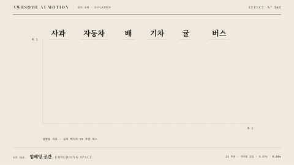

# Nº 363 임베딩 공간 · Embedding Space



[MP4](clip.mp4) · [HTML](index.html)

**단어가 의미에 따른 좌표로 이동해 가까운 뜻끼리 모이는 움직임**

An animation that moves words to semantic coordinates so words with similar meanings cluster together.

| Family | Level | Purpose | Media | Runtime |
|---|---|---|---|---|
| 원리 도해 · EXPLAINER | 기본 | 설명, 순서·흐름 | 설명 영상, 발표, 스크롤덱 | gsap |

다른 이름 / Also known as: 의미 공간, Semantic Space, Embedding projection / Point movement, 임베딩 점 이동

## 선택 기준 / Selection

벡터 공간에서 의미의 유사성이 거리로 표현된다 / Shows how distance represents semantic similarity in a vector space.

- 임베딩을 처음 소개할 때 / When introducing embeddings
- 검색의 의미 유사성을 설명할 때 / When explaining semantic similarity in search

좋은 예 / Good: 과일 세 단어와 탈것 세 단어가 두 무리로 모인다
나쁜 예 / Bad: 단어를 임의 좌표에 흩어 군집 관계가 보이지 않는다
주의 / Avoid: 설명용 좌표를 실제 임베딩 수치로 제시하지 않는다 · 무리 안에서 단어를 겹치지 않는다

## 파라미터 / Parameters

| Parameter | Default | Range | Note |
|---|---|---|---|
| 단어 수 | 6 | 4~10 | 두 의미 무리 |
| 이동 지속 | 1.05s | 0.8~1.3s | 군집으로 도착 |
| 출발 시간차 | 0.09s | 0.05~0.12s | 경로를 구분 |
| 강조 원 | 288×238px | 220~340px | 한 군집만 강조 |

이징 / Ease: `power3.inOut`

## 구현 / Implementation (GSAP)

```js
const tl = Motion.timeline();
const words = document.querySelectorAll('.word');
const offsets = [[130,170],[405,195],[-60,275],[225,285],[-320,210],[-120,140]];
words.forEach((el,i)=>tl.to(el,{x:offsets[i][0],y:offsets[i][1],duration:1.05,ease:'power3.inOut'},.3+i*.09));
tl.to('.ring',{opacity:1,duration:.4},1.85);
tl.to('.group',{opacity:1,duration:.3},1.9);
```

## 프롬프트 / Prompts

### 한국어 · Claude Code
```text
<대상>의 단어 6개를 헤어라인 2D 축 위 두 군집으로 이동시킨다. 0.3초부터 0.09초 간격으로 1.05초 power3.inOut 이동을 쓰고 과일은 왼쪽, 탈것은 오른쪽에 둔다. 1.85초에 왼쪽 군집만 288×238px 주홍 원으로 둘러싼다. 3초 타임라인 하나로 만들고 마지막 0.6초는 정지한다.
```

### 한국어 · Codex
```text
<파일>의 <대상>에 <대상>의 단어 6개를 헤어라인 2D 축 위 두 군집으로 이동시킨다. 0.3초부터 0.09초 간격으로 1.05초 power3.inOut 이동을 쓰고 과일은 왼쪽, 탈것은 오른쪽에 둔다. 1.85초에 왼쪽 군집만 288×238px 주홍 원으로 둘러싼다. 0.24초, 1.25초, 2.9초를 캡처해 단어의 겹침 없이 두 군집과 강조 원을 확인한다. 시간은 GSAP 타임라인만 사용한다.
```

### English · Claude Code
```text
Move 6 words in <target> into two clusters on hairline 2D axes. Starting at 0.3 seconds, move them over 1.05 seconds with power3.inOut at 0.09-second intervals. Place fruits on the left and vehicles on the right. At 1.85 seconds, surround only the left cluster with a vermilion 288×238px circle. Use a single 3-second timeline and hold still for the final 0.6 seconds.
```

### English · Codex
```text
In <target> in <file>, Move 6 words in <target> into two clusters on hairline 2D axes. Starting at 0.3 seconds, move them over 1.05 seconds with power3.inOut at 0.09-second intervals. Place fruits on the left and vehicles on the right. At 1.85 seconds, surround only the left cluster with a vermilion 288×238px circle. Capture at 0.24, 1.25, and 2.9 seconds to check the two clusters without overlapping words and the highlight circle. Use only a GSAP timeline for timing.
```

예시 / Example: 임베딩 공간를 `.hero`에 적용해. / Apply Embedding Space to `.hero`.

## 적용 / Application

- HyperFrames: 3초 paused GSAP 타임라인 하나로 구성하고 Motion.ready()로 seek를 노출한다. 단어별 좌표를 미리 정하고 x/y 이동이 끝나면 한 군집의 원을 공개한다.
- ReelForge: 3초 장면 안의 요소를 분리하고 transform과 opacity 트랙으로 같은 순서를 구현한다. 단어별 좌표를 미리 정하고 x/y 이동이 끝나면 한 군집의 원을 공개한다.
- Scrolline Deck: 0.3~2.4초 동작을 스크롤 진행률 10~80%로 매핑하고 끝 20%를 완성 상태로 둔다. 단어별 좌표를 미리 정하고 x/y 이동이 끝나면 한 군집의 원을 공개한다.

조합 / Pair with: [점 재배치 · Dot Regroup](../dot-regroup/) · [토큰 쪼개기 · Token Split](../token-split/) · [주석 등장 · Annotation Callout](../annotation-callout/)

출처 / Sources: [Google Machine Learning Crash Course, Embeddings](https://developers.google.com/machine-learning/crash-course/embeddings) (개념 참고) · motion dictionary 3-type-data-ui.md#29. 임베딩 점 이동 · Embedding projection / Point movement (own)

[목록 / Catalog](../../references/catalog.md) · [index.json](../../index.json)
