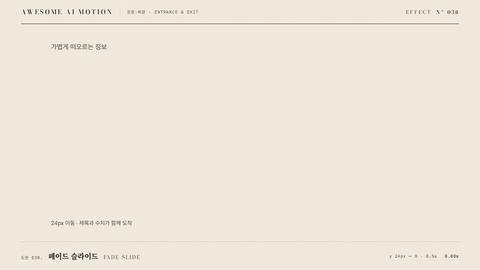

# Nº 038 페이드 슬라이드 · Fade Slide



[MP4](clip.mp4) · [HTML](index.html)

**요소가 가장자리나 조금 낮은 위치에서 이동하며 선명하게 나타난다.**

An element fades in while sliding into position.

| Family | Level | Purpose | Media | Runtime |
|---|---|---|---|---|
| 등장·퇴장 · ENTRANCE & EXIT | 기본 | 주목 끌기, 전환 | 설명 영상, 웹 UI, 숏폼 | gsap |

다른 이름 / Also known as: Fade Up, Fade Through Translation, Fade and slide entrance, 페이드 슬라이드 등장, Alpha Cutout, 알파 컷아웃 리빌, alpha-matte-cutout

## 선택 기준 / Selection

새 항목의 위치와 등장 순서를 읽는다. / Makes the location and arrival order of new content clear.

- 새 목록 항목을 보여줄 때 / Use when presenting fade slide in a content reveal scene.
- 제목과 설명을 순차 등장시킬 때 / Use for a focused title, image, or card with a clearly visible final state.

좋은 예 / Good: 설명 카드가 아래 24px에서 올라오며 선명해진다.
나쁜 예 / Bad: 본문마다 큰 이동을 걸어 읽는 위치가 흔들린다.
주의 / Avoid: 본문마다 큰 이동을 걸어 읽는 위치가 흔들린다. · 완료 자세에서 내용이 가려지지 않게 한다.

## 파라미터 / Parameters

| Parameter | Default | Range | Note |
|---|---|---|---|
| 지속 | 0.5s | 0.35~0.7s | 0초부터 시작하는 공개 구간 |
| 이동 거리 | 24px | 12~48px | 기준 위치 아래에서 시작 |
| 시작 불투명도 | 0 | 0~0.2 | 완료 시 1 |
| 이징 | power2.out | power2.out, power3.out, sine.inOut | 움직임의 가속과 감속 |

## 구현 / Implementation (GSAP)

```js
gsap.set('.target', {y:24, opacity:0});
tl.to('.target', {y:0, opacity:1, duration:0.5, ease:'power2.out'}, 0);
tl.set('.target', {y:0, opacity:1}, 0.5);
```

## 프롬프트 / Prompts

### 한국어 · Claude Code
```text
<파일>에서 <대상>에 페이드 슬라이드을 적용해. 0.5초, 이동 거리 24px; 시작 불투명도 0, 이징 power2.out로 구현해. paused 타임라인으로 seek 가능하게 하고 완료 자세를 유지해.
```

### 한국어 · Codex
```text
<파일>의 <대상> 레이어에 페이드 슬라이드을 적용해. 0.5초, 이동 거리 24px; 시작 불투명도 0, power2.out를 사용하고 0초, 0.25초, 0.5초 캡처로 시작값, 중간 변화, 완료 자세를 확인해. 동일 시점을 두 번 seek해 같은 결과인지 검증해.
```

### English · Claude Code
```text
Apply Fade Slide to <target> in <file>. Use a 0.5s segment with power2.out; implement these explicit settings: Vertical travel: 24px, Initial opacity: 0. Use a paused, seekable timeline and hold the final pose.
```

### English · Codex
```text
Apply Fade Slide to the <target> layer in <file> with Vertical travel: 24px, Initial opacity: 0, using the supplied core snippet and a 0.5s segment with power2.out. Capture at 0s, 0.25s, and 0.5s to verify the initial pose, intermediate change, and final pose. Seek to the same timestamp twice and confirm identical output.
```

예시 / Example: 페이드 슬라이드를 `.hero`에 적용해. / Apply Fade Slide to `.hero`.

## 적용 / Application

- HyperFrames: paused 타임라인에 0.5초 구간을 넣고 seek로 자세를 계산한다. 시작값과 완료값을 명시한다.
- ReelForge: 씬 워커 브리프에 페이드 슬라이드, 0.5초, 이동 거리 24px; 시작 불투명도 0, power2.out를 싣고 대상 레이어를 지정한다.
- Scrolline Deck: 진행률 0~1을 0.5초 구간에 매핑한다. scrub에서는 스프링 대신 ease-out으로 같은 시작값과 완료값을 보간한다.

조합 / Pair with: [스태거 · Stagger](../stagger/) · [스케일 팝 · Scale Pop](../scale-pop/)

출처 / Sources: [animate-css/animate.css](https://github.com/animate-css/animate.css) (Hippocratic-2.1) · [animista.net](https://animista.net/play) (BSD-2-Clause (FreeBSD)) · [michalsnik/aos](https://github.com/michalsnik/aos) (MIT) · [jamiebuilds/tailwindcss-animate](https://github.com/jamiebuilds/tailwindcss-animate) (MIT) · [DavidHDev/react-bits](https://github.com/DavidHDev/react-bits) (MIT + Commons Clause v1.0)

[목록 / Catalog](../../references/catalog.md) · [index.json](../../index.json)
