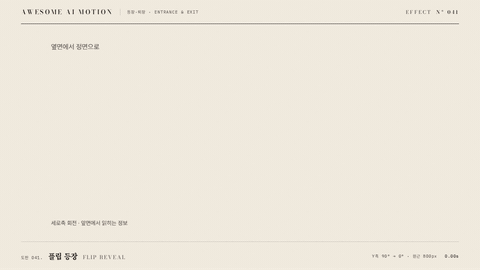

# Nº 041 플립 등장 · Flip Reveal



[MP4](clip.mp4) · [HTML](index.html)

**얇은 옆면으로 보이던 요소가 3D 축을 돌아 정면으로 나타난다.**

An edge-on element rotates around a 3D axis to face the viewer.

| Family | Level | Purpose | Media | Runtime |
|---|---|---|---|---|
| 등장·퇴장 · ENTRANCE & EXIT | 중급 | 주목 끌기, 강조 | 설명 영상, 숏폼, 발표 | css |

다른 이름 / Also known as: Flip In and Out, 뒤집기 등장과 퇴장, Slit Reveal, 얇은 면 펼치기

## 선택 기준 / Selection

카드나 정보의 앞뒤 관계를 알린다. / Suggests the front and back of a card or piece of information.

- 카드의 새 정보를 공개할 때 / Reveal new information on a card.
- 장면의 주인공 한 요소에 시선을 모을 때 / Focus attention on one main element in a scene.

좋은 예 / Good: 답안 카드가 얇은 옆면에서 정면으로 펼쳐진다.
나쁜 예 / Bad: 여러 요소에 동시에 적용해 읽을 위치와 시선을 계속 바꾸게 만든다.
주의 / Avoid: 뒷면 글자가 비치지 않게 한다. · 동작 줄이기 설정에서는 정적인 최종 상태를 보여 준다.

## 파라미터 / Parameters

| Parameter | Default | Range | Note |
|---|---|---|---|
| 지속 시간 | 700ms | 489~979ms | 한 번의 동작 기준 |
| 원근 거리 | 800px | 600~1200px | 3D 깊이 |
| 시작 회전 | 90deg | 60~90deg | 세로축 기준 |

이징 / Ease: `cubic-bezier(0.22, 1, 0.36, 1)`

## 구현 / Implementation (GSAP)

```js
.effect { animation: effect 700ms cubic-bezier(0.22, 1, 0.36, 1) both; }
.effect { backface-visibility: hidden; }
@keyframes effect {
  from{transform:perspective(800px) rotateY(90deg);opacity:0} to{transform:perspective(800px) rotateY(0);opacity:1}
}
```

## 프롬프트 / Prompts

### 한국어 · Claude Code
```text
<파일>에서 <대상>에 플립 등장을 적용해. 지속 700ms, 원근 거리 800px, 시작 회전 90deg, 이징 cubic-bezier(0.22, 1, 0.36, 1)으로 위 키프레임을 구현하고 최종 상태를 유지해. 동작 줄이기 설정에서는 최종 상태를 바로 보여 줘.
```

### 한국어 · Codex
```text
<파일>의 <대상> 스타일에 플립 등장 키프레임을 추가해. 지속 700ms, 원근 거리 800px, 시작 회전 90deg, 이징 cubic-bezier(0.22, 1, 0.36, 1)을 적용하고 0초·0.35초·0.7초 시점을 캡처해 시작 상태, 중간 변화, 최종 정착를 확인해. 고정 키프레임으로 재현하고 동작 줄이기 설정을 확인해.
```

### English · Claude Code
```text
Apply Flip Reveal to <target> in <file>. Implement the provided keyframes with 700ms duration, perspective 800px, initial rotation 90deg, easing cubic-bezier(0.22, 1, 0.36, 1). Preserve the final state and show it immediately when reduced motion is enabled.
```

### English · Codex
```text
Add Flip Reveal keyframes to the styles for <target> in <file> using 700ms duration, perspective 800px, initial rotation 90deg, easing cubic-bezier(0.22, 1, 0.36, 1). Capture at 0, 0.35, and 0.7 seconds to verify the initial state, intermediate motion, and settled state. Use fixed keyframes and verify reduced-motion behavior.
```

예시 / Example: 플립 등장를 `.hero`에 적용해. / Apply Flip Reveal to `.hero`.

## 적용 / Application

- HyperFrames: CSS 키프레임 값을 paused 타임라인에 옮겨 0.7초 구간을 seek한다. 시작과 종료 상태를 명시한다.
- ReelForge: 씬 워커 브리프에 플립 등장의 지속 700ms, 원근 거리 800px, 시작 회전 90deg, 이징 cubic-bezier(0.22, 1, 0.36, 1)을 싣고 대상 한 요소와 안전 영역을 지정한다.
- Scrolline Deck: 진행률 0~1을 0.7초 동작에 매핑한다. scrub에서는 스프링 대신 ease-out을 사용한다.

조합 / Pair with: [페이드 · Fade](../fade/) · [스태거 · Stagger](../stagger/)

출처 / Sources: [animate-css/animate.css](https://github.com/animate-css/animate.css) (Hippocratic-2.1) · [animista.net](https://animista.net/play) (BSD-2-Clause (FreeBSD)) · [michalsnik/aos](https://github.com/michalsnik/aos) (MIT)

[목록 / Catalog](../../references/catalog.md) · [index.json](../../index.json)
