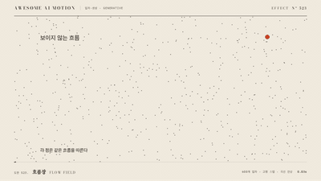

# Nº 523 흐름장 · Flow Field



[MP4](clip.mp4) · [HTML](index.html)

**많은 작은 입자와 잔상이 보이지 않는 흐름을 따라 곡선으로 이동하는 효과**

Many small particles and trails move along curves following an invisible flow.

| Family | Level | Purpose | Media | Runtime |
|---|---|---|---|---|
| 입자·생성 · GENERATIVE | 고급 | 분위기, 브랜딩, 설명 | 설명 영상, 발표, 웹 UI | canvas |

다른 이름 / Also known as: 노이즈 흐름장, bg-flow-field, Vector-field phase flow, 벡터장 흐름, PhaseFlow, Noise Flow Field, Flow-field advection, Perlin flow field, Curl Noise Swirl, 컬 노이즈 소용돌이, Divergence-free particle flow

## 선택 기준 / Selection

바람, 물, 데이터 흐름 같은 보이지 않는 힘을 시각화하고 우아한 생성 미술의 인상을 준다 / Visualizes invisible forces like wind, water, or data flow, with an elegant generative-art feel.

- 타이틀 배경이나 브랜드 영상에 유기적 생성 질감을 깔 때 / To lay an organic generative texture behind titles or brand videos
- 바람, 해류, 데이터 흐름의 방향성을 보여줄 때 / To show the directionality of wind, currents, or data flow

좋은 예 / Good: 입자 600개가 8초 동안 노이즈 흐름을 따라 곡선을 그리며 alpha 0.08의 잔상이 쌓여 흐름이 드러난다
나쁜 예 / Bad: 입자 수를 5000개로 늘려 화면이 하얗게 차거나, 매 실행마다 시드가 달라 결과가 다르다
주의 / Avoid: 잔상 alpha 0.12 초과 금지(화면이 뭉침) · 시드 고정과 사전 계산 필수

## 파라미터 / Parameters

| Parameter | Default | Range | Note |
|---|---|---|---|
| 지속 | 8000ms | 5000~12000ms | 흐름 누적 |
| 입자 수 | 600개 | 300~1200개 | 시드 고정 |
| noise scale | 0.004 | 0.002~0.008 | 작을수록 큰 곡선 |
| 잔상 alpha | 0.08 | 0.04~0.12 | 배경 페이드 |
| 속도 | 90px/s | 60~140px/s | 고정 스텝 |

이징 / Ease: `linear`

## 구현 / Implementation (GSAP)

```js
// 사전 계산: 고정 dt로 궤적 저장 후 시간 t까지 그린다
const traj=P.map(p=>{const pts=[];for(let s=0;s<480;s++){const a=noise(p.x*.004,p.y*.004)*12.566;p.x+=Math.cos(a)*1.5;p.y+=Math.sin(a)*1.5;pts.push([p.x,p.y]);}return pts;});
function draw(k){ctx.clearRect(0,0,1920,1080);traj.forEach(t=>{ctx.beginPath();t.slice(0,k).forEach(([x,y],i)=>i?ctx.lineTo(x,y):ctx.moveTo(x,y));ctx.stroke();});}
```

## 프롬프트 / Prompts

### 한국어 · Claude Code
```text
<배경>에 흐름장을 만들어줘. canvas에서 입자 600개(시드 고정)를 노이즈 scale 0.004의 벡터장을 따라 480스텝 사전 계산해 궤적 배열로 저장하고, 8초 동안 진행값 k만큼 그려. 선은 흰색 alpha 0.35, 잔상 표현은 궤적 뒷부분을 alpha 0.08로 페이드. 상태 누적 없이 progress 순수 함수로 그려서 seek 가능하게 해.
```

### 한국어 · Codex
```text
<파일>에 flow-field 캔버스를 구현해. 입자 600개, noise scale 0.004, 8000ms, 480스텝 사전 계산, seed 고정. 0초, 4초, 8초를 캡처해 궤적이 늘어나며 곡선 흐름이 드러나는지, 같은 시점 재렌더가 동일한지, 화면이 하얗게 포화되지 않는지 확인해.
```

### English · Claude Code
```text
Build a flow field background for <target>. On a canvas, precompute 480 steps of trajectories for 600 seeded particles along a noise vector field with scale 0.004, and draw them up to step k over 8s. Lines are white at alpha 0.35 with the trailing part fading to alpha 0.08. No state accumulation; draw as a pure function of progress so it is seekable.
```

### English · Codex
```text
Implement a flow-field canvas in <file>: 600 particles, noise scale 0.004, 8000ms, 480 precomputed steps, fixed seed. Capture at 0s, 4s, and 8s to verify trajectories lengthen and curved flow emerges, re-rendering the same time is identical, and the frame does not saturate to white.
```

예시 / Example: 흐름장를 `.hero`에 적용해. / Apply Flow Field to `.hero`.

## 적용 / Application

- HyperFrames: 궤적을 미리 계산해 저장하고 draw(k)에서 k 스텝까지 그린다. 이렇게 하면 seek해도 같다. 상태를 누적하는 방식은 seek에서 깨진다
- ReelForge: 브리프에 particleCount, noiseScale, durationMs, seed를 싣는다. 사전 계산은 워커 시작 시 1회, 480스텝 x 600개
- Scrolline Deck: 진행률을 스텝 k에 선형 매핑한다. 궤적이 사전 계산되어 있으므로 되감기도 정확하다

조합 / Pair with: [입자 힘장 · Particle Force Field](../particle-force-field/) · [이상 끌개 · Strange Attractor Trails](../strange-attractor/) · [입자 소용돌이 · Particle Vortex](../particle-vortex/) · [보이드 군집 · Boid Flocking](../boid-flocking/)

출처 / Sources: local/music-to-video (`claude-skill:music-to-video/references/motion-primitive-catalog.md#bg-flow-field`) (unknown) · local/music-to-video (`claude-skill:music-to-video/references/motion-primitives/bg-flow-field/scene.html`) (unknown) · local/music-to-video (`claude-skill:music-to-video/references/motion-primitives/bg-flow-field/index.html`) (unknown) · local/music-to-video (`claude-skill:music-to-video/references/template-catalog.md#held-message-living-field`) (unknown) · local/claude-synced-skills (`claude-skill:synced/39cd27d1-5d54-43b6-b557-65596e75bccb_30aab8dd-6815-4962-a41b-a684567e027b/algorithmic-art/SKILL.md`) (Apache-2.0)

[목록 / Catalog](../../references/catalog.md) · [index.json](../../index.json)
