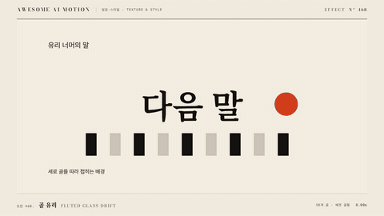

# Nº 468 골 유리 · Fluted Glass Drift



[MP4](clip.mp4) · [HTML](index.html)

**반복된 세로 굴곡이 배경을 늘리고 접으며 옆으로 천천히 이동하는 골 유리**

Repeated vertical flutes stretch and fold the background as they drift sideways.

| Family | Level | Purpose | Media | Runtime |
|---|---|---|---|---|
| 질감·스타일 · TEXTURE & STYLE | 중급 | 분위기, 브랜딩 | 웹 UI, 제품 시연, 발표 | webgl |

다른 이름 / Also known as: 골 유리 이동

## 선택 기준 / Selection

반투명 건축 재질의 세련된 굴절감. 정보를 가리지 않고 분위기만 걸러 주는 막 / The refined refraction of translucent architectural glass. A veil that filters mood without hiding the information.

- 카드나 패널 뒤 배경을 골 유리로 걸러 고급스럽게 만들 때 / Filter the backdrop behind a card or panel through fluted glass for a premium look.
- 이미지 위에 세로 굴절 필터를 덮어 분위기를 바꿀 때 / Overlay a vertical refraction filter to change an image's mood.

좋은 예 / Good: 골 18개가 배경을 좌우 0.025UV씩 굴절시키며 5초 동안 초당 0.04UV로 옆으로 흘러 빛의 결이 이동한다
나쁜 예 / Bad: 골 수가 40개 이상이라 잔줄무늬가 되거나 왜곡이 0.06UV를 넘어 배경이 알아볼 수 없다
주의 / Avoid: 골 수 32개 초과 금지 · 왜곡 0.05UV 초과 금지

## 파라미터 / Parameters

| Parameter | Default | Range | Note |
|---|---|---|---|
| 골 수 | 18 | 10~28 | 화면 폭 기준 |
| 왜곡 | 0.025UV | 0.015~0.04 | 좌우 굴절 |
| 이동 | 0.04UV/s | 0.02~0.08 | 옆 방향 |
| 그림자 | 0.2 | 0.1~0.3 | 골 사이 명암 |
| 지속 | 5s | 4~8s | 루프 |

이징 / Ease: `none`

## 구현 / Implementation (GSAP)

```js
const u = { t: 0 };
tl.to(u, { t: 5, duration: 5, ease: 'none', onUpdate: draw }, 0);
// GLSL: float x = fract(uv.x * 18.0 + t * 0.04 * 18.0); float n = x * 2.0 - 1.0;   // 골 안 위치 -1..1
// uv.x += n * 0.025; float shade = 1.0 - 0.2 * n * n; col = texture(tex, uv).rgb * shade;
```

## 프롬프트 / Prompts

### 한국어 · Claude Code
```text
<대상> 배경에 골 유리 효과를 넣어줘. 화면을 세로 골 18개로 나누고 골 안 위치 n(-1~1)만큼 UV를 좌우 0.025 이동시켜 굴절시키며, 골 가장자리로 갈수록 n^2*0.2만큼 어둡게 해. 골 패턴은 5초 동안 초당 0.04UV로 옆으로 흘러. 패널 위 텍스트는 이 효과 밖에 둬.
```

### 한국어 · Codex
```text
<파일>의 배경 캔버스에 fluted 셰이더를 추가해. x=fract(uv.x*18+t*0.04*18), n=x*2-1, uv.x+=n*0.025, shade=1-0.2*n*n. t는 5초 선형 tween. 0초·2.5초·5초 캡처로 세로 골이 일정 간격으로 보이고 옆으로 이동하며 배경 색이 유지되는지 확인해.
```

### English · Claude Code
```text
Add a fluted glass effect to the background of <target>. Divide the frame into 18 vertical flutes, shift the UV sideways by 0.025 times the in-flute position n (-1 to 1) to refract, and darken toward flute edges by n^2*0.2. The pattern drifts sideways at 0.04UV per second over 5 seconds. Keep panel text outside the effect.
```

### English · Codex
```text
Add a fluted shader to the background canvas in <file>. x=fract(uv.x*18+t*0.04*18); n=x*2-1; uv.x+=n*0.025; shade=1-0.2*n*n. Tween t linearly over 5 s. Capture 0 s, 2.5 s and 5 s to confirm evenly spaced vertical flutes that drift sideways while the background colors remain.
```

예시 / Example: 골 유리를 `.hero`에 적용해. / Apply Fluted Glass Drift to `.hero`.

## 적용 / Application

- HyperFrames: 골 안 위치를 fract로 계산해 결정론적이다. t만 tween하고 배경 이미지는 고정 텍스처로 둔다
- ReelForge: 씬 브리프에 골 18, 왜곡 0.025UV, 이동 0.04UV/s, 그림자 0.2와 배경 이미지를 싣는다
- Scrolline Deck: 진행률을 t에 선형 매핑한다. 골이 정적인 상태에서 배경만 움직이는 변형(골 고정, 배경 이동)도 스크럽에 잘 맞는다

조합 / Pair with: [유리 굴절 · Glass Refraction](../glass-refraction/) · [수면 굴절 · Water Surface Refraction](../water-refraction/) · [홀로그램 광택 · Holographic sheen](../holographic-sheen/) · [점진적 블러 · Progressive Blur](../progressive-blur/)

출처 / Sources: [paper-design/shaders](https://shaders.paper.design/fluted-glass) (Apache-2.0)

[목록 / Catalog](../../references/catalog.md) · [index.json](../../index.json)
