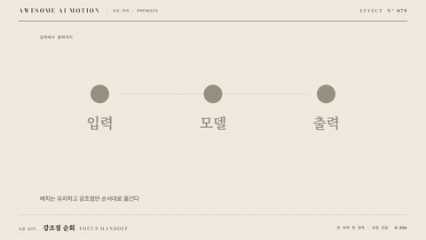

# Nº 079 강조점 순회 · Focus Handoff



[MP4](clip.mp4) · [HTML](index.html)

**이미 배치된 여러 항목 중 하나씩 색이나 빛이 켜졌다가 다음 항목으로 옮겨 간다**

Among items already laid out, one lights up at a time and the highlight hands off to the next.

| Family | Level | Purpose | Media | Runtime |
|---|---|---|---|---|
| 강조·주의 · EMPHASIS | 기본 | 강조, 순서·흐름 | 설명 영상, 발표, 스크롤덱 | gsap |

다른 이름 / Also known as: Accent Walk, gradient-text-sweep, Narration-synchronized signaling, 해설 동기 신호 주기, 초점 이전, Code Range Focus, 코드 범위 초점 이동

## 선택 기준 / Selection

지금 설명 중인 항목이 어디인지, 읽는 순서가 어떻게 되는지 한눈에 알게 한다 / Viewers see which item is being explained and the reading order at a glance.

- 4개 항목을 차례로 설명하며 현재 항목만 밝히고 싶을 때 / Explain four items in turn and light only the current one.
- 해설과 화면이 동기되는 목록형 장면을 만들 때 / Build a list scene synced with narration.

좋은 예 / Good: 항목 4개가 모두 보이고 강조는 하나씩 500ms 홀드 후 150ms 전환으로 넘어간다. 꺼진 항목은 opacity 0.35
나쁜 예 / Bad: 항목마다 다른 색을 쓰고 전환이 0.6초 이상 걸려 어디가 켜졌는지 헷갈린다. 두 항목이 동시에 켜진다
주의 / Avoid: 동시 강조는 하나만 · 항목 6개 초과 시 스크롤이나 분할을 쓴다

## 파라미터 / Parameters

| Parameter | Default | Range | Note |
|---|---|---|---|
| 항목 수 | 4 | 3~6 | 전부 미리 배치 |
| 홀드 | 500ms | 400~1200ms | 해설 길이에 맞춤 |
| 전환 | 150ms | 100~250ms | 교차 페이드 |
| 비활성 opacity | 0.35 | 0.25~0.5 | 읽을 수 있는 최소 |

이징 / Ease: `power2.inOut`

## 구현 / Implementation (GSAP)

```js
items.forEach((el, i) => {
  const t = 0.4 + i * 0.65; // 홀드 500 + 전환 150
  tl.to(el, { opacity: 1, scale: 1.04, duration: 0.15, ease: 'power2.inOut' }, t);
  tl.to(el, { opacity: 0.35, scale: 1, duration: 0.15, ease: 'power2.inOut' }, t + 0.65);
});
```

## 프롬프트 / Prompts

### 한국어 · Claude Code
```text
<대상> 목록 4개 항목이 처음부터 모두 보이되 0.35 opacity로 흐리게 두고, 0.4초부터 항목이 하나씩 opacity 1, scale 1.04로 켜지게 해줘. 각 항목은 500ms 홀드 후 150ms에 다음 항목으로 넘어가고 이전 항목은 다시 0.35로 돌아가게 해. 이징은 power2.inOut.
```

### 한국어 · Codex
```text
<파일>에 focus handoff를 구현해. 항목 4개, 홀드 500ms, 전환 150ms, 비활성 opacity 0.35, 활성 scale 1.04, ease power2.inOut. 0.6초, 1.25초, 1.9초, 2.55초에 캡처해 그 시점에 켜진 항목이 정확히 하나인지 확인해.
```

### English · Claude Code
```text
Make all 4 list items in <target> visible from the start at 0.35 opacity, then from 0.4 seconds light them one at a time with opacity 1 and scale 1.04. Each holds 500ms then hands off over 150ms while the previous returns to 0.35. Use power2.inOut.
```

### English · Codex
```text
Implement focus handoff in <file>: 4 items, hold 500ms, transition 150ms, inactive opacity 0.35, active scale 1.04, ease power2.inOut. Capture at 0.6s, 1.25s, 1.9s and 2.55s and verify exactly one item is lit at each time.
```

예시 / Example: 강조점 순회를 `.hero`에 적용해. / Apply Focus Handoff to `.hero`.

## 적용 / Application

- HyperFrames: 항목별 on/off tween을 타임라인 위치로 배치한다. 해설 시각 배열을 그대로 시작 시각에 쓰면 narration-sync와도 맞물린다
- ReelForge: 브리프에 항목 수, 홀드, 전환, 비활성 opacity를 싣고 해설 문장 길이로 홀드를 정한다
- Scrolline Deck: 진행률 구간을 항목 수로 등분한다. 스크럽 중 두 항목이 겹치지 않도록 전환 폭은 구간의 20% 이하

조합 / Pair with: [하이라이트 스윕 · Highlight Sweep](../highlight-sweep/) · [해설 동기 모션 · Narration-synchronized Motion](../narration-sync/) · [선택 영역 이동 · Selection Travel](../selection-travel/)

출처 / Sources: gongnyang/awesome-html-scrolline-deck (`gongnyang/awesome-html-scrolline-deck:references/techniques.md#kinetic-titles`) (MIT) · [Richard E. Mayer / Wiley](https://onlinelibrary.wiley.com/doi/10.1111/jcal.12197) (unknown) · motion dictionary 1-principles.md#7. 연속성·공간 모델·시선 유도 (own) · gongnyang/awesome-html-scrolline-deck (`gongnyang/awesome-html-scrolline-deck:templates/scenes/kinetic-titles/scene.css`) (MIT) · [Cambridge University Press](https://www.cambridge.org/highereducation/books/multimedia-learning/FB7E79A165D24D47CEACEB4D2C426ECD/signaling-principle/9E37E775874EC1D93763620B8A296DD4) (unknown) · [motion-canvas/motion-canvas](https://motioncanvas.io/docs/code) (MIT) · [motion-canvas/motion-canvas](https://github.com/motion-canvas/motion-canvas) (MIT)

[목록 / Catalog](../../references/catalog.md) · [index.json](../../index.json)
