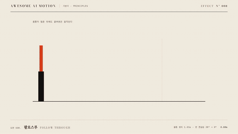

# Nº 008 팔로스루 · Follow-through



[MP4](clip.mp4) · [HTML](index.html)

**몸통이 멈춘 뒤 붙어 있는 끝부분이 관성으로 더 움직였다가 늦게 정지하는 기법**

An attached extremity continues moving through inertia after the main body stops, then settles later.

| Family | Level | Purpose | Media | Runtime |
|---|---|---|---|---|
| 기본기 · PRINCIPLES | 기본 | 설명, 강조, 분위기 | 설명 영상, 숏폼, 웹 UI | gsap |

다른 이름 / Also known as: 후속 동작, 관성 잔동작, Follow through, 후행 정착, Follow Through Settle, 후속 움직임 정착, Follow Through and Overlapping Action

## 선택 기준 / Selection

대상의 유연함과 관성. 정지 순간에도 힘이 남아 있음을 보여 준다 / Conveys flexibility and inertia, showing that force remains after the main body stops.

- 몸통에 붙은 깃발이나 꼬리의 관성을 표현할 때 / Show inertia in a flag or tail attached to a body.
- 갑작스러운 정지에 무게와 유연함을 더할 때 / Add weight and flexibility to an abrupt stop.

좋은 예 / Good: 먹 막대가 1.05초에 멈춘 뒤 위의 주홍 판만 38도 더 기울었다가 진폭을 줄이며 2.23초에 멈춘다
나쁜 예 / Bad: 몸통까지 계속 흔들려 무엇이 먼저 멈췄는지 구별하기 어렵다
주의 / Avoid: 끝부분의 연결점이 몸통에서 떨어지지 않게 한다 · 흔들림 진폭을 계속 같은 크기로 반복하지 않는다

## 파라미터 / Parameters

| Parameter | Default | Range | Note |
|---|---|---|---|
| 몸통 이동 | 650px | 300~750px | 몸통은 한 번 이동하고 정지 |
| 몸통 지속 | 0.75s | 0.5~1.1s | none으로 이동 후 급정지 |
| 이동 중 기울기 | -24° | -12~-30° | 진행 방향 반대로 따라온다 |
| 정지 후 최대각 | 38° | 20~45° | 관성으로 진행 방향을 넘는다 |
| 감쇠 각도 | -20°, 11°, -6°, 3°, 0° | 2~3회 진동 | 매 반주기마다 진폭을 줄인다 |

이징 / Ease: `none 몸통 / power2.out 관성 / power1.inOut 감쇠`

## 구현 / Implementation (GSAP)

```js
tl.to('#body',{x:650,duration:.75,ease:'none'},.3);
tl.to('#flag',{rotation:-24,duration:.25,ease:'power2.out'},.3);
tl.to('#flag',{rotation:38,duration:.18,ease:'power2.out'},1.05);
[[-20,.22],[11,.20],[-6,.20],[3,.18],[0,.20]].forEach(([rotation,duration],i)=>{
  const start=[1.23,1.45,1.65,1.85,2.03][i];
  tl.to('#flag',{rotation,duration,ease:'power1.inOut'},start);
});
```

## 프롬프트 / Prompts

### 한국어 · Claude Code
```text
GSAP으로 <대상>의 몸통과 붙어 있는 얇은 판에 팔로스루를 넣어줘. 몸통은 0.30초부터 0.75초 동안 오른쪽 650px 이동한 뒤 급정지하고, 판은 이동 중 -24도로 기울여. 1.05초부터 판만 0.18초 동안 38도로 더 나간 뒤 -20, 11, -6, 3, 0도로 각각 0.22, 0.20, 0.20, 0.18, 0.20초 동안 감쇠시켜. 연결점은 고정하고 2.45초부터 3.00초까지 완성 상태를 유지해.
```

### 한국어 · Codex
```text
<파일>에서 얇은 판을 몸통의 자식으로 두고 transform-origin을 하단 연결점으로 지정해. 몸통은 시작 0.30초, duration 0.75초, x 650px, ease none으로 급정지시키고 판은 1.05초부터 38도 관성 회전 후 -20, 11, -6, 3, 0도로 감쇠시켜 2.23초에 멈춰. 0.73초와 1.23초 캡처에서 판의 기울기가 반대 방향인지, 1.23초 이후 몸통 위치는 고정되는지, 2.50초와 2.90초에서는 모두 멈추는지 확인해.
```

### English · Claude Code
```text
Add follow-through to the body and attached thin panel of <target> with GSAP. Move the body 650px right starting at 0.30 seconds over 0.75 seconds, then stop abruptly. Tilt the panel to -24 degrees during movement. Starting at 1.05 seconds, rotate only the panel farther to 38 degrees over 0.18 seconds, then damp it through -20, 11, -6, 3, and 0 degrees over 0.22, 0.20, 0.20, 0.18, and 0.20 seconds respectively. Keep the attachment point fixed and hold the completed state from 2.45 to 3.00 seconds.
```

### English · Codex
```text
In <file>, make the thin panel a child of the body and set transform-origin to its bottom attachment point. Move the body with start 0.30 seconds, duration 0.75 seconds, x 650px, and ease none, then stop abruptly. Starting at 1.05 seconds, rotate the panel to 38 degrees through inertia, then damp it through -20, 11, -6, 3, and 0 degrees, stopping at 2.23 seconds. Capture at 0.73 and 1.23 seconds to check opposite panel tilts. Verify that the body position stays fixed after 1.23 seconds and that everything is stationary at 2.50 and 2.90 seconds.
```

예시 / Example: 팔로스루를 `.hero`에 적용해. / Apply Follow-through to `.hero`.

## 적용 / Application

- HyperFrames: 판을 몸통의 자식으로 두고 연결점에 transform-origin을 지정한다. 몸통 tween 뒤에 판 회전만 이어 간다
- ReelForge: 몸통 이동 비트와 끝부분 감쇠 회전 비트를 분리해 끝부분만 늦게 정지시킨다
- Scrolline Deck: 몸통의 정지 진행률 이후 구간에 감쇠 회전 키프레임을 배치한다

조합 / Pair with: [오버랩 · Overlapping Action](../overlapping-action/) · [예비동작 · Anticipation](../anticipation/) · [스프링 오버슛 · Spring & Overshoot](../spring-overshoot/)

출처 / Sources: [Twelve basic principles of animation, Follow through and overlapping action](https://en.wikipedia.org/wiki/Twelve_basic_principles_of_animation) (개념 인용) · motion dictionary 1-principles.md#3.1 함께 쓰지만 구분해야 할 하위 개념 (own) · [motiondesign.school](https://motiondesign.school/blog/animation-principles-in-logo-animation/) (unknown) · [airbnb/lottie-web](https://github.com/airbnb/lottie-web) (MIT) · [DavidHDev/react-bits](https://github.com/DavidHDev/react-bits) (MIT + Commons Clause v1.0) · [nature-of-code/noc-book-2](https://natureofcode.com/physics-libraries/) (unknown) · [mrdoob/three.js](https://threejs.org/examples/#physics_ammo_rope) (MIT)

[목록 / Catalog](../../references/catalog.md) · [index.json](../../index.json)
