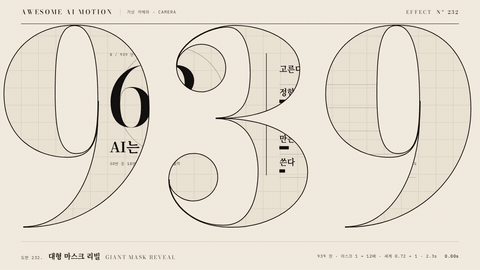

# Nº 232 대형 마스크 리빌 · Giant Mask Reveal



[MP4](clip.mp4) · [HTML](index.html)

**화면을 채운 큰 숫자 939가 창이 되어 안쪽 세계를 비추고, 카메라가 획 속으로 파고들어 세계 전체가 드러난다.**

A frame-filling 939 acts as a window onto an editorial world, and the camera dives into a stroke until the whole world is revealed.

| Family | Level | Purpose | Media | Runtime |
|---|---|---|---|---|
| 가상 카메라 · CAMERA | 고급 | 주목 끌기, 전환, 브랜딩 | 숏폼, 설명 영상, 발표, 데이터 스토리 | svg |

다른 이름 / Also known as: 글자 창 리빌, 타이포 마스크 줌, Type mask zoom, Zoom through letter, Knockout reveal

## 선택 기준 / Selection

숫자나 단어 안에 더 큰 이야기가 들어 있다는 느낌. 표지에서 본문으로 들어가는 문턱을 한 번의 움직임으로 넘는다. / A bigger story lives inside the number or word. One move carries the viewer from cover to content.

- 핵심 수치나 제목에서 상세 도판으로 넘어갈 때 / Move from a headline number or title into a detailed plate.
- 영상 오프닝에서 브랜드 숫자·로고 안으로 들어갈 때 / Open a video by diving into a brand number or logo.

좋은 예 / Good: 939의 가운데 3에서 가장 굵은 획을 기준점으로 잡아 마스크를 12배까지 지수로 키우고, 안쪽 도판은 0.72배에서 1배로 커져 창보다 먼 층처럼 따라온다.
나쁜 예 / Bad: 기준점을 가는 헤어라인이나 획 바깥에 잡아 확대 끝에 종이 여백이 화면을 덮고, 세계가 드러나기 전에 빈 화면이 번쩍인다.
주의 / Avoid: 기준점은 획의 내접원 반지름이 화면 대각선/배율 이상인 곳에만(939, 700px 기준 가운데 3 획 안 반지름 66px) · 확대를 선형 scale로 걸지 않는다(앞은 느리고 끝에서 튄다). 12^p 지수로 · 마스크 안이 종이와 같은 색이면 창이 안 보인다. 짙은 종이·격자·윤곽선으로 구분

## 파라미터 / Parameters

| Parameter | Default | Range | Note |
|---|---|---|---|
| 마스크 배율 | 1 → 12 | 8~20 | scale = 12^p, 기준점은 굵은 획 안 |
| 세계 배율 | 0.72 → 1 | 0.6~0.85 | 먼 층, 같은 기준점, power3.inOut |
| 파고들기 시간 | 2.3s | 1.6~2.8s | p에 power1.in |
| 글자 크기 | 700px | 560~760px | Bodoni 800, 무대 가로 1280px를 거의 채움 |

이징 / Ease: `power1.in (지수 배율) + power3.inOut`

## 구현 / Implementation (GSAP)

```js
gsap.set('#mt, #mo, .wcam', {svgOrigin: '732 114', smoothOrigin: false});
const z = {p: 0};
tl.fromTo(z, {p: 0}, {p: 1, duration: 2.3, ease: 'power1.in',
  onUpdate: () => gsap.set('#mt, #mo', {scale: Math.pow(12, z.p)})}, 0.25);
tl.fromTo('.wcam', {scale: 0.72, x: 36}, {scale: 1, x: 0, duration: 2.3, ease: 'power3.inOut'}, 0.25);
tl.set('#full', {opacity: 1}, 2.55);
tl.to('.vbar', {scaleX: 1, duration: 0.45, ease: 'power3.out'}, 2.55);
```

## 프롬프트 / Prompts

### 한국어 · Claude Code
```text
<파일>에 대형 마스크 리빌을 만들어줘. 무대 전폭 1280px를 채우는 Bodoni 700px 숫자 <대상>을 SVG clipPath 창으로 쓰고, 안쪽에는 격자·큰 숫자·세리프 제목·막대 도해로 된 편집 도판을 넣어. 가장 굵은 획 안의 한 점을 기준으로 마스크를 2.3초 동안 scale 12^p(p에 power1.in)로 키우고, 도판은 같은 기준점에서 0.72배에서 1배로 power3.inOut. 다 덮인 뒤 주홍 막대 하나를 0.45초에 그리고 0.5초 홀드해.
```

### 한국어 · Codex
```text
<파일>의 오프닝에 giant mask reveal을 구현해. clipPath 안 text에 svgOrigin을 굵은 획 내접원 중심(939, 700px 기준 732 114)으로 set하고 smoothOrigin false로 둔다. 프록시 {p} 0→1 2.3s power1.in의 onUpdate에서 scale = 12^p를 넣고, 세계 그룹은 0.72→1 power3.inOut. 확대가 끝나면 같은 도판의 무마스크 사본을 opacity 1로 바꿔 틈을 막는다. 0.3초·1.5초·3.3초를 캡처해 시작에 939 모양 창이 읽히는지, 끝에 종이 여백 없이 도판이 화면을 다 채우는지 확인해.
```

### English · Claude Code
```text
Build a giant mask reveal in <file>. Use a 700px Bodoni number <target> that fills the 1280px stage as an SVG clipPath window, with an editorial plate inside (grid, big number, serif title, bar diagram). Scale the mask about a point inside its thickest stroke over 2.3s as scale 12^p (power1.in on p), while the plate scales from 0.72 to 1 about the same point with power3.inOut. Once covered, draw one vermilion bar in 0.45s and hold for 0.5s.
```

### English · Codex
```text
Implement a giant mask reveal at the opening of <file>. Set svgOrigin on the clipPath text to the center of the thickest stroke's inscribed circle (732 114 for 939 at 700px) with smoothOrigin false. Tween a proxy {p} 0 to 1 over 2.3s with power1.in and apply scale = 12^p in onUpdate; scale the world group 0.72 to 1 with power3.inOut. After the zoom, switch an unmasked copy of the plate to opacity 1 to seal any gap. Capture at 0.3s, 1.5s, 3.3s to verify the 939 window reads at the start and the plate fills the frame with no paper gap at the end.
```

예시 / Example: 대형 마스크 리빌를 `.hero`에 적용해. / Apply Giant Mask Reveal to `.hero`.

## 적용 / Application

- HyperFrames: SVG 한 장에 clipPath text와 세계 그룹을 두고, svgOrigin을 set으로 먼저 고정(smoothOrigin false)한 뒤 프록시 p로 scale 12^p를 onUpdate에서 적용한다
- ReelForge: 오프닝 씬 파라미터로 마스크 문자·기준점 좌표·배율 12·세계 배율 0.72를 받고, 기준점은 렌더 전에 글리프 내접원으로 자동 계산한다
- Scrolline Deck: 진행률을 p에 바로 물려 scale = 12^진행률로 둔다. 스크롤이 일정하면 파고드는 속도도 일정해 보인다

조합 / Pair with: [줌 전환 · Zoom Through](../zoom-through/) · [마스크 리빌 · Mask Reveal](../mask-reveal/) · [마스크 전환 · Shape Mask Transition](../iris-mask/) · [푸시인 · Push-in](../push-in/)

출처 / Sources: [MDN <clipPath>](https://developer.mozilla.org/en-US/docs/Web/SVG/Element/clipPath) (CC-BY-SA 2.5) · [GSAP CSSPlugin (svgOrigin, smoothOrigin)](https://gsap.com/docs/v3/GSAP/CorePlugins/CSS/) (문서 참고)

[목록 / Catalog](../../references/catalog.md) · [index.json](../../index.json)
