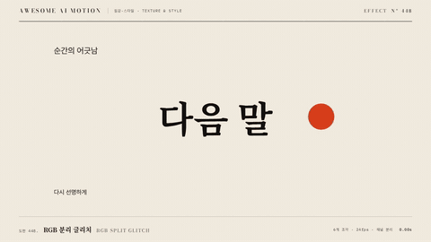

# Nº 448 RGB 분리 글리치 · RGB Split Glitch



[MP4](clip.mp4) · [HTML](index.html)

**색 채널과 가로 조각이 순간적으로 어긋나 떨린 뒤 원래 화면으로 돌아오는 효과**

Color channels and horizontal slices jitter apart for a moment, then snap back to the original frame.

| Family | Level | Purpose | Media | Runtime |
|---|---|---|---|---|
| 질감·스타일 · TEXTURE & STYLE | 중급 | 주목 끌기, 강조, 전환 | 숏폼, 설명 영상, 웹 UI | css |

다른 이름 / Also known as: Chromatic glitch, 색 분리 글리치, Chromatic Split, 색수차 분리, chromatic-aberration-static, chromatic-aberration-glitch-cut, chromatic-glitch, chromatic-pressure

## 선택 기준 / Selection

디지털 오류와 신호 불안정을 보여주고, 짧은 순간에 강한 강조를 만든다 / Signals digital error and instability and creates a strong emphasis in a very short beat.

- 제목이나 로고가 나타나는 순간 충격을 주고 싶을 때 / To hit hard when a title or logo appears
- 기술, 해킹, 사이버 주제에서 장면이 튀는 지점을 표시할 때 / To mark a jarring moment in tech, hacker, or cyber topics

좋은 예 / Good: 제목이 0.3초 동안 R 채널 -12px, B 채널 +12px로 갈라졌다 3프레임 안에 붙는다
나쁜 예 / Bad: 변위 40px 이상을 1초 넘게 유지해 글자를 읽을 수 없게 하거나, 한 장면에 글리치를 여러 번 반복한다
주의 / Avoid: 지속 0.5초 초과 금지(가독성 상실) · 본문 문장 전체에는 걸지 않고 제목이나 핵심어에만 쓴다

## 파라미터 / Parameters

| Parameter | Default | Range | Note |
|---|---|---|---|
| 지속 | 300ms | 200~500ms | 양자화된 프레임 단위 |
| 채널 변위 | 12px | 8~30px | 1920x1080 기준 |
| 복사 opacity | 0.35 | 0.25~0.5 | R과 B 복사본 |
| 조각 수 | 6개 | 4~10개 | 가로 띠 높이 다르게 |
| 프레임 양자화 | 24fps | 12~30fps | 시드 기반 변위 |

이징 / Ease: `steps(6)`

## 구현 / Implementation (GSAP)

```js
for(let f=0;f<7;f++){ // 24fps 스텝, 위상은 sin 고정값(난수 없음)
  tl.set('.r',{x:-12*Math.sin(f*2.1),clipPath:`inset(${f*9}% 0 ${60-f*9}% 0)`},t+f/24);
  tl.set('.b',{x:12*Math.sin(f*1.7)},t+f/24);
}
tl.set('.r,.b',{x:0,clipPath:'none',opacity:0},t+7/24);
```

## 프롬프트 / Prompts

### 한국어 · Claude Code
```text
<대상> 제목에 RGB 분리 글리치를 넣어줘. 원본 위에 빨강 복사와 파랑 복사를 mix-blend-mode screen, opacity 0.35로 얹고, 0.3초 동안 24fps 스텝으로 R은 -12px, B는 +12px 안에서 흔들며 가로 조각 6개를 clip-path로 어긋나게 해. 끝나면 두 복사를 제거하고 원본만 남겨. 난수는 시드 고정, paused 타임라인 하나로 만들어.
```

### 한국어 · Codex
```text
<파일>의 <대상>에 glitch-rgb-split을 구현해. duration 0.3s, 채널 변위 12px, 복사 opacity 0.35, 24fps 스텝, 조각 6개, 시드 난수. 0.05초, 0.15초, 0.35초 시점을 캡처해 채널이 갈라졌다가 0.35초에 완전히 붙어 있는지, 글자 가독성이 마지막에 복구되는지 확인해.
```

### English · Claude Code
```text
Add an RGB split glitch to the title in <target>. Stack a red copy and a blue copy over the original with mix-blend-mode screen at opacity 0.35. For 0.3s at 24fps steps, jitter red by -12px and blue by +12px and offset six horizontal clip-path slices. Remove both copies at the end. Seeded randomness only, one paused timeline.
```

### English · Codex
```text
Implement glitch-rgb-split on <target> in <file>: duration 0.3s, channel shift 12px, copy opacity 0.35, 24fps steps, 6 slices, seeded random. Capture at 0.05s, 0.15s, and 0.35s to verify the channels split then fully realign by 0.35s and that text legibility is restored at the end.
```

예시 / Example: RGB 분리 글리치를 `.hero`에 적용해. / Apply RGB Split Glitch to `.hero`.

## 적용 / Application

- HyperFrames: 빨강과 파랑 복사 레이어를 paused 타임라인에 tl.set으로 프레임마다 찍는다. 보간 없이 24fps 격자에 맞추면 seek해도 같은 결과가 나온다
- ReelForge: 씬 워커 브리프에 glitchAt, duration, shiftPx, sliceCount를 싣고 변위는 시드 하나로 고정한다
- Scrolline Deck: 진행률 구간 안에서만 프레임 스텝을 돌리고, 구간 밖에서는 복사 레이어를 opacity 0으로 둔다. 연속 보간은 쓰지 않는다

조합 / Pair with: [스캔 왜곡 띠 · Scan band](../glitch-scan-band/) · [크로매틱 와이프 · Chromatic Wipe](../chromatic-wipe/) · [화면 흔들림 · Screen Shake](../screen-shake/) · [코덱 글리치 · Codec Glitch](../codec-glitch/)

출처 / Sources: [heygen-com/hyperframes](https://raw.githubusercontent.com/heygen-com/hyperframes/main/registry/blocks/glitch/registry-item.json) (Apache-2.0) · [heygen-com/hyperframes](https://raw.githubusercontent.com/heygen-com/hyperframes/main/registry/components/rgb-glitch-text/registry-item.json) (Apache-2.0) · [heygen-com/hyperframes](https://raw.githubusercontent.com/heygen-com/hyperframes/main/registry/components/caption-glitch-rgb/registry-item.json) (Apache-2.0) · local/HyperFrames-skills (`claude-skill:hyperframes-animation/rules/chromatic-glitch.md`) (unknown) · local/HyperFrames-skills (`claude-skill:hyperframes-animation/transitions/css-distortion.md`) (unknown) · [bradley/Blotter](https://github.com/bradley/Blotter) (MIT) · [codrops/TextDistortionEffects](https://github.com/codrops/TextDistortionEffects) (unknown)

[목록 / Catalog](../../references/catalog.md) · [index.json](../../index.json)
