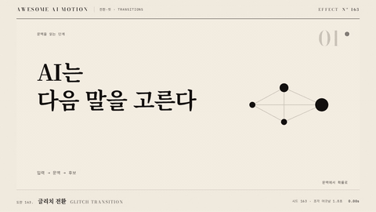

# Nº 163 글리치 전환 · Glitch Transition



[MP4](clip.mp4) · [HTML](index.html)

**영상 블록이 순간적으로 어긋나고 색 채널이나 잔상이 깨지는 동안 다음 장면으로 교체된다**

Video blocks momentarily misalign and color channels or ghosts break apart while the scene is replaced.

| Family | Level | Purpose | Media | Runtime |
|---|---|---|---|---|
| 전환·컷 · TRANSITIONS | 중급 | 전환, 주목 끌기 | 숏폼, 설명 영상 | webgl |

다른 이름 / Also known as: Glitch displacement, 글리치 변위, Block RGB glitch, 블록 RGB 글리치, Parametric glitch, 매개 파형 글리치, Flicker ghost glitch, 점멸 잔상 글리치

## 선택 기준 / Selection

신호가 깨지는 순간의 충격. 거칠고 디지털한 톤의 컷을 만든다 / Creates a signal-error look and a rough transition shock.

- 기술, 사이버, 해킹 톤의 영상에서 장면을 거칠게 끊어 넘길 때 / When cutting roughly between scenes in a tech, cyber, or hacking tone
- 숏폼 오프닝의 첫 컷에서 시선을 붙잡을 때 / To grab attention on the first cut of a short-form opener

좋은 예 / Good: 450ms 동안 화면 블록이 최대 화면 폭 4%까지 어긋나고 RGB가 1.4% 갈라지다가, 중간(225ms)에 다음 장면으로 바뀐 뒤 안정된다
나쁜 예 / Bad: 글리치가 1초 이상 이어져 불안하게 보이거나, 매 프레임 난수라 재생할 때마다 결과가 달라진다
주의 / Avoid: 지속은 600ms 이하로 둔다(길면 오류처럼 보임) · 난수는 시드 고정. 프레임 번호에서 계산한다

## 파라미터 / Parameters

| Parameter | Default | Range | Note |
|---|---|---|---|
| 지속 | 450ms | 300~600ms | 짧을수록 충격이 큼 |
| 블록 변위 | 화면 폭 4% | 2~6% | 최대값, 중간에 정점 |
| RGB 오프셋 | 화면 폭 1.4% | 0.8~2% | R은 +, B는 - |
| 프레임 단계 | 24fps | 12~30fps | 계단식으로 갱신 |
| 시드 | 1 | 고정 정수 | 재현성 |

이징 / Ease: `steps(11)`

## 구현 / Implementation (GSAP)

```js
const h = i => Math.abs(Math.sin(i * 127.1 + 1) * 43758.5) % 1; // 시드 해시
for (let f = 0; f < 11; f++) {
  const k = 1 - Math.abs(f - 5) / 5;               // 정점 f=5
  tl.set('.blk', { x: (h(f) - 0.5) * 2 * 77 * k }, f / 24);
  tl.set('.r', { x: 27 * k }, f / 24).set('.b', { x: -27 * k }, f / 24);
}
tl.set('.next', { autoAlpha: 1 }, 5 / 24);
```

## 프롬프트 / Prompts

### 한국어 · Claude Code
```text
<대상> 장면 전환에 글리치 전환을 넣어줘. 총 450ms, 24fps 계단으로 진행하고, 블록 x 변위는 최대 77px(화면 폭 4%), R 채널 +27px, B 채널 -27px(1.4%)로 정점은 225ms. 난수는 프레임 번호로 계산하는 시드 해시만 쓰고 225ms 시점에 다음 장면으로 교체해. GSAP paused 타임라인으로 seek 가능하게 만들어줘.
```

### 한국어 · Codex
```text
<파일>에 글리치 전환을 구현해. f=0..10, k=1-|f-5|/5, 블록 x=(h(f)-0.5)*2*77*k, .r x=27k, .b x=-27k, 시각 f/24. 5/24초에 .next를 표시. 0.1초, 0.21초, 0.3초, 0.45초 시점을 캡처해 정점에서 어긋남이 최대인지, 0.45초에 변위와 RGB 분리가 0인지, 두 번 렌더해도 프레임이 같은지 확인해.
```

### English · Claude Code
```text
Add a Glitch Transition to <target>. Total 450ms stepped at 24fps. Block x displacement up to 77px (4% of width), R channel +27px, B channel -27px (1.4%), peaking at 225ms. Use only a seeded hash of the frame number for randomness, and swap to the next scene at 225ms. Keep it on a paused GSAP timeline so it seeks deterministically.
```

### English · Codex
```text
Implement Glitch Transition in <file>. Frames f=0..10, k=1-|f-5|/5, block x=(h(f)-0.5)*2*77*k, .r x=27k, .b x=-27k at time f/24; show .next at 5/24s. Capture at 0.1s, 0.21s, 0.3s, and 0.45s to confirm displacement peaks mid-transition, is 0 at 0.45s, and that two renders produce identical frames.
```

예시 / Example: 글리치 전환를 `.hero`에 적용해. / Apply Glitch Transition to `.hero`.

## 적용 / Application

- HyperFrames: 프레임 번호 f에서 결정론 해시로 변위를 계산해 tl.set으로 24fps 계단을 깐다. seek해도 같은 프레임이 나온다
- ReelForge: 씬 워커 브리프에 지속 450ms, 변위 4%, RGB 1.4%, 시드 1을 싣는다. 렌더 FPS가 24가 아니면 f/24를 렌더 FPS에 맞춘다
- Scrolline Deck: scrub에서는 해시 입력을 시간이 아니라 진행률 구간 번호(0~10)로 쓰고 정점을 진행률 0.5에 둔다. 되감아도 같은 모양이 나온다

조합 / Pair with: [크로매틱 와이프 · Chromatic Wipe](../chromatic-wipe/) · [데이터모시 전환 · Datamosh Transition](../datamosh-transition/) · [TV 노이즈 전환 · TV Static Transition](../tv-static-transition/)

출처 / Sources: [gl-transitions/gl-transitions](https://github.com/gl-transitions/gl-transitions/blob/master/transitions/GlitchDisplace.glsl) (MIT) · [mifi/editly](https://github.com/mifi/editly#transition-types) (MIT) · [gl-transitions/gl-transitions](https://github.com/gl-transitions/gl-transitions/blob/master/transitions/GlitchMemories.glsl) (MIT) · [gl-transitions/gl-transitions](https://github.com/gl-transitions/gl-transitions/blob/master/transitions/parametric_glitch.glsl) (MIT) · [gl-transitions/gl-transitions](https://github.com/gl-transitions/gl-transitions/blob/master/transitions/Drop_Zone_Flicker.glsl) (MIT)

[목록 / Catalog](../../references/catalog.md) · [index.json](../../index.json)
