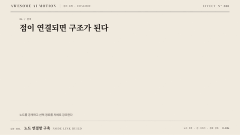

# Nº 380 노드 연결망 구축 · Node-link Build



[MP4](clip.mp4) · [HTML](index.html)

**노드가 순서대로 나타나고 연결선이 각 노드 사이에 그려진다. 선택 경로의 노드와 선을 차례로 강조한다.**

Reveal eight service nodes before their connecting edges.

| Family | Level | Purpose | Media | Runtime |
|---|---|---|---|---|
| 원리 도해 · EXPLAINER | 중급 | 설명, 순서·흐름 | 설명 영상, 제품 시연, 스크롤덱 | svg |

다른 이름 / Also known as: Avatar network, 아바타 연결망, Flowchart build, 흐름도 구축, Avatar Hub, 아바타 허브 연결, avatar-cloud-network, Relation Traverse, 관계 도해 탐색, Graph port linking, 그래프 포트 연결

## 선택 기준 / Selection

구성요소 사이의 관계와 처리 순서를 보여준다. / Shows relationships and processing order.

- 서비스 8개의 의존 관계를 입력 노드부터 공개한다. / Explain dependencies between services.
- 구성요소 사이의 관계와 처리 순서를 보여준다. 기준값과 대상을 함께 표시할 때. / Keep the encoded values, labels, and visual state synchronized.

좋은 예 / Good: 서비스 8개의 의존 관계를 입력 노드부터 공개한다.
나쁜 예 / Bad: 연결선을 먼저 모두 켜 관계 순서를 읽기 어렵게 만든다.
주의 / Avoid: 복잡한 교차선은 분리한다.

## 파라미터 / Parameters

| Parameter | Default | Range | Note |
|---|---|---|---|
| 노드 수 | 8 | 3~12 | 노드 간 120px 이상 확보 |
| 등장 간격 | 200ms | 100~300ms | 관계 순서로 공개 |
| 연결선 지속 | 400ms | 250~700ms | 노드 등장 뒤 시작 |
| 활성 유지 | 700ms | 400~1200ms | 선택 경로만 강조 |

이징 / Ease: `power2.out`

## 구현 / Implementation (GSAP)

```js
const tl = gsap.timeline({paused:true});
tl.fromTo('.node',{opacity:0},{opacity:1,duration:0.3,stagger:0.2},0);
document.querySelectorAll('.edge').forEach((e,i)=>{
  const L=e.getTotalLength();
  tl.fromTo(e,{strokeDasharray:L,strokeDashoffset:L},{strokeDashoffset:0,duration:0.4},0.3+i*0.2);
});
```

## 프롬프트 / Prompts

### 한국어 · Claude Code
```text
<파일>의 <대상>에 노드 연결망 구축을 적용해. SVG 노드와 연결선을 순서대로 공개하고 동일 시간표에서 선택 경로의 색을 갱신한다. 노드 수 8; 등장 간격 200ms; 연결선 지속 400ms; 활성 유지 700ms을 적용한다. GSAP 코어의 paused 타임라인 하나로 seek 가능하게 만들고 임의 난수와 타이머를 쓰지 마.
```

### 한국어 · Codex
```text
<파일>의 설명 장면에서 <대상>에 노드 연결망 구축을 적용해. SVG 노드와 연결선을 순서대로 공개하고 동일 시간표에서 선택 경로의 색을 갱신한다. 노드 수 8; 등장 간격 200ms; 연결선 지속 400ms; 활성 유지 700ms을 적용한다. 0초, 1.25초, 2.5초를 캡처해 시작 상태, 중간 진행, 최종 상태를 확인하고 같은 시각으로 다시 seek했을 때 좌표와 라벨이 같은지 검증해.
```

### English · Claude Code
```text
Implement Node-link Build on <target> in <file>. Reveal 8 nodes at 200ms intervals, draw each connector over 400ms, and hold an active node for 700ms. Use one paused GSAP core timeline, support seeking, and avoid random values and timers.
```

### English · Codex
```text
Implement Node-link Build on <target> in <file>. Reveal 8 nodes at 200ms intervals, draw each connector over 400ms, and hold an active node for 700ms. Use one paused GSAP core timeline, support seeking, and avoid random values and timers. Capture at 0s, 1.25s, and 2.5s to check the initial state, intermediate motion, and final state. Seek to each time again and verify identical geometry and labels.
```

예시 / Example: 노드 연결망 구축를 `.hero`에 적용해. / Apply Node-link Build to `.hero`.

## 적용 / Application

- HyperFrames: paused 타임라인에 노드 연결망 구축 상태를 넣고 seek 시 2.5초의 좌표와 색을 다시 계산한다.
- ReelForge: 씬 워커 브리프에 노드 수 8; 등장 간격 200ms; 연결선 지속 400ms; 활성 유지 700ms을 싣고 서비스 8개의 의존 관계를 입력 노드부터 공개한다.
- Scrolline Deck: 진행률 0~1을 2.5초 구간에 매핑한다. scrub에서는 스프링 대신 power2.out을 쓰고 역방향에서도 라벨과 도형을 함께 갱신한다.

조합 / Pair with: [경로 신호 빔 · Path Beam](../path-beam/) · [상태 전이 순회 · State Transition Walk](../state-transition-walk/)

출처 / Sources: [heygen-com/hyperframes](https://raw.githubusercontent.com/heygen-com/hyperframes/main/registry/components/avatar-cloud/registry-item.json) (Apache-2.0) · [heygen-com/hyperframes](https://raw.githubusercontent.com/heygen-com/hyperframes/main/registry/components/constellation-hub/registry-item.json) (Apache-2.0) · local/HyperFrames-skills (`claude-skill:hyperframes-animation/rules/avatar-cloud-network.md`) (unknown) · local/HyperFrames-skills (`claude-skill:hyperframes-animation/blueprints/constellation-hub.md`) (unknown) · [heygen-com/hyperframes](https://raw.githubusercontent.com/heygen-com/hyperframes/main/registry/blocks/flowchart/registry-item.json) (Apache-2.0)

[목록 / Catalog](../../references/catalog.md) · [index.json](../../index.json)
