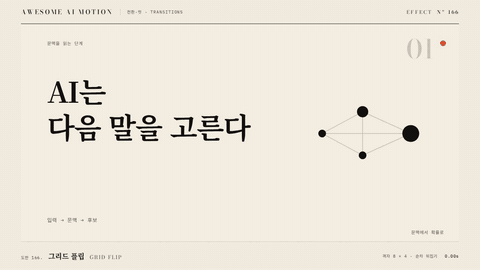

# Nº 166 그리드 플립 · Grid Flip



[MP4](clip.mp4) · [HTML](index.html)

**장면을 나눈 사각 타일이 순차로 뒤집혀 뒷면의 다음 장면을 보여주는 전환**

Rectangular tiles cut from the scene flip in sequence to reveal the next scene on their backs.

| Family | Level | Purpose | Media | Runtime |
|---|---|---|---|---|
| 전환·컷 · TRANSITIONS | 중급 | 전환, 순서·흐름 | 설명 영상, 웹 UI, 숏폼 | css |

다른 이름 / Also known as: 격자 플립, PuzzleRight, Tile wave flip, 타일 파도 플립, Card Wipe, 카드 와이프

## 선택 기준 / Selection

부분의 변화가 전체의 변화로 쌓여 가는 흐름. 카드가 차례로 뒤집힌다 / A flow where partial changes accumulate into a full one: cards flip one after another.

- 대시보드나 카드 UI에서 전체 상태가 바뀔 때 / Change the whole state of a dashboard or card UI.
- 타일 순서로 파도치듯 장면을 교체하고 싶을 때 / Swap scenes in a wave-like tile order.

좋은 예 / Good: 8x5 격자 타일이 좌상에서 우하로 30ms 간격으로 180도 회전하며 1.0초 안에 모두 뒤 장면을 보여준다
나쁜 예 / Bad: 타일마다 perspective가 각자 걸려 뒤틀려 보이거나, 격자가 20x20처럼 촘촘해 렌더가 느리다
주의 / Avoid: 타일 수 60개 초과 금지(DOM 부담) · perspective는 부모에 한 번만 건다

## 파라미터 / Parameters

| Parameter | Default | Range | Note |
|---|---|---|---|
| 전체 지속 | 1.0s | 0.7~1.4s | 마지막 타일 종료 기준 |
| 격자 | 8x5 | 6x4~10x6 | 타일 40개 |
| 타일 지연 | 30ms | 15~50ms | 좌상에서 우하 |
| perspective | 900px | 700~1200px | 부모에 한 번 |

이징 / Ease: `power2.inOut`

## 구현 / Implementation (GSAP)

```js
gsap.set('.stage', { perspective: 900 });
tl.to('.tile', { rotationY: 180, duration: 0.6, ease: 'power2.inOut',
  stagger: { each: 0.03, grid: [5, 8], from: 'start' } });
```

## 프롬프트 / Prompts

### 한국어 · Claude Code
```text
<대상A>에서 <대상B>로 그리드 플립 전환을 만들어줘. 화면을 8x5 타일로 나눠 각 타일이 rotationY 0에서 180도로 0.6초 동안 power2.inOut으로 뒤집히고, 뒷면에는 B가 보이게 해. stagger는 30ms, 좌상에서 우하 순서, 부모에 perspective 900px을 한 번만 걸고 backface-visibility hidden. paused 타임라인 하나.
```

### 한국어 · Codex
```text
<파일>에 grid flip을 적용해. .tile 40개에 rotationY 0에서 180 (0.6s, power2.inOut), stagger { each: 0.03, grid: [5, 8], from: 'start' }, .stage perspective 900px. 0.3초 캡처에서 좌상 타일부터 뒤집힌 대각선 파도가 보이는지, 1.0초에 전체가 B인지 확인해.
```

### English · Claude Code
```text
Build a grid flip from <targetA> to <targetB>. Split the frame into 8x5 tiles, each rotating rotationY 0 to 180 over 0.6 seconds with power2.inOut and showing B on the back. Stagger 30ms from top left to bottom right, apply perspective 900px once on the parent, and set backface-visibility hidden. One paused timeline.
```

### English · Codex
```text
Apply a grid flip in <file>. Animate 40 .tile elements rotationY 0 to 180 (0.6s, power2.inOut) with stagger { each: 0.03, grid: [5, 8], from: 'start' } and perspective 900px on .stage. Capture at 0.3 seconds to confirm a diagonal wave of flipped tiles from the top left, and at 1.0 seconds to confirm the whole frame shows B.
```

예시 / Example: 그리드 플립를 `.hero`에 적용해. / Apply Grid Flip to `.hero`.

## 적용 / Application

- HyperFrames: 각 타일에 앞뒤 면을 두고 backface-visibility: hidden. 뒷면은 원본 이미지를 background-position으로 잘라 맞춘다
- ReelForge: 씬 워커 브리프에 cols, rows, staggerMs, flipDeg를 싣는다. 타일 이미지는 두 장면 스냅샷을 씬에서 받는다
- Scrolline Deck: 진행률에 stagger를 비율로 적용한다(전체 1.0을 셀 지연 30ms로 분배). 각 타일 회전은 ease-out

조합 / Pair with: [타일 플립 · Tile Flip](../tile-flip/) · [플립 등장 · Flip Reveal](../flip-reveal/) · [스태거 · Stagger](../stagger/)

출처 / Sources: [gl-transitions/gl-transitions](https://github.com/gl-transitions/gl-transitions/blob/master/transitions/GridFlip.glsl) (MIT) · [gl-transitions/gl-transitions](https://github.com/gl-transitions/gl-transitions/blob/master/transitions/PuzzleRight.glsl) (MIT) · [mifi/editly](https://github.com/mifi/editly#transition-types) (MIT) · [gl-transitions/gl-transitions](https://github.com/gl-transitions/gl-transitions/blob/master/transitions/TilesWave.glsl) (MIT) · [helpx.adobe.com](https://helpx.adobe.com/after-effects/desktop/apply-effects-and-animation-presets/list-of-effects/transition-effects.html) (unknown)

[목록 / Catalog](../../references/catalog.md) · [index.json](../../index.json)
