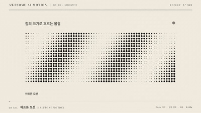

# Nº 525 하프톤 모션 · Halftone Motion



[MP4](clip.mp4) · [HTML](index.html)

**격자 위 점의 크기가 밝기를 따르며 물결이나 스캔처럼 움직이는 하프톤 패턴**

A grid of dots whose size follows brightness and moves in waves or scans.

| Family | Level | Purpose | Media | Runtime |
|---|---|---|---|---|
| 입자·생성 · GENERATIVE | 중급 | 분위기, 브랜딩, 주목 끌기 | 숏폼, 설명 영상, 웹 UI | canvas |

다른 이름 / Also known as: Halftone field, 하프톤 필드, Screen-tone animation, CMYK, RGB 망점

## 선택 기준 / Selection

인쇄물과 팝아트의 그래픽한 질감을 주고 정적 이미지에 리듬을 더한다 / Brings a printed, pop-art graphic texture and adds rhythm to a still image.

- 인쇄 감성이나 팝아트 톤의 배경, 타이틀 카드를 만들 때 / For print-flavored or pop-art backgrounds and title cards
- 이미지 전환에서 점 크기로 화면이 나타나고 사라지게 할 때 / For transitions where dot size makes the image appear and vanish

좋은 예 / Good: 12px 격자에 최대 반경 5px의 점이 깔리고 밝은 물결이 5초에 한 번 대각선으로 지나가며 점 크기가 커졌다 작아진다
나쁜 예 / Bad: 점 격자가 텍스트 뒤에서 대비가 커 글자를 방해하거나, 점을 너무 작게 잡아 모아레가 생긴다
주의 / Avoid: 격자 8px 미만 금지(모아레) · 텍스트 뒤에서는 점 opacity 0.4 이하

## 파라미터 / Parameters

| Parameter | Default | Range | Note |
|---|---|---|---|
| 격자 | 12px | 8~20px | 점 중심 간격 |
| 최대 반경 | 5px | 3~7px | 격자의 0.42배 이하 |
| 주기 | 5000ms | 3000~8000ms | 물결 한 번 |
| 격자 각도 | 45도 | 0~45도 | CMYK 표준 각도 근사 |
| 파장 | 360px | 240~600px | 물결 폭 |

이징 / Ease: `sine.inOut`

## 구현 / Implementation (GSAP)

```js
function draw(p){ctx.clearRect(0,0,1920,1080);
 for(let y=6;y<1080;y+=12)for(let x=6;x<1920;x+=12){
 const w=.5+.5*Math.sin((x*.7+y*.7)/360*6.283-p*6.283);
 const r=5*(lum(x,y)*.6+w*.4); ctx.beginPath();ctx.arc(x,y,r,0,6.283);ctx.fill();}}
// 45도 회전은 ctx.rotate 후 격자 그리기
```

## 프롬프트 / Prompts

### 한국어 · Claude Code
```text
<대상>에 하프톤 모션 배경을 만들어줘. 12px 격자에 원을 그리되 반경은 이미지 밝기 60%와 대각선 사인 물결 40%로 정하고 최대 5px. 물결 파장 360px, 주기 5초 선형 반복, 격자는 45도 회전. 텍스트 뒤에서는 점 opacity 0.4 이하. progress 순수 함수로 그려서 seek 가능하게 해.
```

### 한국어 · Codex
```text
<파일>에 halftone-motion 캔버스를 구현해. 격자 12px, 최대 반경 5px, 주기 5000ms, 파장 360px, 각도 45도. 0초, 1.25초, 2.5초를 캡처해 점 크기 분포가 물결처럼 이동하는지, 0초와 5초 프레임이 같은지, 모아레가 없는지 확인해.
```

### English · Claude Code
```text
Build a halftone motion background for <target>. Draw circles on a 12px grid at 45 degrees, with radius set by 60% image brightness and 40% diagonal sine wave, max 5px. Wave length 360px, period 5s looping linearly. Keep dot opacity at or below 0.4 behind text. Draw as a pure function of progress so it is seekable.
```

### English · Codex
```text
Implement a halftone-motion canvas in <file>: grid 12px, max radius 5px, period 5000ms, wavelength 360px, angle 45 degrees. Capture at 0s, 1.25s, and 2.5s to verify the size distribution travels like a wave, 0s equals 5s, and there is no moire.
```

예시 / Example: 하프톤 모션를 `.hero`에 적용해. / Apply Halftone Motion to `.hero`.

## 적용 / Application

- HyperFrames: draw는 진행값 p의 순수 함수로 하고 p는 paused 타임라인에서 선형 보간한다. 점 수가 많아 캔버스 해상도 1920x1080에서 약 14,000개까지 허용한다
- ReelForge: 브리프에 gridPx, maxRadiusPx, periodMs, angleDeg를 싣고 배경 톤 색 하나만 노출한다
- Scrolline Deck: 진행률 p를 물결 위상에 매핑한다. 한 주기가 스크롤 구간 전체가 되게 하면 느린 스크럽에서도 자연스럽다

조합 / Pair with: [디더링 모션 · Animated Dithering](../animated-dither/) · [하프톤 디졸브 · Halftone Dissolve](../halftone-dissolve/) · [ASCII 모션 · ASCII Motion](../ascii-motion/) · [해칭 채움 · Hatch Fill](../hatch-fill/)

출처 / Sources: [heygen-com/hyperframes](https://raw.githubusercontent.com/heygen-com/hyperframes/main/registry/blocks/halftone-field/registry-item.json) (Apache-2.0) · [paper-design/shaders](https://shaders.paper.design/halftone-dots) (Apache-2.0) · [paper-design/shaders](https://shaders.paper.design/halftone-cmyk) (Apache-2.0) · [mrdoob/three.js](https://threejs.org/examples/#webgl_postprocessing_rgb_halftone) (MIT) · [fand/vfx-js](https://github.com/fand/vfx-js/tree/main/packages/effects#effects) (MIT)

[목록 / Catalog](../../references/catalog.md) · [index.json](../../index.json)
