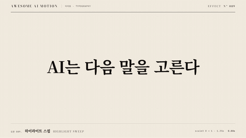

# Nº 089 하이라이트 스윕 · Highlight Sweep



[MP4](clip.mp4) · [HTML](index.html)

**핵심 구절 뒤의 형광펜 띠를 왼쪽에서 오른쪽으로 칠하는 효과**

A highlighter band sweeps from left to right behind a key phrase.

| Family | Level | Purpose | Media | Runtime |
|---|---|---|---|---|
| 타이포 · TYPOGRAPHY | 기본 | 강조, 설명 | 설명 영상, 스크롤덱, 발표 | gsap |

다른 이름 / Also known as: 형광펜 강조, Marker sweep, 하이라이트 쓸기, 빛 하이라이트 스윕, light-sweep-sheen, gradient-text-sweep, chrome-sweep

## 선택 기준 / Selection

문장 안에서 주목할 구절을 분명하게 지정한다 / Clearly identifies the phrase that deserves attention within a sentence.

- 문장에서 핵심 구절을 짚을 때 / Call out a key phrase in a sentence.
- 이미 읽힌 문장의 의미를 강조할 때 / Emphasize the meaning of a sentence that has already been read.

좋은 예 / Good: AI는 다음 말을 고른다에서 다음 말 뒤에만 연주홍 띠를 칠한다
나쁜 예 / Bad: 문장 전체를 진한 색으로 덮어 글자가 읽히지 않는다
주의 / Avoid: 여러 구절을 동시에 칠하지 않는다 · 텍스트 위로 띠를 덮지 않는다

## 파라미터 / Parameters

| Parameter | Default | Range | Note |
|---|---|---|---|
| 지속 | 1.35s | 0.7~1.5s | 칠하는 방향을 읽을 시간 |
| 시작 | 0.3s | 0.2~0.5s | 문장을 먼저 보여준다 |
| 띠 높이 | 66px | 40~75px | 84px 제목의 아래쪽을 받친다 |
| 좌우 여백 | 8px | 4~12px | 핵심어 양끝 여유 |

이징 / Ease: `power1.inOut`

## 구현 / Implementation (GSAP)

```js
const tl = Motion.timeline();
tl.fromTo('.mark', {scaleX:0}, {scaleX:1, duration:1.35, ease:'power1.inOut'}, 0.3);
tl.to('.lead', {opacity:1, duration:0.25}, 1.85);
Motion.ready();
```

## 프롬프트 / Prompts

### 한국어 · Claude Code
```text
<대상>의 문장 중 다음 말 뒤에 하이라이트 스윕을 넣어줘. 글자는 84px로 고정하고 연주홍 띠는 높이 66px, 좌우 여백 8px, transform-origin 0 50%로 배치해. 0.3초부터 scaleX 0에서 1로 1.35초 동안 power1.inOut으로 칠하고 3초까지 유지해.
```

### 한국어 · Codex
```text
<파일>의 핵심어 span 뒤에 .mark를 배치하고 isolation과 z-index로 글자가 띠 위에 보이게 해. 0.3초부터 duration 1.35초, ease power1.inOut으로 scaleX 0에서 1로 움직여. 0.23초, 0.73초, 1.23초, 2.9초를 캡처해 띠의 왼쪽 고정, 오른쪽 확장, 글자 가독성과 완성 홀드를 확인해.
```

### English · Claude Code
```text
Add a highlight sweep behind "next word" in the sentence in <target>. Keep the text at 84px. Place a pale vermilion band with height 66px, horizontal padding 8px, and transform-origin 0 50%. Starting at 0.3 seconds, animate scaleX from 0 to 1 over 1.35 seconds with power1.inOut, and hold until 3 seconds.
```

### English · Codex
```text
Place .mark behind the key phrase span in <file>, using isolation and z-index to keep the text above the band. Starting at 0.3 seconds, animate scaleX from 0 to 1 with duration 1.35 seconds and ease power1.inOut. Capture at 0.23, 0.73, 1.23, and 2.9 seconds to check the fixed left edge, rightward expansion, text legibility, and completed hold.
```

예시 / Example: 하이라이트 스윕를 `.hero`에 적용해. / Apply Highlight Sweep to `.hero`.

## 적용 / Application

- HyperFrames: 핵심어 내부에 띠를 절대 배치하고 transform-origin을 왼쪽에 두어 scaleX만 움직인다
- ReelForge: 강조 비트에서 텍스트는 고정하고 뒤쪽 띠의 가로 배율을 1.35초 동안 늘린다
- Scrolline Deck: 핵심어가 뷰포트에 들어올 때 띠의 scaleX를 스크롤 진행률에 연결한다

조합 / Pair with: [단어 강조 · Word Emphasis](../word-emphasis/) · [밑줄 드로우 · Underline Draw](../underline-draw/) · [주석 등장 · Annotation Callout](../annotation-callout/)

출처 / Sources: [GSAP CSSPlugin](https://gsap.com/docs/v3/GSAP/CorePlugins/CSS/) (공식 문서 참조) · [heygen-com/hyperframes](https://raw.githubusercontent.com/heygen-com/hyperframes/main/registry/components/marker-highlight/registry-item.json) (Apache-2.0) · [heygen-com/hyperframes](https://raw.githubusercontent.com/heygen-com/hyperframes/main/registry/components/inline-highlight/registry-item.json) (Apache-2.0) · [heygen-com/hyperframes](https://raw.githubusercontent.com/heygen-com/hyperframes/main/registry/components/caption-highlight/registry-item.json) (Apache-2.0) · [heygen-com/hyperframes](https://raw.githubusercontent.com/heygen-com/hyperframes/main/registry/blocks/mk-callout-highlight/registry-item.json) (Apache-2.0) · [Vox](https://www.youtube.com/watch?v=kIID5FDi2JQ) (unknown)

[목록 / Catalog](../../references/catalog.md) · [index.json](../../index.json)
