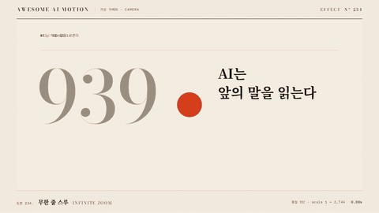

# Nº 234 무한 줌 스루 · Infinite Zoom



[MP4](clip.mp4) · [HTML](index.html)

**작은 주홍 점 속의 다음 도판으로 세 번 연속 파고들며 2744배 확대한다**

Dive into a scarlet dot three times as nested plates expand through a continuous 2,744× zoom.

| Family | Level | Purpose | Media | Runtime |
|---|---|---|---|---|
| 가상 카메라 · CAMERA | 고급 | 주목 끌기, 순서·흐름, 전환 | 설명 영상, 숏폼, 스크롤덱, 발표 | gsap |

다른 이름 / Also known as: 재귀 줌, Recursive zoom

## 선택 기준 / Selection

작은 정보 안에 또 다른 정보가 이어지는 재귀적 깊이 / Recursive depth as each small detail contains another full composition.

- 전체 정보에서 세부와 결론으로 연속 진입할 때 / Travel continuously from overview into detail and conclusion.
- 반복되는 구조나 재귀 개념을 공간으로 설명할 때 / Explain recursion through nested visual structure.

좋은 예 / Good: 각 도판 중심의 83px 주홍 점 안에 다음 도판을 1/14배로 중첩하고 전체 월드를 14의 진행률 제곱으로 확대한다
나쁜 예 / Bad: 서로 다른 화면을 컷으로 교체하거나 각 확대 단계에서 정지해 연속성이 끊긴다
주의 / Avoid: 단계 경계에서 확대 속도를 다시 0으로 만들지 않는다 · 줌 중심과 다음 도판 중심을 어긋나게 두지 않는다 · 큰 조상 변환의 래스터 손상을 막기 위해 정수 단계에서 월드 축척을 재기준화한다

## 파라미터 / Parameters

| Parameter | Default | Range | Note |
|---|---|---|---|
| 단계 수 | 3 | 2~4 | 문장 3개 뒤 최종 핵심어 |
| 중첩 축척 | 1/14 | 1/10~1/16 | 주홍 점 안의 작은 도판 |
| 최종 확대 | 2744× | 1000~4096× | 14의 3제곱 |
| 이동 시간 | 3.3s | 2.8~3.5s | 4초 중 마지막 0.5초 홀드 |
| 확대 중심 | 584, 290px | 무대 중심 | 모든 단계의 중심을 일치 |

이징 / Ease: `sine.inOut 진행률 + 14^p 지수 확대`

## 구현 / Implementation (GSAP)

```js
const zoom = {p:0};
function draw(){
  const stage=Math.min(3,Math.floor(zoom.p));
  world.style.transform=`scale(${Math.pow(14,zoom.p-stage)})`;
  pages.forEach((el,i)=>{const active=i>=stage; el.style.transform=`scale(${active?Math.pow(14,stage-i):1})`; el.style.opacity=!active?0:i===0?1:Math.max(0,Math.min(1,(zoom.p-i+.82)/.48));});
}
tl.to(zoom,{p:3,duration:3.3,ease:'sine.inOut',onUpdate:draw},.2);
```

## 프롬프트 / Prompts

### 한국어 · Claude Code
```text
<대상>에 1168×580 도판 중앙의 83px 주홍 점 안에 다음 도판을 1/14 축척으로 세 단계 중첩한다. 월드 래퍼 중심은 584,290px로 고정하고 진행률 p를 0부터 3까지 3.3초간 sine.inOut 이동하며 scale=14^p로 계산한다. 다음 도판은 p가 단계값+0.18부터 0.48 구간 동안 나타나며 마지막 0.5초 정지한다. 종이·먹·주홍 한 점과 큰 숫자·세리프 문장을 사용하고 타이머 없이 한 GSAP 타임라인으로 구현한다. 도판을 월드의 형제 요소로 배치하고 정수 단계마다 월드 scale=14^(p-floor(p)), 도판 scale=14^(floor(p)-i)로 재기준화해 큰 조상 래스터 손상을 막는다.
```

### 한국어 · Codex
```text
<파일>에 1168×580 도판 중앙의 83px 주홍 점 안에 다음 도판을 1/14 축척으로 세 단계 중첩한다. 월드 래퍼 중심은 584,290px로 고정하고 진행률 p를 0부터 3까지 3.3초간 sine.inOut 이동하며 scale=14^p로 계산한다. 다음 도판은 p가 단계값+0.18부터 0.48 구간 동안 나타나며 마지막 0.5초 정지한다. 0.3초·1.0초·2.0초·2.8초·3.8초를 캡처해 주홍 점이 다음 도판으로 확대되고 최종 핵심어가 온전한지 확인한다. 도판을 월드의 형제 요소로 배치하고 정수 단계마다 월드 scale=14^(p-floor(p)), 도판 scale=14^(floor(p)-i)로 재기준화해 큰 조상 래스터 손상을 막는다.
```

### English · Claude Code
```text
Apply this effect to <대상>. Nest three 1/14-scale plates inside centered 83px scarlet apertures on a 1,168×580 stage. Keep the world origin at 584,290px and animate p from 0 to 3 over 3.3 seconds with sine.inOut, computing scale=14^p. Reveal each next plate over 0.48 progress units from its stage+0.18, then hold for 0.5 seconds. Use paper, ink, a single scarlet focus, large numerals and serif text in one seekable GSAP timeline. Use sibling plates and rebase the camera at integer stages: world scale=14^(p-floor(p)) and plate scale=14^(floor(p)-i), preserving continuous visible scale.
```

### English · Codex
```text
Implement in <파일>. Nest three 1/14-scale plates inside centered 83px scarlet apertures on a 1,168×580 stage. Keep the world origin at 584,290px and animate p from 0 to 3 over 3.3 seconds with sine.inOut, computing scale=14^p. Reveal each next plate over 0.48 progress units from its stage+0.18, then hold for 0.5 seconds. Capture 0.3, 1.0, 2.0, 2.8 and 3.8 seconds to verify each dot grows into the next plate and the final keyword fits. Use sibling plates and rebase the camera at integer stages: world scale=14^(p-floor(p)) and plate scale=14^(floor(p)-i), preserving continuous visible scale.
```

예시 / Example: 무한 줌 스루를 `.hero`에 적용해. / Apply Infinite Zoom to `.hero`.

## 적용 / Application

- HyperFrames: 1168×580 도판 중앙의 83px 주홍 점 안에 다음 도판을 1/14 축척으로 세 단계 중첩한다. 월드 래퍼 중심은 584,290px로 고정하고 진행률 p를 0부터 3까지 3.3초간 sine.inOut 이동하며 scale=14^p로 계산한다. 다음 도판은 p가 단계값+0.18부터 0.48 구간 동안 나타나며 마지막 0.5초 정지한다 하나의 paused 타임라인에서 프록시와 월드 이동을 관리한다. 정수 단계마다 월드와 도판의 축척을 상쇄해 실제 화면의 연속성을 유지한다.
- ReelForge: 1168×580 도판 중앙의 83px 주홍 점 안에 다음 도판을 1/14 축척으로 세 단계 중첩한다. 월드 래퍼 중심은 584,290px로 고정하고 진행률 p를 0부터 3까지 3.3초간 sine.inOut 이동하며 scale=14^p로 계산한다. 다음 도판은 p가 단계값+0.18부터 0.48 구간 동안 나타나며 마지막 0.5초 정지한다 효과 씬의 월드 이동과 단계 수를 파라미터로 노출한다. 정수 단계마다 월드와 도판의 축척을 상쇄해 실제 화면의 연속성을 유지한다.
- Scrolline Deck: 1168×580 도판 중앙의 83px 주홍 점 안에 다음 도판을 1/14 축척으로 세 단계 중첩한다. 월드 래퍼 중심은 584,290px로 고정하고 진행률 p를 0부터 3까지 3.3초간 sine.inOut 이동하며 scale=14^p로 계산한다. 다음 도판은 p가 단계값+0.18부터 0.48 구간 동안 나타나며 마지막 0.5초 정지한다 재생 시간 대신 스크롤 진행률 0~1을 같은 진행 구간으로 매핑한다. 정수 단계마다 월드와 도판의 축척을 상쇄해 실제 화면의 연속성을 유지한다.

조합 / Pair with: [줌 전환 · Zoom Through](../zoom-through/) · [좌표 줌 · Zoom to Detail](../zoom-to-detail/) · [매치컷 · Match Cut](../match-cut/)

출처 / Sources: [GSAP Tween documentation](https://gsap.com/docs/v3/GSAP/Tween/) (공식 문서 개념 참조)

[목록 / Catalog](../../references/catalog.md) · [index.json](../../index.json)
