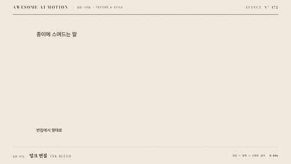

# Nº 472 잉크 번짐 · Ink Bleed



[MP4](clip.mp4) · [HTML](index.html)

**잉크 덩어리가 종이 속으로 번지며 합쳐진 뒤 수축해 선명한 글자나 마크가 남는 효과**

Ink blobs bleed into paper, merge, then contract, leaving a crisp letter or mark.

| Family | Level | Purpose | Media | Runtime |
|---|---|---|---|---|
| 질감·스타일 · TEXTURE & STYLE | 중급 | 분위기, 브랜딩, 전환 | 설명 영상, 숏폼, 발표 | svg |

다른 이름 / Also known as: Noise Threshold Ink, 노이즈 임계 잉크

## 선택 기준 / Selection

손으로 만든 흔적과 유기적인 생성을 보여준다. 디지털 화면에 종이 질감의 인간미를 더한다 / Shows handmade traces and organic generation, bringing human warmth to a digital screen.

- 제목이나 로고를 수묵화처럼 번져 나타나게 할 때 / To make a title or logo appear as if bleeding like ink wash
- 교육, 출판, 공예 주제에서 사람 손길을 표현할 때 / To express a human touch in education, publishing, or craft topics

좋은 예 / Good: 잉크 얼룩이 0.5초에 번져 퍼진 뒤 1.2초에 걸쳐 임계 필터가 조여 지며 글자 윤곽이 선명하게 남는다
나쁜 예 / Bad: blur를 너무 크게 잡아 글자 윤곽을 잃거나, 종이 입자 패턴을 프레임마다 바꿔 화면이 지글거린다
주의 / Avoid: 최종 프레임에서 blur 0, 글자 가장자리 선명 · 종이 입자 시드는 고정

## 파라미터 / Parameters

| Parameter | Default | Range | Note |
|---|---|---|---|
| 지속 | 1200ms | 800~1800ms | 번짐에서 수축 |
| blur | 16px에서 0 | 10~24px | 마스크 blur |
| 임계 | 0.5 | 0.4~0.6 | feComponentTransfer 기울기 24 |
| 잉크 색 | #1a1a1f | 어두운 무채색 | 종이 #f2ede2 |
| 종이 입자 | 고정 시드 | freq 0.8 | feTurbulence 1개 |

이징 / Ease: `power2.inOut`

## 구현 / Implementation (GSAP)

```js
/* SVG: <filter id=ink><feGaussianBlur id=b stdDeviation=16/><feColorMatrix type=matrix values='1 0 0 0 0  0 1 0 0 0  0 0 1 0 0  0 0 0 24 -12'/></filter> */
tl.fromTo('#b',{attr:{stdDeviation:16}},{attr:{stdDeviation:0},duration:1.2,ease:'power2.inOut'},t)
 .fromTo('.ink',{opacity:0},{opacity:1,duration:.5,ease:'power1.out'},t);
```

## 프롬프트 / Prompts

### 한국어 · Claude Code
```text
<제목>을 잉크가 번지며 나타나게 해줘. SVG 필터로 feGaussianBlur stdDeviation을 16에서 0으로 1.2초 동안 power2.inOut으로 줄이고, 이어서 feColorMatrix 알파 기울기 24, 오프셋 -12로 임계를 걸어 액체 경계를 만들어. 잉크 색 #1a1a1f, 종이 #f2ede2에 feTurbulence 시드 고정 입자. 마지막 프레임에서 blur는 0.
```

### 한국어 · Codex
```text
<파일>의 <제목>에 ink-bleed를 구현해. blur 16px에서 0, 1200ms power2.inOut, 임계 알파 24/-12, 시드 고정 종이 입자. 0.2초, 0.6초, 1.0초, 1.3초를 캡처해 번짐이 퍼졌다가 조여지는지, 1.3초에 글자 가장자리가 선명한지, 종이 입자가 프레임마다 같은지 확인해.
```

### English · Claude Code
```text
Make <title> appear as bleeding ink. With an SVG filter, reduce feGaussianBlur stdDeviation from 16 to 0 over 1.2s with power2.inOut, then threshold with feColorMatrix alpha slope 24 and offset -12 to form a liquid edge. Ink #1a1a1f on paper #f2ede2 with a fixed-seed feTurbulence grain. Blur must be 0 at the last frame.
```

### English · Codex
```text
Implement ink-bleed on <title> in <file>: blur 16px to 0, 1200ms power2.inOut, threshold alpha 24/-12, fixed-seed paper grain. Capture at 0.2s, 0.6s, 1.0s, and 1.3s to verify the bleed spreads then tightens, edges are crisp at 1.3s, and the paper grain is identical across frames.
```

예시 / Example: 잉크 번짐를 `.hero`에 적용해. / Apply Ink Bleed to `.hero`.

## 적용 / Application

- HyperFrames: filter의 stdDeviation attr을 paused 타임라인으로 보간한다. feTurbulence seed는 attribute로 고정해 seek 결과를 같게 한다
- ReelForge: 브리프에 blurStart, thresholdSlope, inkColor, paperColor를 싣는다. 종이는 별도 PNG 대신 feTurbulence로 생성해도 된다
- Scrolline Deck: 진행률 0~1을 stdDeviation 16에서 0으로 매핑한다. 임계 기울기는 고정이라 스크럽해도 윤곽이 튀지 않는다

조합 / Pair with: [유체 잉크 · Fluid Ink Advection](../fluid-ink/) · [액체 금속 · Liquid Metal](../liquid-metal/) · [스크리블 와이프 · Scribble Wipe](../scribble-wipe/) · [마스크 리빌 · Mask Reveal](../mask-reveal/)

출처 / Sources: [heygen-com/hyperframes](https://raw.githubusercontent.com/heygen-com/hyperframes/main/registry/components/ink-bleed-reveal/registry-item.json) (Apache-2.0) · local/HyperFrames-skills (`claude-skill:embedded-captions/CATALOG.md`) (unknown) · [helpx.adobe.com](https://helpx.adobe.com/after-effects/desktop/apply-effects-and-animation-presets/list-of-effects/noise-grain-effects.html) (unknown)

[목록 / Catalog](../../references/catalog.md) · [index.json](../../index.json)
