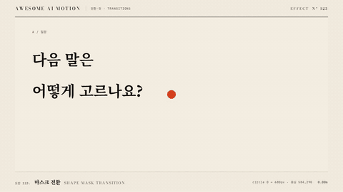

# Nº 123 마스크 전환 · Shape Mask Transition



[MP4](clip.mp4) · [HTML](index.html)

**한 점에서 원형 마스크가 커지며 다음 장면을 드러내는 전환**

A circular mask expands from a point to reveal the next scene.

| Family | Level | Purpose | Media | Runtime |
|---|---|---|---|---|
| 전환·컷 · TRANSITIONS | 중급 | 전환, 순서·흐름 | 설명 영상, 숏폼, 발표 | gsap |

다른 이름 / Also known as: 원형 전환, Iris reveal, Iris mask, 아이리스 마스크, Circle iris, Diamond iris, iris-circle-directional

## 선택 기준 / Selection

같은 위치를 출발점으로 새 정보가 화면 전체로 퍼진다 / Shows new information spreading across the screen from a shared origin.

- 질문에서 답으로 장면을 바꿀 때 / Transition from a question to its answer.
- 선택한 지점을 기준으로 상세 장면을 열 때 / Open a detail scene from a selected point.

좋은 예 / Good: 주홍 점의 중심에서 원형 마스크가 커지며 질문 장면을 답 장면으로 바꾼다
나쁜 예 / Bad: 원이 충분히 커지지 않아 끝까지 모서리에 이전 장면이 남는다
주의 / Avoid: 마스크 중심과 시작 점의 위치를 맞춘다 · 완료 반경을 가장 먼 모서리 거리보다 크게 둔다

## 파라미터 / Parameters

| Parameter | Default | Range | Note |
|---|---|---|---|
| 시작 반경 | 0px | 0~20px | 작은 한 점에서 시작 |
| 완료 반경 | 680px | 655~800px | 1168×580 중심 기준으로 모서리까지 덮는다 |
| 중심 | 584px 290px | 장면 내부 좌표 | 주홍 점 중심과 동일 |
| 전환 시간 | 1.35s | 0.8~1.5s | 마스크 확장이 읽히는 시간 |

이징 / Ease: `power2.inOut`

## 구현 / Implementation (GSAP)

```js
tl.to('.b', {clipPath:'circle(680px at 584px 290px)', duration:1.35, ease:'power2.inOut'}, 0.4);
tl.to('.seed', {scale:0, duration:0.15, ease:'power1.in'}, 0.4);
tl.to('.lead', {opacity:1, duration:0.25}, 1.95);
```

## 프롬프트 / Prompts

### 한국어 · Claude Code
```text
<대상>을 한 점에서 열리는 원형 마스크 전환으로 만들어줘. 1168×580 장면 중심 584px, 290px에 주홍 점을 두고 장면 B의 clip-path를 circle(0px at 584px 290px)에서 circle(680px at 584px 290px)로 바꿔. 0.4초부터 1.35초간 power2.inOut으로 확장하고 2.2초 이후 정지해.
```

### 한국어 · Codex
```text
<파일>의 장면 B 래퍼에 clip-path circle을 적용해. 중심은 584px, 290px이고 반경은 0.4초부터 1.35초간 0에서 680px까지 power2.inOut으로 커지게 해. 0.23초, 0.73초, 1.23초, 2.9초 캡처로 시작 점과 마스크 중심이 일치하고 마지막 모서리에 장면 A가 남지 않는지 확인해.
```

### English · Claude Code
```text
Create a circular mask transition for <target> that opens from a point. Place a vermilion dot at the center of a 1168×580 scene, at 584px, 290px. Animate scene B's clip-path from circle(0px at 584px 290px) to circle(680px at 584px 290px). Expand starting at 0.4 seconds over 1.35 seconds with power2.inOut, and hold after 2.2 seconds.
```

### English · Codex
```text
Apply a circle clip-path to the scene B wrapper in <file>. Use center 584px, 290px and animate the radius from 0 to 680px starting at 0.4 seconds over 1.35 seconds with power2.inOut. Capture at 0.23, 0.73, 1.23, and 2.9 seconds to verify that the starting dot and mask center align and that no scene A remains in the corners at the end.
```

예시 / Example: 마스크 전환를 `.hero`에 적용해. / Apply Shape Mask Transition to `.hero`.

## 적용 / Application

- HyperFrames: 장면 안쪽 래퍼를 paused GSAP 타임라인 하나로 움직인다. 3초 길이에서 마지막 0.5초 이상을 홀드한다.
- ReelForge: 전환 전후 장면을 동시에 배치하고 이동·마스크·색 변화의 시작과 끝을 같은 시간축에 둔다.
- Scrolline Deck: 전환 시간을 스크롤 진행률로 환산한다. 역방향 seek에도 시작 상태가 복원되게 초기값을 타임라인에 둔다.

조합 / Pair with: [와이프 · Wipe](../wipe/) · [스포트라이트 · Spotlight](../spotlight/) · [점진적 공개 · Progressive Disclosure](../progressive-disclosure/)

출처 / Sources: [GSAP Timeline 공식 문서](https://gsap.com/docs/v3/GSAP/Timeline/) (공식 문서 개념 참조) · [heygen-com/hyperframes](https://raw.githubusercontent.com/heygen-com/hyperframes/main/registry/components/iris-reveal/registry-item.json) (Apache-2.0) · [heygen-com/hyperframes](https://raw.githubusercontent.com/heygen-com/hyperframes/main/registry/blocks/sdf-iris/registry-item.json) (Apache-2.0) · [heygen-com/hyperframes](https://raw.githubusercontent.com/heygen-com/hyperframes/main/registry/blocks/transitions-radial/registry-item.json) (Apache-2.0) · [motion.dev Motion+](https://motion.dev/docs/react-use-curtains) (unknown) · [motion.dev examples](https://motion.dev/examples/react-curtains-iris) (unknown)

[목록 / Catalog](../../references/catalog.md) · [index.json](../../index.json)
