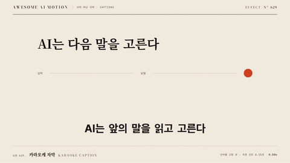

# Nº 629 카라오케 자막 · Karaoke Caption



[MP4](clip.mp4) · [HTML](index.html)

**자막 줄은 그대로 두고 발화 중인 단어의 색이나 배경만 이동하는 효과**

The caption line stays put while only the color or pill background of the spoken word moves.

| Family | Level | Purpose | Media | Runtime |
|---|---|---|---|---|
| 자막·하단 자막 · CAPTIONS | 기본 | 피드백, 순서·흐름 | 숏폼, 설명 영상, 웹 UI | css |

다른 이름 / Also known as: Karaoke Pill, 카라오케 알약 강조, Karaoke Continuous Color Wipe, 카라오케 연속 색 채움, Karaoke Active Word Step, 카라오케 활성 단어 이동, Karaoke emphasis / Word tracking

## 선택 기준 / Selection

소리와 읽는 위치를 정확히 맞춘다. 시청자가 어디를 읽고 있는지 잃지 않는다 / Locks the reading position to the audio so viewers never lose their place.

- 말이 빠른 강의·인터뷰 자막을 읽기 쉽게 할 때 / Make fast-speaking lecture or interview captions easy to follow.
- 노래·랩 가사 자막을 박자에 맞출 때 / Sync song or rap lyric captions to the beat.

좋은 예 / Good: 한 줄 6단어 중 발화 단어가 시작 시각에 150ms로 노랑으로 바뀌고 단어가 끝나면 원래 색으로 돌아간다
나쁜 예 / Bad: 단어 타임스탬프보다 0.3초 늦게 바뀌어 소리와 어긋나고, 강조 때문에 줄 위치가 흔들린다
주의 / Avoid: 강조 시 글자 폭이 변하는 굵기 변경 금지(줄이 흔들림) · 자막 줄 폭 최대 32자 · 타임스탬프 없이 균등 분할로 대신하지 않는다

## 파라미터 / Parameters

| Parameter | Default | Range | Note |
|---|---|---|---|
| 강조 전환 | 150ms | 80~200ms | 색·배경 전환 |
| 단어 시작 오프셋 | 0ms | -50~50ms | 싱크 보정 |
| 강조 색 | #FFD400 | - | 배경 대비 7:1 이상 |
| 줄당 단어 수 | 4~6 | 3~7 | 한 화면 줄 |

이징 / Ease: `power1.out`

## 구현 / Implementation (GSAP)

```js
words.forEach(w => {
  tl.to(w.el, { color: '#FFD400', duration: 0.15, ease: 'power1.out' }, w.start)
    .to(w.el, { color: '#FFFFFF', duration: 0.15, ease: 'power1.out' }, w.end);
});
```

## 프롬프트 / Prompts

### 한국어 · Claude Code
```text
<대상> 자막을 카라오케 방식으로 만들어줘. 한 줄에 4~6단어(한글은 어절 단위 span)를 흰색으로 두고, <타임스탬프 JSON>의 단어 start에 0.15초 동안 #FFD400으로 바뀌고 end에 흰색으로 돌아오게 해. 굵기 변경은 하지 말고 줄 위치가 흔들리지 않게 해.
```

### 한국어 · Codex
```text
<파일>의 단어 span에 start/end 타임스탬프로 color tween(0.15s)을 걸어. 임의 단어 3개에 대해 start 시각에 색이 바뀌고 end 시각에 복구되는지 해당 시점 캡처로 확인하고, 줄 x 좌표가 변하지 않았는지도 봐.
```

### English · Claude Code
```text
Build karaoke captions in <target>. Keep 4 to 6 words per line in white (per word span; for Korean group by eojeol, never split jamo). At each word start from <timestamp JSON> tween to #FFD400 over 0.15 seconds and return to white at the word end. Do not change weight and keep the line from shifting.
```

### English · Codex
```text
In <file> add color tweens (0.15s) to word spans using start/end timestamps. Capture three arbitrary words at their start and end times to confirm the color change and recovery, and check the line x position never changes.
```

예시 / Example: 카라오케 자막를 `.hero`에 적용해. / Apply Karaoke Caption to `.hero`.

## 적용 / Application

- HyperFrames: transcript의 단어 start/end를 tl.to 위치로 그대로 쓴다. 단어 span은 빌드 시 생성하고 한글은 어절 단위로 묶는다(자모 분리 금지)
- ReelForge: 캡션 씬에 단어 타임스탬프 JSON과 강조 스타일(색, 알약)을 파라미터로 넘긴다. 알약 이동형이면 배경 요소만 x/width tween
- Scrolline Deck: 단어 시각을 진행률 0..1로 환산해 배치한다. 색 전환은 scrub에서도 안전한 짧은 ease-out 사용

조합 / Pair with: [단어 팝 자막 · Word Pop Caption](../word-pop-caption/) · [자막 페이지 교체 · Caption Page Swap](../caption-page-swap/) · [하이라이트 스윕 · Highlight Sweep](../highlight-sweep/)

출처 / Sources: [heygen-com/hyperframes](https://raw.githubusercontent.com/heygen-com/hyperframes/main/registry/components/caption-pill-karaoke/registry-item.json) (Apache-2.0) · local/HyperFrames-skills (`claude-skill:embedded-captions/references/rail.md`) (unknown) · local/HyperFrames-skills (`claude-skill:media-use/audio/references/captions/motion.md`) (unknown) · local/motion-graphics (`claude-skill:motion-graphics/references/motion-vocabulary.md`) (unknown) · [dcmcand/dynamic-typography-videos](https://github.com/dcmcand/dynamic-typography-videos) (Apache-2.0)

[목록 / Catalog](../../references/catalog.md) · [index.json](../../index.json)
