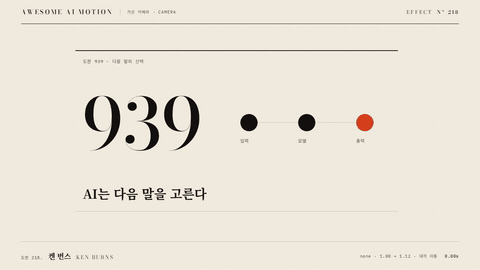

# Nº 218 켄 번스 · Ken Burns



[MP4](clip.mp4) · [HTML](index.html)

**한 정지 도판을 천천히 확대하고 비스듬히 옮기는 카메라 움직임**

A camera move that slowly zooms into a still image while panning diagonally.

| Family | Level | Purpose | Media | Runtime |
|---|---|---|---|---|
| 가상 카메라 · CAMERA | 기본 | 강조, 설명 | 설명 영상, 발표, 스크롤덱 | gsap |

다른 이름 / Also known as: 정지 이미지 팬 줌, 사진 이동, 켄 번즈, Ken Burns Effect

## 선택 기준 / Selection

정지 자료에 시선의 흐름과 차분한 시간감을 준다 / Gives static material a flowing visual path and a calm sense of time.

- 정지 사진이나 인쇄 도판을 영상으로 보여줄 때 / When presenting still photographs or printed illustrations in a video
- 자료 전체에서 특정 부분으로 조금씩 시선을 모을 때 / When gradually guiding attention from the whole image to a specific detail

좋은 예 / Good: 939와 입력·모델·출력 도판을 2.2초 동안 1.12배 확대하며 왼쪽 위로 이동한다
나쁜 예 / Bad: 빠른 확대와 급한 이징으로 정지 자료가 튀어나온다
주의 / Avoid: 빠른 확대와 급한 이징으로 정지 자료가 튀어나온다 · 최종 상태를 0.5초 미만으로 유지하지 않는다

## 파라미터 / Parameters

| Parameter | Default | Range | Note |
|---|---|---|---|
| 확대율 | 1.12 | 1.05~1.18 | 느린 확대 |
| 이동 거리 | x -28px / y -18px | 10~40px | 확대와 함께 대각 이동 |
| 동작 시간 | 2.2s | 1.8~2.2s | 3초 클립의 준비와 홀드 제외 |
| 이징 | none | none | 일정한 속도 |

## 구현 / Implementation (GSAP)

```js
tl.to('#plate', {scale: 1.12, x: -28, y: -18, duration: 2.2, ease: 'none'}, .3);
```

## 프롬프트 / Prompts

### 한국어 · Claude Code
```text
<대상>에 켄 번스 효과를 GSAP 코어로 만들어줘. 939와 입력·모델·출력 도판을 2.2초 동안 1.12배 확대하며 왼쪽 위로 이동한다 3초 클립에서 0.3초까지 시작 상태를 유지하고 다음 기본값을 적용해: 확대율 1.12, 이동 거리 x -28px / y -18px, 동작 시간 2.2s, 이징 none. 마지막 0.5초 이상은 완성 상태로 정지하고 시간 제어는 paused 타임라인 하나로 해.
```

### 한국어 · Codex
```text
<파일>의 scene 내부에 켄 번스를 적용해. 확대율는 1.12. 이동 거리는 x -28px / y -18px. 동작 시간는 2.2s. 이징는 none. 0.23초, 1.23초, 2.9초를 캡처해 시작 상태와 중간 변화, 939와 입력·모델·출력 도판을 2.2초 동안 1.12배 확대하며 왼쪽 위로 이동한다의 최종 상태를 확인해. 2.5초와 2.9초의 장면이 같은지, 의도한 카메라 프레임 외의 잘림과 라벨 겹침이 없는지 검증해.
```

### English · Claude Code
```text
Create a Ken Burns effect on <target> using GSAP core. Enlarge 939 and the input, model, and output diagram to 1.12 times its size over 2.2 seconds while moving toward the upper left. In a 3-second clip, hold the initial state until 0.3 seconds and apply these defaults: scale 1.12, translation x -28px / y -18px, duration 2.2s, ease none. Hold the completed state for at least the final 0.5 seconds, and control timing with a single paused timeline.
```

### English · Codex
```text
Apply Ken Burns inside the scene in <file>. Use these settings: scale 1.12, translation x -28px / y -18px, duration 2.2s, ease none. Capture at 0.23, 1.23, and 2.9 seconds to check the initial state, intermediate changes, and the final state: Enlarge 939 and the input, model, and output diagram to 1.12 times its size over 2.2 seconds while moving toward the upper left. Verify that the scenes at 2.5 and 2.9 seconds match, with no clipping beyond the intended camera frame or overlapping labels.
```

예시 / Example: 켄 번스를 `.hero`에 적용해. / Apply Ken Burns to `.hero`.

## 적용 / Application

- HyperFrames: 장면 내부 래퍼를 하나의 paused GSAP 타임라인으로 움직이고 seek 시 같은 좌표를 재현한다.
- ReelForge: 장면 내부 요소의 transform 키프레임에 위 기본값을 적용하고 3초 끝까지 최종 상태를 유지한다.
- Scrolline Deck: 0.3~2.5초 동작 구간을 스크롤 진행률 0.1~0.83에 대응시키고 끝 구간은 최종 상태로 둔다.

조합 / Pair with: [패럴랙스 · Parallax](../parallax/) · [푸시인 · Push-in](../push-in/) · [크로스페이드 · Crossfade](../crossfade/)

출처 / Sources: [GSAP Timeline.to()](https://gsap.com/docs/v3/GSAP/Timeline/to()/) (공식 API 문서 참조) · [animista.net](https://animista.net/play) (BSD-2-Clause (FreeBSD)) · motion dictionary 2-transitions-camera.md#24. 켄 번스 · Ken Burns Effect (own)

[목록 / Catalog](../../references/catalog.md) · [index.json](../../index.json)
