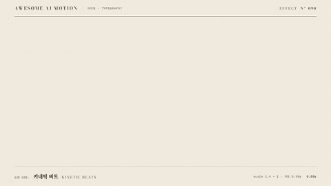

# Nº 090 키네틱 비트 · Kinetic Beats



[MP4](clip.mp4) · [HTML](index.html)

**단어를 일정한 박자마다 중앙에 크게 찍고 빠르게 정착시키는 효과**

Words hit the center at a large scale on regular beats and quickly settle.

| Family | Level | Purpose | Media | Runtime |
|---|---|---|---|---|
| 타이포 · TYPOGRAPHY | 기본 | 주목 끌기, 순서·흐름, 강조 | 숏폼, 설명 영상, 발표 | gsap |

다른 이름 / Also known as: 단어 비트, Kinetic typography, 박자 타이포, 비트 타이포, kinetic-beat-slam, Word Grid Burst, 단어 격자 축적

## 선택 기준 / Selection

세 단계의 리듬과 마지막 행동의 중요성을 전한다 / Communicates a three-step rhythm and emphasizes the final action.

- 짧은 동사로 순서를 압축할 때 / Compress a sequence into short verbs.
- 마지막 핵심 행동에 시선을 모을 때 / Focus attention on the final key action.

좋은 예 / Good: 읽고, 매기고, 고른다를 0.5초 간격으로 중앙에 찍고 마지막 단어만 주홍으로 남긴다
나쁜 예 / Bad: 긴 문장을 빠르게 교체해 읽기 전에 사라지게 한다
주의 / Avoid: 긴 문장에는 쓰지 않는다 · 교체 순간에 두 단어를 겹치지 않는다 · 모든 단어에 강조색을 넣지 않는다

## 파라미터 / Parameters

| Parameter | Default | Range | Note |
|---|---|---|---|
| 비트 간격 | 0.5s | 0.4~0.8s | 단어별 출발 간격 |
| 시작 배율 | 1.4 | 1.2~1.5 | 큰 단어가 빠르게 정착한다 |
| 정착 시간 | 0.25s | 0.18~0.3s | 다음 비트 전 읽기 시간을 남긴다 |
| 시작 | 0.3s | 0.2~0.4s | 빈 준비 구간 |

이징 / Ease: `power3.out`

## 구현 / Implementation (GSAP)

```js
['#read','#score','#choose'].forEach((s,i) => {
  const at = 0.3 + i * 0.5;
  tl.set(s, {opacity:1, scale:1.4}, at);
  tl.to(s, {scale:1, duration:0.25, ease:'power3.out'}, at);
  if(i < 2) tl.set(s, {opacity:0}, at + 0.5);
});
```

## 프롬프트 / Prompts

### 한국어 · Claude Code
```text
<대상>의 세 단어 읽고, 매기고, 고른다를 화면 중앙에 한 단어씩 보여줘. 0.3초, 0.8초, 1.3초에 opacity 1과 scale 1.4로 찍고 0.25초 동안 power3.out으로 scale 1에 정착시켜. 다음 비트에서 앞 단어를 즉시 숨기고 마지막 고른다만 주홍으로 3초까지 유지해.
```

### 한국어 · Codex
```text
<파일>의 .scene 중앙에 세 단어를 각각 독립된 span으로 배치해. 0.3초부터 0.5초 간격으로 opacity 1, scale 1.4를 설정하고 0.25초 동안 power3.out으로 scale 1에 정착시켜. 0.3초와 0.43초 캡처로 축소를, 0.73초와 1.23초로 단어 교체를, 2.9초로 마지막 주홍 단어 홀드와 겹침 없음을 확인해.
```

### English · Claude Code
```text
Show the three words "Read", "Score", and "Pick" one at a time in the center of <target>. At 0.3, 0.8, and 1.3 seconds, make each word hit with opacity 1 and scale 1.4, then settle to scale 1 over 0.25 seconds with power3.out. Immediately hide the previous word on the next beat. Keep only the final word "Pick" in vermilion until 3 seconds.
```

### English · Codex
```text
Place the three words "Read", "Score", and "Pick" in separate spans at the center of .scene in <file>. Starting at 0.3 seconds with 0.5-second intervals, set opacity 1 and scale 1.4, then settle to scale 1 over 0.25 seconds with power3.out. Capture at 0.3 and 0.43 seconds to check the scale reduction, at 0.73 and 1.23 seconds to check word replacement, and at 2.9 seconds to verify the final vermilion word holds without overlap.
```

예시 / Example: 키네틱 비트를 `.hero`에 적용해. / Apply Kinetic Beats to `.hero`.

## 적용 / Application

- HyperFrames: 한 타임라인에서 단어의 등장과 교체를 0.5초 간격으로 예약하고 scale을 1.4에서 1로 줄인다
- ReelForge: 세 단어를 세 비트로 나누고 마지막 비트에 주홍색과 긴 홀드를 배정한다
- Scrolline Deck: 단어 교체를 세 진행률 구간으로 나누고 각 구간 시작에서 확대 후 정착시킨다

조합 / Pair with: [타이밍과 간격 · Timing & Spacing](../timing-spacing/) · [단어 강조 · Word Emphasis](../word-emphasis/) · [마스크 리빌 · Mask Reveal](../mask-reveal/)

출처 / Sources: [GSAP Timeline](https://gsap.com/docs/v3/GSAP/Timeline/) (공식 문서 참조) · [heygen-com/hyperframes](https://raw.githubusercontent.com/heygen-com/hyperframes/main/registry/components/caption-kinetic-slam/registry-item.json) (Apache-2.0) · [heygen-com/hyperframes](https://raw.githubusercontent.com/heygen-com/hyperframes/main/registry/components/headline-slam/registry-item.json) (Apache-2.0) · [heygen-com/hyperframes](https://raw.githubusercontent.com/heygen-com/hyperframes/main/registry/components/shutter-slam/registry-item.json) (Apache-2.0) · [heygen-com/hyperframes](https://raw.githubusercontent.com/heygen-com/hyperframes/main/registry/components/logo-sting/registry-item.json) (Apache-2.0)

[목록 / Catalog](../../references/catalog.md) · [index.json](../../index.json)
