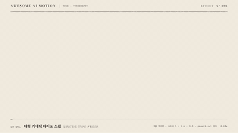

# Nº 096 대형 키네틱 타이포 스윕 · Kinetic Type Sweep



[MP4](clip.mp4) · [HTML](index.html)

**200px 넘는 세리프 문장 세 줄이 서로 반대 방향, 다른 속도로 화면을 가로지르고 마지막에 핵심어 하나만 정중앙에 급정지한다.**

Three lines of 200px+ serif type sweep across the frame in opposite directions at different speeds, then one key word slams to a stop dead center.

| Family | Level | Purpose | Media | Runtime |
|---|---|---|---|---|
| 타이포 · TYPOGRAPHY | 중급 | 주목 끌기, 강조, 브랜딩 | 숏폼, 설명 영상, 발표 | gsap |

다른 이름 / Also known as: 타이포 스윕, 역방향 텍스트 띠, Kinetic typography, Marquee sweep, Type slam, Kinetic Type Curtain Transition, 키네틱 타이포 커튼 전환

## 선택 기준 / Selection

많은 말이 흘러가는 가운데 하나가 선택된다는 느낌. 흐름의 속도감이 정지 순간의 무게를 키운다. / Many words stream past and one gets chosen. The speed of the flow gives the stop its weight.

- 영상 첫 3초에 주제어 하나를 강하게 박을 때 / Stamp a single theme word in the first three seconds of a video.
- 여러 후보 가운데 하나가 뽑히는 장면을 글자만으로 보여줄 때 / Show one choice being picked from many candidates with type alone.
- 섹션 전환에서 큰 제목을 소개할 때 / Introduce a large section title at a transition.

좋은 예 / Good: 세 줄이 각각 초속 약 1000px, 1700px, 500px로 엇갈려 흐르다가 가운데 줄의 "다음 말"만 0.3초 만에 멈추며 주홍으로 바뀌고 나머지는 13% 농도로 가라앉는다.
나쁜 예 / Bad: 세 줄이 같은 방향, 같은 속도로 흘러 한 덩어리 슬라이드처럼 보이고, 핵심어가 서서히 감속해 멈춘 순간이 느껴지지 않는다.
주의 / Avoid: 줄마다 속도비를 1.5배 이상 벌린다(비슷하면 한 장이 미끄러지는 것처럼 보임) · 급정지 뒤 흔들림·반복 튕김 금지 · 본문 크기 글자에는 쓰지 않는다(글자 높이 150px 이상에서만 흐름이 읽힘)

## 파라미터 / Parameters

| Parameter | Default | Range | Note |
|---|---|---|---|
| 글자 크기 | 200px | 160~260px | 줄 높이 193px에 세 줄이 580px 무대를 채움 |
| 줄별 속도비 | 1 : 1.6 : 0.5 | 0.4~1.8 | 위·가운데·아래 줄, 방향은 좌·우·좌 |
| 질주 구간 | 1.95s 등속 | 1.4~2.4s | ease none, 가운데 줄만 |
| 급정지 | 0.30s power4.out | 0.2~0.4s | 직전 등속과 첫 속도를 맞춰 끊김 없이 멈춤 |
| 나머지 줄 농도 | 0.13 | 0.1~0.2 | 정지 순간부터 0.5초에 걸쳐 가라앉힘 |

이징 / Ease: `none → power4.out`

## 구현 / Implementation (GSAP)

```js
tl.fromTo('#R1', {x: 1300}, {x: -1500, duration: 2.6, ease: 'power2.out'}, 0.1);
tl.fromTo('#R3', {x: 1300}, {x: -60, duration: 2.6, ease: 'power2.out'}, 0.1);
const xEnd = 640 - (hit.offsetLeft + hit.offsetWidth / 2), xStart = -r2.offsetWidth - 40;
const s = (xEnd - xStart) * 0.037; // 등속 끝 속도 = power4.out 첫 속도
tl.fromTo('#R2', {x: xStart}, {x: xEnd - s, duration: 1.95, ease: 'none'}, 0.15);
tl.to('#R2', {x: xEnd, duration: 0.3, ease: 'power4.out'}, 2.1);
tl.to('#hit', {color: 'var(--verm)', duration: 0.12}, 2.12);
tl.to('#R1, #R3', {opacity: 0.13, duration: 0.5}, 2.15);
```

## 프롬프트 / Prompts

### 한국어 · Claude Code
```text
<파일>에 대형 키네틱 타이포 스윕을 만들어줘. 200px 세리프 문장 세 줄을 위·가운데·아래에 두고 좌·우·좌로 속도비 1 : 1.6 : 0.5로 흘려. 가운데 줄은 1.95초 등속으로 달리다 마지막 0.3초 power4.out으로 급정지하고, 핵심어 <대상>의 중심이 화면 가로 중앙에 오게 해. 정지 순간 핵심어만 주홍으로, 나머지 두 줄은 0.5초에 걸쳐 opacity 0.13으로 가라앉히고 0.6초 이상 홀드해.
```

### 한국어 · Codex
```text
<파일>의 오프닝 장면에 kinetic type sweep을 적용해. 줄 3개(font-size 200px, 줄 높이 193px)를 transform x만으로 움직이고, 가운데 줄은 xEnd = 640 - (핵심어 offsetLeft + 폭/2)로 계산해 등속 1.95s(ease none) 뒤 0.3s power4.out으로 멈추게 해. 등속 끝 속도와 감속 첫 속도가 같도록 등속 구간 끝을 전체 이동량의 3.7% 앞에 둔다. 0.9초·2.0초·3.3초를 캡처해 세 줄이 엇갈려 흐르는지, 핵심어가 정중앙에 멈췄는지, 주홍이 한 곳뿐인지 확인해.
```

### English · Claude Code
```text
Build a large kinetic type sweep in <file>. Place three lines of 200px serif text at top, middle, and bottom, moving left, right, left at a speed ratio of 1 : 1.6 : 0.5. Run the middle line at constant speed for 1.95s, then stop it hard with power4.out over 0.3s so the center of <target> lands at the horizontal center. On the stop, turn only the key word vermilion, fade the other two lines to opacity 0.13 over 0.5s, and hold for at least 0.6s.
```

### English · Codex
```text
Apply a kinetic type sweep to the opening scene in <file>. Move three lines (font-size 200px, line height 193px) with transform x only. For the middle line compute xEnd = 640 - (key word offsetLeft + width/2), run 1.95s with ease none, then stop over 0.3s with power4.out. End the constant segment 3.7% of the total distance early so the exit speed matches the deceleration's start speed. Capture at 0.9s, 2.0s, 3.3s to verify the lines cross in opposite directions, the key word stops dead center, and vermilion appears in one place only.
```

예시 / Example: 대형 키네틱 타이포 스윕를 `.hero`에 적용해. / Apply Kinetic Type Sweep to `.hero`.

## 적용 / Application

- HyperFrames: 줄 세 개를 각각 transform x만 tween하고, 핵심어 좌표는 글꼴 로드 뒤 offsetLeft로 재서 타임라인을 만든다. 등속 1.95초 뒤 power4.out 0.3초로 이어 붙인다
- ReelForge: 타이틀 씬 비트에 줄 문구 3개·속도비(1:1.6:0.5)·정지 단어를 파라미터로 노출하고 정지 시각을 비트 박자에 맞춘다
- Scrolline Deck: 스크럽에서는 급정지가 스크롤 속도에 묻힌다. 진행률 0~0.7은 흐름, 0.7~0.8에 정지를 몰고 0.8 이후는 홀드로 둔다

조합 / Pair with: [키네틱 비트 · Kinetic Beats](../kinetic-beats/) · [단어 강조 · Word Emphasis](../word-emphasis/) · [휩팬 · Whip Pan](../whip-pan/) · [글자별 스태거 · Per-character Rise](../char-stagger/)

출처 / Sources: [Kinetic typography (Wikipedia)](https://en.wikipedia.org/wiki/Kinetic_typography) (개념 인용) · [GSAP Eases](https://gsap.com/docs/v3/Eases) (문서 참고) · [codrops/KineticTypePageTransition](https://github.com/codrops/KineticTypePageTransition) (MIT)

[목록 / Catalog](../../references/catalog.md) · [index.json](../../index.json)
