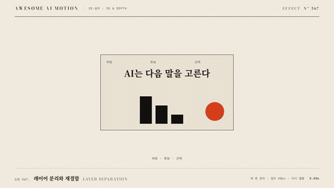

# Nº 567 레이어 분리와 재결합 · Layer Separation



[MP4](clip.mp4) · [HTML](index.html)

**겹쳐진 평면 레이어들이 깊이와 각도 차이를 두고 벌어져 보인 뒤 다시 포개진다**

Stacked flat layers spread out at different depths and angles, then fold back together.

| Family | Level | Purpose | Media | Runtime |
|---|---|---|---|---|
| 3D·깊이 · 3D & DEPTH | 중급 | 설명, 순서·흐름 | 설명 영상, 발표, 제품 시연 | css |

다른 이름 / Also known as: 3D Layer Fan Out, 3D 레이어 펼침, Layer separation and recomposition, 레이어 분리와 재합성

## 선택 기준 / Selection

화면이 여러 층으로 구성돼 있다는 구조를 보여 준다. 각 층의 역할을 설명하기 전에 분해해 보여 준다 / Reveals that the screen is built from layers, decomposing it before explaining each layer's role.

- UI 스크린샷의 배경, 콘텐츠, 오버레이 층을 나누어 설명할 때 / Explain the background, content and overlay layers of a UI screenshot.
- 구성 요소의 계층 구조를 입체로 보여 줄 때 / Show the layered structure of components in 3D.

좋은 예 / Good: 레이어 4장이 1600ms 동안 깊이 간격 100px, 회전 15도로 벌어져 층이 드러나고, 60ms 간격으로 순차 재결합한다
나쁜 예 / Bad: 깊이 간격 500px로 벌려 원근이 과하게 왜곡되고, 레이어가 서로 관통한다
주의 / Avoid: 깊이 간격 200px 초과 금지 · 레이어는 최대 6장

## 파라미터 / Parameters

| Parameter | Default | Range | Note |
|---|---|---|---|
| 지속 | 1600ms | 1200~2000ms | 벌림 800 + 재결합 800 |
| 깊이 간격 | 100px | 60~160px | translateZ |
| 회전 | 15도 | 10~25도 | rotateY 또는 rotateX |
| 레이어 간 시간차 | 60ms | 40~100ms | stagger |

이징 / Ease: `power3.inOut`

## 구현 / Implementation (GSAP)

```js
gsap.set('.stack', { transformStyle: 'preserve-3d', perspective: 1400, rotateX: 55, rotateZ: -35 });
layers.forEach((el, i) => tl.to(el, { z: i * 100, duration: 0.8, ease: 'power3.inOut' }, 0.3 + i * 0.06));
layers.forEach((el, i) => tl.to(el, { z: 0, duration: 0.8, ease: 'power3.inOut' }, 1.8 + i * 0.06));
```

## 프롬프트 / Prompts

### 한국어 · Claude Code
```text
<대상> 화면 스택을 레이어 분리로 보여줘. 컨테이너에 perspective 1400, rotateX 55, rotateZ -35를 주고, 레이어 4장의 translateZ를 0.3초부터 60ms 간격으로 0, 100, 200, 300px로 0.8초 동안 power3.inOut으로 벌린 뒤 1.8초에 순서대로 다시 0으로 합쳐.
```

### 한국어 · Codex
```text
<파일>에 layer separation을 구현해. preserve-3d, perspective 1400, 레이어 4장 z i*100, 벌림 0.8s, 재결합 0.8s, stagger 0.06s, ease power3.inOut. 0.3초, 1.1초, 1.8초, 2.7초를 캡처해 층 간격이 최대인 순간이 1.1~1.8초인지, 2.7초에 완전히 포개지는지 확인해.
```

### English · Claude Code
```text
Show the screen stack in <target> with layer separation. On the container set perspective 1400, rotateX 55 and rotateZ -35, then spread the 4 layers' translateZ to 0, 100, 200, 300px over 0.8 seconds from 0.3s with a 60ms stagger and power3.inOut, and merge them back to 0 in order at 1.8 seconds.
```

### English · Codex
```text
Implement layer separation in <file>: preserve-3d, perspective 1400, 4 layers at z i*100, spread 0.8s, rejoin 0.8s, stagger 0.06s, ease power3.inOut. Capture at 0.3s, 1.1s, 1.8s and 2.7s and verify spacing is widest between 1.1s and 1.8s and fully stacked again at 2.7s.
```

예시 / Example: 레이어 분리와 재결합를 `.hero`에 적용해. / Apply Layer Separation to `.hero`.

## 적용 / Application

- HyperFrames: preserve-3d 컨테이너에 perspective를 두고 자식 z만 tween한다. paused 타임라인에서 seek 안전
- ReelForge: 씬 브리프에 레이어 목록, 깊이 간격, 회전 각도, 각 레이어 라벨 위치를 싣는다
- Scrolline Deck: 진행률 0~0.5에서 벌림, 0.5~1에서 재결합으로 나눈다. 스프링 대신 power3.inOut

조합 / Pair with: [3D 조립 · Depth Assemble](../depth-assemble/) · [분해도 조립 · Exploded Assembly](../exploded-assembly/) · [3D 원근 틸트 리빌 · Perspective Tilt Reveal](../perspective-tilt/)

출처 / Sources: [helpx.adobe.com](https://helpx.adobe.com/after-effects/desktop/work-with-layers/3d-layers/3d-layers.html) (unknown) · [motion-canvas/examples](https://github.com/motion-canvas/examples/blob/master/examples/deferred-lighting/src/scenes/layers.tsx) (MIT) · [airbnb/lottie-web](https://github.com/airbnb/lottie-web) (MIT)

[목록 / Catalog](../../references/catalog.md) · [index.json](../../index.json)
